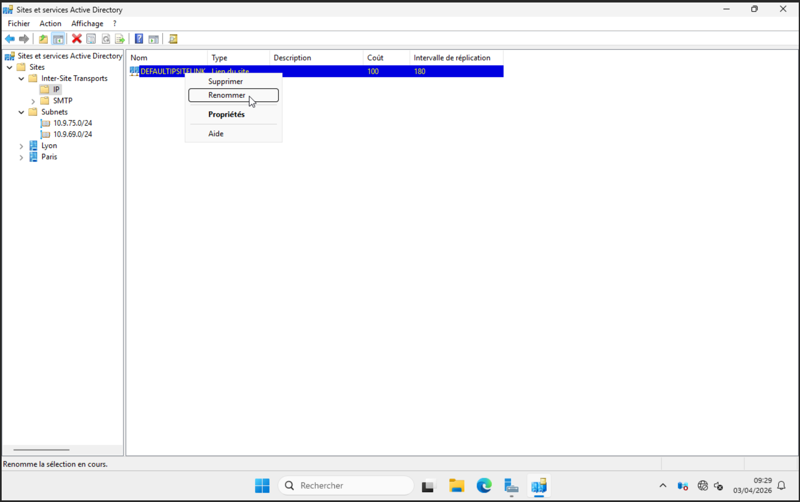
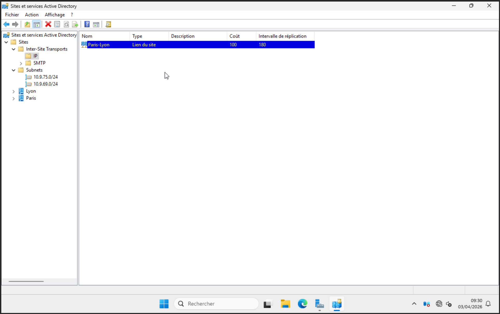
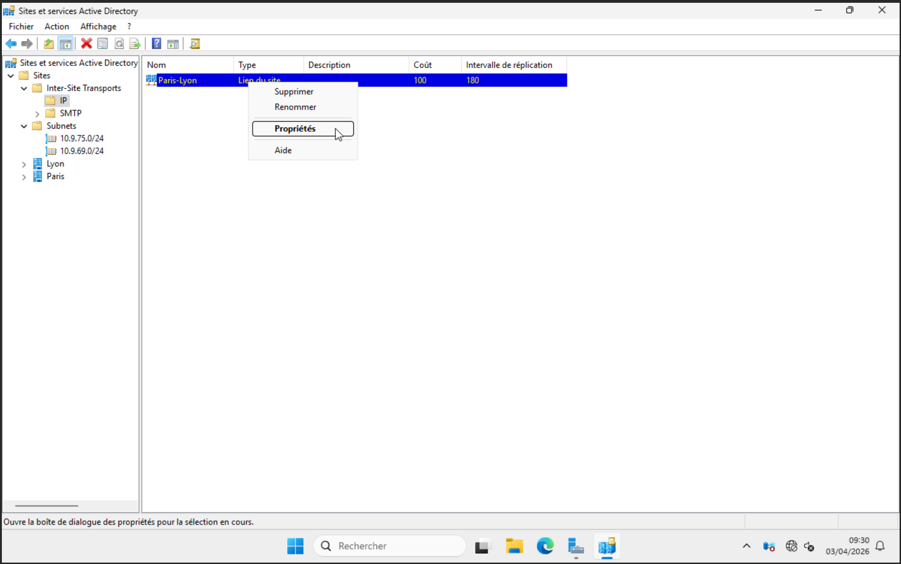
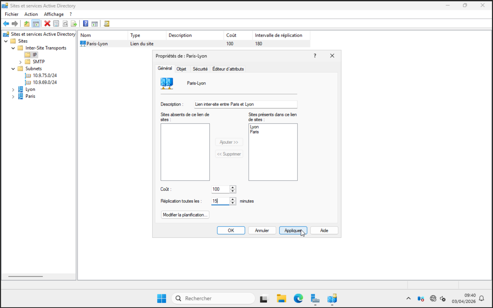

import {LinkButton, Steps, Badge, Aside, Card, CardGrid, StarlightIcon } from '@astrojs/starlight/components';

## Introduction

Ce document fait suite à la mise en place de l'infrastructure **Active Directory Domain Services** 
de l'entreprise **Freemotion** et se concentre sur la configuration de la **réplication entre 
les contrôleurs de domaine** des sites de Paris et Lyon.

La réplication Active Directory est un mécanisme fondamental qui garantit la **cohérence des 
données de l'annuaire** sur l'ensemble des contrôleurs de domaine. Toute modification effectuée 
sur un contrôleur — création d'un utilisateur, modification d'un mot de passe, application d'une 
GPO — doit être propagée sur l'ensemble de l'infrastructure dans les meilleurs délais.

## Stratégie de réplication
Dans le cadre de cette infrastructure, deux types de réplication sont mis en œuvre :

<Card title="Réplication Intra-site (Paris)" icon="right-arrow">
    Entre **PRS-DC-01** et **PRS-DC-02** au sein du site de Paris.
    - Communication directe et continue entre les deux contrôleurs de domaine
    - Objectif : haute disponibilité et synchronisation quasi-immédiate
</Card>
<Card title="Réplication Inter-site (Paris → Lyon)" icon="random">
    De **PRS-DC-01** et **PRS-DC-02** vers **LY-RODC-01** sur le site de Lyon.
    - Réplication **unidirectionnelle** vers le RODC
    - Planifiée toutes les **15 minutes** via le lien `Paris-Lyon`
    - Objectif : limiter la consommation de bande passante
</Card>

Cette configuration s'appuie sur les **Sites et Services Active Directory** afin de refléter 
la topologie physique du réseau et d'optimiser les flux de réplication entre les deux sites.

## Mise en place de la topologie de réplication

Les **Sites et Services AD** permettent de définir la topologie physique du réseau afin d'optimiser la réplication entre les contrôleurs de domaine et l'authentification des utilisateurs.

### Création des sites

La configuration s'effectue via **"Sites et Services Active Directory"** sur `PRS-DC-01` :

#### Renommer le site par défaut

<Steps>
1. Faire un clic droit sur **"Default-First-Site-Name"**

2. Sélectionner **"Renommer"**

    
3. Renseigner le nom : `Paris`

</Steps>

#### Créer le site Lyon

<Steps>
1. Faire un clic droit sur **"Sites"**

2. Sélectionner **"Nouveau site"**

3. Renseigner le nom : `Lyon`

4. Sélectionner le lien de site : `DEFAULTIPSITELINK`

5. Valider

</Steps>

### Création des sous-réseaux

Les sous-réseaux permettent d'associer automatiquement les machines au bon site AD :

<Steps>
1. Faire un clic droit sur **"Subnets"**
2. Sélectionner **"Nouveau sous-réseau"**

3. Renseigner le sous-réseau et associer au site correspondant
</Steps>
<CardGrid>
  <Card title="Paris"  icon="seti:config">
  `10.9.75.0/24`
  </Card>
  <Card title="Lyon"  icon="seti:config">
    `10.9.69.0/24`
  </Card>
</CardGrid>

L'association des sous-réseaux aux sites est essentielle. Sans cette configuration, les machines ne sont pas rattachées automatiquement au bon site ce qui peut dégrader les performances. 

  ### Création du lien inter-site

  <Steps>
  1. Développer **"Inter-Site Transports"** → **"IP"**

  2. Faire un clic droit sur **"DEFAULTIPSITELINK"** → **"Renommer"**
  

  3. Renseigner le nom : `Paris-Lyon`
  

  4. Faire un clic droit sur **"Paris-Lyon"** → **"Propriétés"**
  

  5. Configurer les paramètres suivants :
  

  </Steps>
  
  | Paramètre        | Valeur recommandée                        |
  |------------------|-------------------------------------------|
  | **Sites**        | `Paris` et `Lyon`                         |
  | **Coût**         | `100`                                     |
  | **Réplication**  | `15 minutes`    		                     |

<Card title="Coût du lien inter-site & Réplication" icon="approve-check-circle">
  - Le **coût** permet à AD de choisir le meilleur chemin de réplication lorsque plusieurs liens existent. Plus le coût est faible, plus le lien est prioritaire. 
    - Ici un seul, est présent c'est pour cela que nous gardons la varleur par défaut. 
  - La **réplication** sur le lien entre Paris et Lyon sera répliqué toutes les 15 minutes.
</Card>
  {/*

    

    <Aside type="note" title="Coût du lien inter-site">
      Le **coût** permet à AD de choisir le meilleur chemin de réplication lorsque plusieurs liens existent. Plus le coût est faible, plus le lien est prioritaire.
    </Aside>

*/}