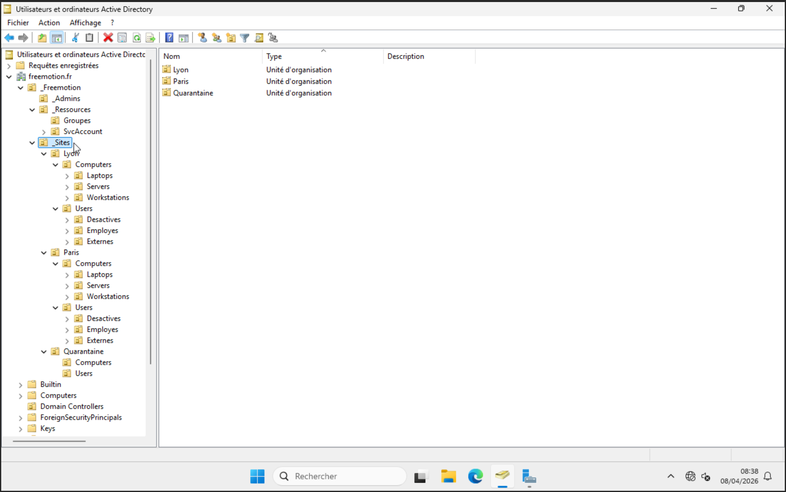
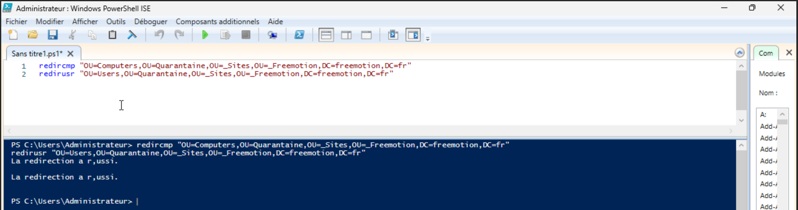

import {LinkButton, Steps, Badge, Aside, Card, CardGrid, StarlightIcon } from '@astrojs/starlight/components';

## Introduction
Cette section décrit l'organisation de l'annuaire Active Directory mis en place pour l'entreprise Freemotion.
L'architecture repose sur le domaine unique `freemotion.fr`, structuré autour de deux sites géographiques : le site principal de Paris, qui héberge l'ensemble des services d'annuaire, et le site secondaire de Lyon, équipé d'un contrôleur de domaine en lecture seule (RODC) pour garantir la continuité de service locale.

---
### Domaine

| Paramètre | Valeur |
|---|---|
| Nom de domaine | `freemotion.fr` |
| Niveau fonctionnel | Windows Server 2025 |
| Site principal | Paris |
| Site secondaire | Lyon (RODC) |

## Organisation des unités organisationnelles (OU)

La hiérarchie des OU suit une logique de découpage par **site géographique** puis par **type d’objet** (ordinateurs, utilisateurs), avec une organisation interne par **usage ou niveau de rôle** (postes, serveurs, employés, externes, etc.). 

Des OU transverses sont utilisées pour les fonctions spécifiques comme l’administration, les ressources et la quarantaine.

```
freemotion.fr
├── _Freemotion
│   ├── _Admins
│   ├── _Sites
│   │   ├── Paris
│   │   │   ├── Computers
│   │   │   │   ├── Workstations
│   │   │   │   ├── Laptops
│   │   │   │   ├── Servers
│   │   │   │   │   ├── Infra
|   │   │   │   │   │   ├──PRS-FILE-01
|   │   │   │   │   │   ├──PRS-RDS-01
|   │   │   │   │   │   ├──PRS-ITAM-01
│   │   │   └── Users
│   │   │       ├── Employes
│   │   │       ├── Externes
│   │   │       └── Desactives
│   │   └── Lyon
│   │       ├── Computers
│   │       │   ├── Workstations
│   │       │   ├── Laptops
│   │       └── Users
│   │          ├── Employes
│   │          ├── Externes
│   │          └── Desactives
│   └── Quarantaine             ← OU de transit pour les nouveaux objets (ordinateurs)
│   └── _Ressources
│       ├── Groupes             ← groupes de sécurité et distribution
│       └── SvcAccounts
└── Domain Controllers          ← OU système — ne pas déplacer
```

Toutes les OU sont regroupées sous une OU racine `_Freemotion`, créée directement à la racine du domaine. Cette convention (underscore en préfixe) garantit qu'elle apparaît en premier dans la console ADUC et la distingue clairement des conteneurs système générés par Windows (`Builtin`, `Computers`, `Users`).

## Sites et contrôleurs de domaine

### Paris — site principal

Le site de Paris héberge les contrôleurs de domaine en lecture/écriture et l'ensemble des services d'infrastructure centraux : DNS, DHCP, WDS/MDT, RDS, PKI interne et serveurs de fichiers. 

C'est depuis ce site que la réplication AD est initiée vers Lyon.

| Rôle | Détail |
|---|---|
| Contrôleurs de domaine | DC01, DC02 (lecture/écriture) |
| Services centraux | DNS, DHCP, RDS, WDS/MDT, PKI, File |
| Réplication | Source vers Lyon |

### Lyon — site secondaire (RODC)

Le site de Lyon est équipé d'un contrôleur de domaine en lecture seule (RODC). Ce choix est adapté à un site distant disposant d'un environnement physique non sécurisé.

| Rôle | Détail |
|---|---|
| Contrôleur de domaine | RODC-LY01 (lecture seule) |
| Réplication | Reçoit depuis Paris (DC01) |
| Mots de passe mis en cache | Limités aux comptes du site Lyon uniquement |
| Services locaux | DNS secondaire |

> **Note :** La liste des comptes autorisés à mettre leur mot de passe en cache sur le RODC doit être gérée via le groupe `Allowed RODC Password Replication Group`. Aucun compte à droits privilégiés ne doit figurer dans ce groupe. Voir la section [Stratégie de réplication des mots de passe (PRP)](../doc-replication-mdp-prp)


## Conventions de nommage

### Comptes utilisateurs

| Type | Format | Exemple |
|---|---|---|
| Employé standard | `p.nom` | `p.dupont` |
| Prestataire externe | `ext.nom` | `ext.martin` |
| Compte de service | `svc.service` | `svc.backup` |
| Compte admin  | `adm.nom` | `adm.dupont` |

### Objets ordinateurs

| Type | Format | Exemple |
|---|---|---|
| Poste fixe Paris | `PRS-WS-XXXX` | `PRS-WS-0042` |
| Laptop Paris | `PRS-LT-XXXX` | `PRS-LT-0012` |
| Serveur Paris | `PRS-ROLE-XX` | `PRS-FILE-01` |
| Poste fixe Lyon | `LY-WS-XXXX` | `LY-WS-0001` |

---
## Principes d'administration

Quelques règles fondamentales encadrent la gestion quotidienne de l'annuaire Freemotion.

Les objets ne sont jamais placés dans les conteneurs par défaut `Computers` et `Users` du domaine. Toute jonction de domaine doit rediriger vers l'OU `Quarantine` du site concerné via les commandes `redircmp` et `redirusr`.

Les comptes administrateurs sont strictement séparés des comptes utilisateurs du quotidien. Un administrateur dispose d'un compte standard pour ses tâches courantes et d'un compte dédié préfixé `adm.` pour les opérations d'administration.

Les comptes externes disposent systématiquement d'une date d'expiration. Aucun compte prestataire ou partenaire ne doit exister sans attribut `accountExpires` renseigné.

Tout compte dont le titulaire quitte l'entreprise est désactivé le jour du départ et déplacé dans l'OU `Desactives` du site correspondant. La suppression définitive intervient après 30 jours, sur validation RH.

---

## Création des OU 

Grâce à PowerShell, la création des OU nécessaires à la structuration du domaine `freemotion.fr` dans Active Directory est automatisée, assurant une organisation claire et sécurisée.

```
Import-Module ActiveDirectory -ErrorAction Stop

# Base DN
$domain = "DC=freemotion,DC=fr"

# Création racine
New-ADOrganizationalUnit -Name "_Freemotion" -Path $domain

# Niveau 1
New-ADOrganizationalUnit -Name "_Admins" -Path "OU=_Freemotion,$domain"
New-ADOrganizationalUnit -Name "_Sites" -Path "OU=_Freemotion,$domain"
New-ADOrganizationalUnit -Name "_Ressources" -Path "OU=_Freemotion,$domain"

# --- SITES ---
New-ADOrganizationalUnit -Name "Quarantaine" -Path "OU=_Sites,OU=_Freemotion,$domain"

# Sous OU Quarantaine
New-ADOrganizationalUnit -Name "Computers" -Path "OU=Quarantaine,OU=_Sites,OU=_Freemotion,$domain"
New-ADOrganizationalUnit -Name "Users" -Path "OU=Quarantaine,OU=_Sites,OU=_Freemotion,$domain"


# Paris
New-ADOrganizationalUnit -Name "Paris" -Path "OU=_Sites,OU=_Freemotion,$domain"

New-ADOrganizationalUnitNew -Name "Computers" -Path "OU=Paris,OU=_Sites,OU=_Freemotion,$domain"
New-ADOrganizationalUnit -Name "Users" -Path "OU=Paris,OU=_Sites,OU=_Freemotion,$domain"

New-ADOrganizationalUnit -Name "Workstations" -Path "OU=Computers,OU=Paris,OU=_Sites,OU=_Freemotion,$domain"
New-ADOrganizationalUnit -Name "Laptops" -Path "OU=Computers,OU=Paris,OU=_Sites,OU=_Freemotion,$domain"
New-ADOrganizationalUnit -Name "Servers" -Path "OU=Computers,OU=Paris,OU=_Sites,OU=_Freemotion,$domain"

New-ADOrganizationalUnit -Name "Infra" -Path "OU=Servers,OU=Computers,OU=Paris,OU=_Sites,OU=_Freemotion,$domain"

New-ADOrganizationalUnit -Name "Employes" -Path "OU=Users,OU=Paris,OU=_Sites,OU=_Freemotion,$domain"
New-ADOrganizationalUnit -Name "Externes" -Path "OU=Users,OU=Paris,OU=_Sites,OU=_Freemotion,$domain"
New-ADOrganizationalUnit -Name "Desactives" -Path "OU=Users,OU=Paris,OU=_Sites,OU=_Freemotion,$domain"

# Lyon
New-ADOrganizationalUnit -Name "Lyon" -Path "OU=_Sites,OU=_Freemotion,$domain"

New-ADOrganizationalUnit -Name "Computers" -Path "OU=Lyon,OU=_Sites,OU=_Freemotion,$domain"
New-ADOrganizationalUnit -Name "Users" -Path "OU=Lyon,OU=_Sites,OU=_Freemotion,$domain"

New-ADOrganizationalUnit -Name "Workstations" -Path "OU=Computers,OU=Lyon,OU=_Sites,OU=_Freemotion,$domain"
New-ADOrganizationalUnit -Name "Laptops" -Path "OU=Computers,OU=Lyon,OU=_Sites,OU=_Freemotion,$domain"

New-ADOrganizationalUnit -Name "Employes" -Path "OU=Users,OU=Lyon,OU=_Sites,OU=_Freemotion,$domain"
New-ADOrganizationalUnit -Name "Externes" -Path "OU=Users,OU=Lyon,OU=_Sites,OU=_Freemotion,$domain"
New-ADOrganizationalUnit -Name "Desactives" -Path "OU=Users,OU=Lyon,OU=_Sites,OU=_Freemotion,$domain"

# --- RESSOURCES ---
New-ADOrganizationalUnit -Name "Groupes" -Path "OU=_Ressources,OU=_Freemotion,$domain"
New-ADOrganizationalUnit -Name "SvcAccounts" -Path "OU=_Ressources,OU=_Freemotion,$domain"
```

Résultat obtenu après l’exécution du script PowerShell : la création réussie de l’ensemble des unités d’organisation (OU).


---
### Redirection des comptes ordinateurs et utilisateurs

Après la mise en place de la structure des OU, les commandes `redircmp` et `redirusr` permettent de rediriger automatiquement la création des nouveaux objets vers l'OU Quarantaine, 
plutôt que dans les conteneurs par défaut de l'Active Directory (`CN=Computers` et `CN=Users`).

#### Mise en œuvre

La commande **redircmp** permet de rediriger tous les nouveaux comptes ordinateurs vers l’OU Quarantaine par défaut :

`redircmp "OU=Computers,OU=Quarantaine,OU=_Sites,OU=_Freemotion,DC=freemotion,DC=fr"`

La commande **redirusr** permet de faire la même chose pour les comptes utilisateurs :

`redirusr "OU=Users,OU=Quarantaine,OU=_Sites,OU=_Freemotion,DC=freemotion,DC=fr"`

- Tous les ordinateurs nouvellement ajoutés au domaine seront créés dans l’OU *Quarantaine*, quelle que soit leur future destination (Paris ou Lyon).
- Tous les nouveaux comptes utilisateurs seront également créés dans l’OU *Quarantaine* avant d’être organisés.
- Cette configuration est permanente : elle s’applique à tous les objets créés après l’exécution des commandes, jusqu’à modification future.



Tous les nouveaux objets intégreront le domaine dans un premier temps au sein de l’OU **Quarantaine**.

- Les **postes** seront ensuite déplacés vers leur **OU finale** correspondant à leur site et à leur type (Workstations ou Laptops).
- Les **comptes utilisateurs** seront déplacés vers leur **OU cible** en fonction de leur site et de leur statut (Employés, Externes, Désactivés).

---

<Aside type="tip" title="Structure organisationnelles terminées">
La structure de l’Active Directory étant désormais définie avec la création des unités d’organisation (OU), 
la prochaine étape consiste à configurer la **réplication des mots de passe (PRP)** avant de procéder à la gestion des GPO.
</Aside>