import {LinkButton, Steps, Badge, Aside, Card, CardGrid, StarlightIcon } from '@astrojs/starlight/components';

## Introduction

Cette section décrit la mise en place de la solution de pare-feu pour l'entreprise Freemotion.

L'architecture repose sur deux pfSense déployés en haute disponibilité (HA) via le protocole CARP sur chacun des deux sites, 
à Paris comme à Lyon, garantissant la continuité du filtrage réseau et la bascule automatique en cas de défaillance d'un des deux nœuds d'un site.

---

### Rappel d'architecture 

#### WAN

| Site  | Rôle           | Hostname | Adresse IP      | Statut CARP |
|-------|----------------|--------------------|------------------|-------------|
| Paris | Pare-feu       | PRS-FW01          | 192.168.254.19       | <Badge text="Master" variant="success" />      |
| Paris | Pare-feu       | PRS-FW02         | 192.168.254.29    | <Badge text="Slave" variant="caution" />        |
| Paris | IP virtuelle   | PRS-FW-VIP                | 192.168.254.9      | <Badge text="VIP (CARP)" variant="note" />  |
| Lyon  | Pare-feu       | LY-FW01          | 192.168.254.49        | <Badge text="Master" variant="success" />      |
| Lyon  | Pare-feu       | LY-FW02          | 192.168.254.59        | <Badge text="Slave" variant="caution" />       |
| Lyon  | IP virtuelle   | LY-FW-VIP                  | 192.168.254.39      | <Badge text="VIP (CARP)" variant="note" />  |
|. | Gateway Internet | . | 192.168.254.254 | .  |

#### LAN

| Site  | Rôle           | Hostname | Adresse IP          | Statut CARP |
|-------|----------------|--------------------|--------------------|-------------|
| Paris | Pare-feu       | PRS-FW01         | 10.9.75.2            | <Badge text="Master" variant="success" />      |
| Paris | Pare-feu       | PRS-FW02         | 10.9.75.3            | <Badge text="Slave" variant="caution" />        |
| Paris | Gateway LAN PARIS VIP CARP | PRS-FW-LAN-VIP    | 10.9.75.1 | <Badge text="VIP (CARP)" variant="note" />  |
| Lyon  | Pare-feu       | LY-FW01          | 10.9.69.2       | <Badge text="Master" variant="success" />      |
| Lyon  | Pare-feu       | LY-FW02          | 10.9.69.3       | <Badge text="Slave" variant="caution" />       |
| Lyon  | Gateway LAN Lyon VIP CARP   | LY-FW-LAN-VIP	   | 10.9.69.1            | <Badge text="VIP (CARP)" variant="note" />  |

---

## Haute Disponibilité avec CARP

CARP (_Common Address Redundancy Protocol_) est un protocole réseau permettant à plusieurs machines de partager une adresse IP virtuelle (VIP). 
En cas de défaillance du nœud **Master**, le nœud **Slave** prend automatiquement en charge la VIP sans interruption de service, assurant ainsi la continuité du filtrage réseau.

Dans le cadre du projet Freemotion, pfSense exploite CARP conjointement avec **pfSync**, qui se charge de synchroniser en temps réel les tables d'états des connexions entre les deux nœuds d'un même site. 
Cette combinaison garantit qu'en cas de bascule, les sessions réseau actives ne sont pas interrompues.

Deux paires de pare-feu sont déployées de manière indépendante :
- **Paris** : PRS-FW01  (Master) et PRS-FW02 (Slave).
- **Lyon** : LY-FW01  (Master) et LY-FW02 (Slave).

Chaque site dispose ainsi de sa propre redondance locale, sans dépendance entre les deux sites.

### Interfaces réseau

Chaque nœud pfSense est configuré avec les interfaces réseau suivantes :

| Interface | Rôle                        | Site       |
|-----------|-----------------------------|------------|
| WAN       | Connexion vers Internet      | Paris / Lyon |
| LAN       | Réseau local du site         | Paris / Lyon |
| OPT1      | Synchronisation pfSync       | Paris / Lyon |

:::note
L'interface OPT1 dédiée à pfSync n'est pas configurée lors de l'installation initiale. Elle est ajoutée et assignée ultérieurement depuis l'interface graphique de pfSense.
:::

### Installation

#### Installation de pfSense

Lors de l'installation, deux interfaces sont détectées et assignées :

- **WAN** : interface connectée vers l'extérieur.
- **LAN** : interface connectée au réseau local du site (LAN Paris pour PRS-FW01/02, LAN Lyon pour LY-FW01/02).

Ensuite la configuration des interfaces réseaux est réalisée  : 

##### Paris : 
**PRS-FW01**
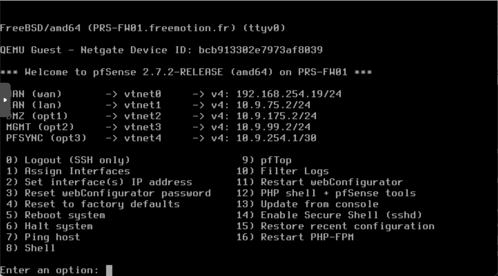

**PRS-FW02**
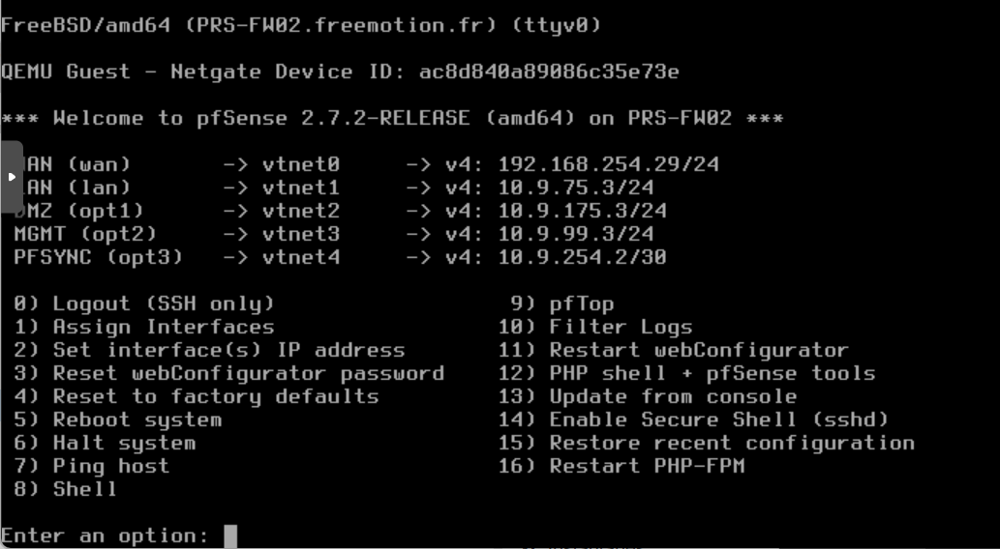

##### Lyon : 
**LY-FW01**
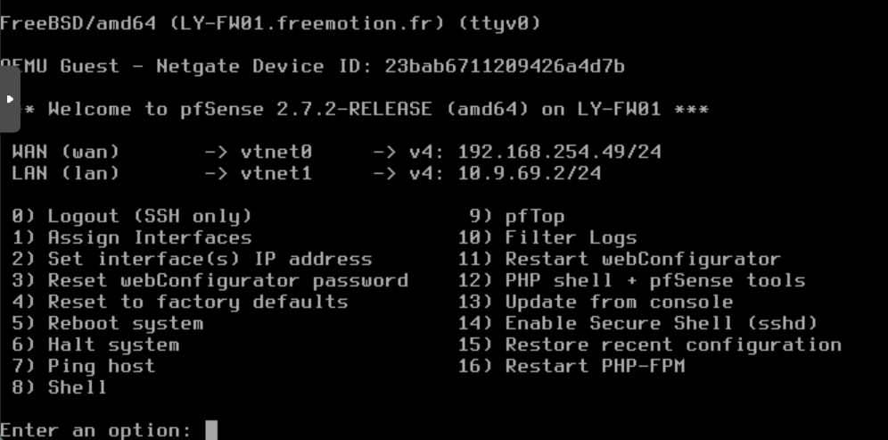

**LY-FW02**
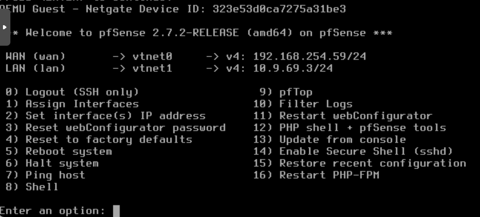

Une fois les adresses IP configurées en ligne de commande lors de l'installation, l'interface graphique de pfSense est accessible depuis un navigateur. 
La suite de la configuration s'effectue entièrement depuis cette interface.

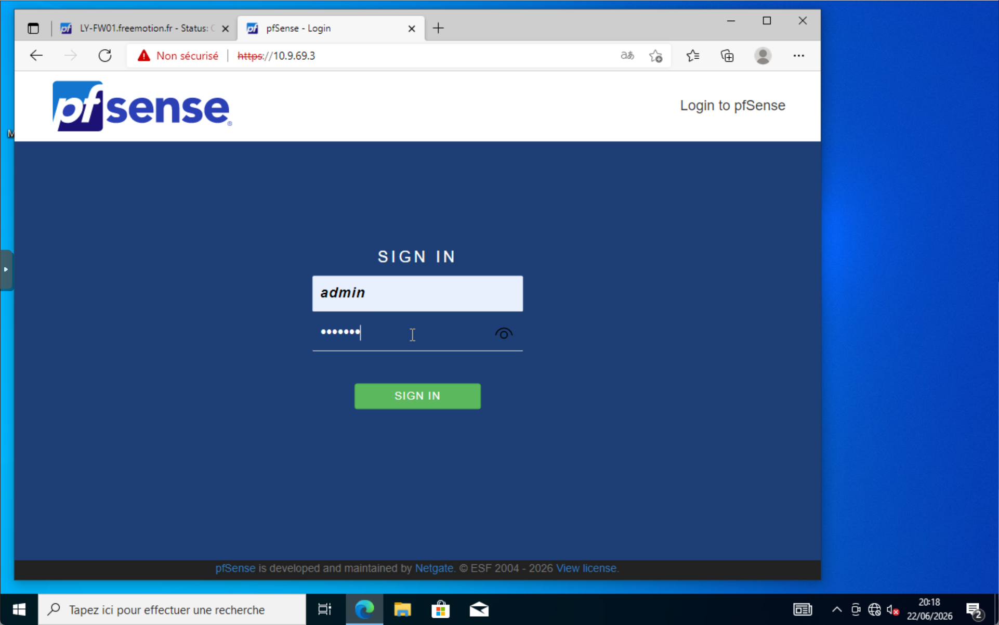

### Ajout de l'interface pfSync (OPT1)

L'interface OPT1 est dédiée exclusivement à la synchronisation entre les deux nœuds pfSense d'un même site. 
L'utilisation d'un réseau de synchronisation isolé est plus sécurisée que de faire transiter le trafic pfSync sur les interfaces LAN ou WAN, qui sont exposées au reste du réseau.

Elle est ajoutée manuellement depuis l'interface graphique sur chacun des quatre nœuds.

<Steps>
    1. Dans **Interfaces > Assignments**.
    2. **+** permet d'ajouter l'interface disponible - elle apparaît sous le nom **OPT1**.
    3. Sélection de l'interface physique correspondante

        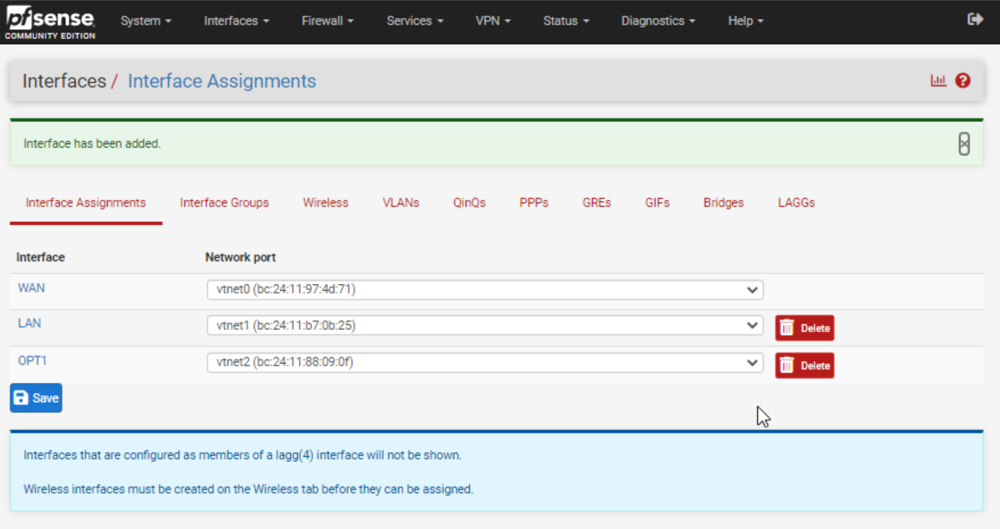
</Steps>

L'interface OPT1 a été ajouté.

### Configuration de l'interface OPT1
   - Activation de l'interface **Enable Interface**.
   - Description `PFSYNC`.
   - Une adresse IP dédiée est renseigner pour la synchronisation.

   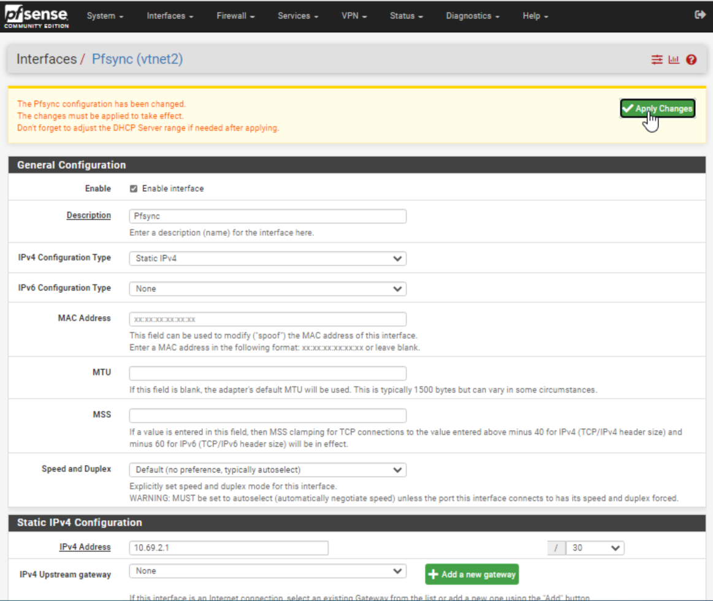

:::note
Cette procédure est répété sur les quatre nœuds (PRS-FW01, PRS-FW02, LY-FW01, LY-FW02) en adaptant l'adresse IP de l'interface pfSync à chaque nœud.
:::

### Création de l'IP virtuelle CARP

La création de l'IP virtuelle n'est effectuée que sur le **Master** de chaque site. Elle sera automatiquement répliquée sur le Slave via pfSync.

<Steps>
    1. Dans **Firewall > Virtual IPs**.
    2. **+** pour créer une nouvelle entrée.
    3. Sélection du type **CARP**.
    4. Choisir l'interface concernée (**LAN** ou **WAN**).
    5. Saisir l'adresse IP virtuelle du cluster.
    6. Mot de passe de groupe (**Password**) pour sécuriser les échanges CARP.
</Steps>

##### IPs virtuelles de Paris
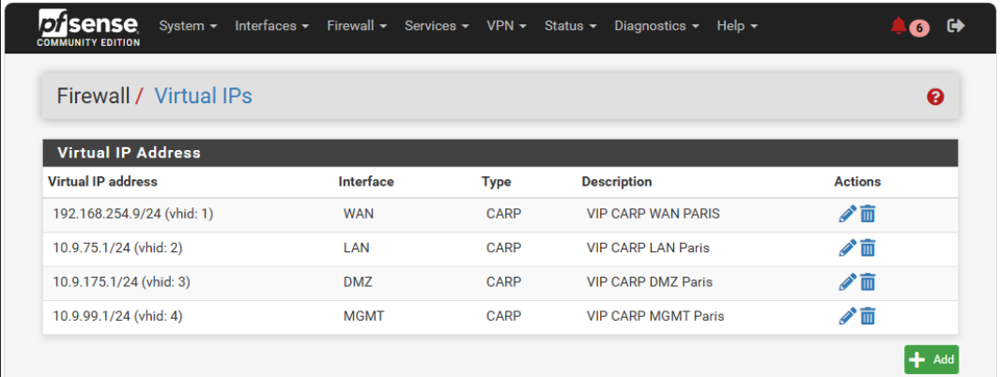 

##### IPs virtuelles de Lyon
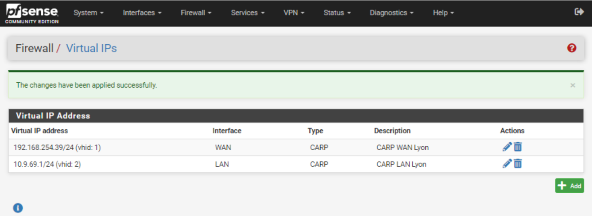 

#### Vérification du statut CARP

Une fois la configuration appliquée, il est possible de vérifier l'état du cluster CARP depuis **Status > CARP (failover)**. 
Les captures suivantes illustrent l'état des nœuds Master et Slave sur chacun des deux sites après mise en place.

##### Paris 
**Master Paris** (PRS-FW01)
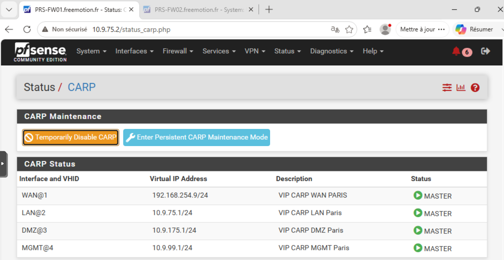 

**Slave Paris** (PRS-FW02)
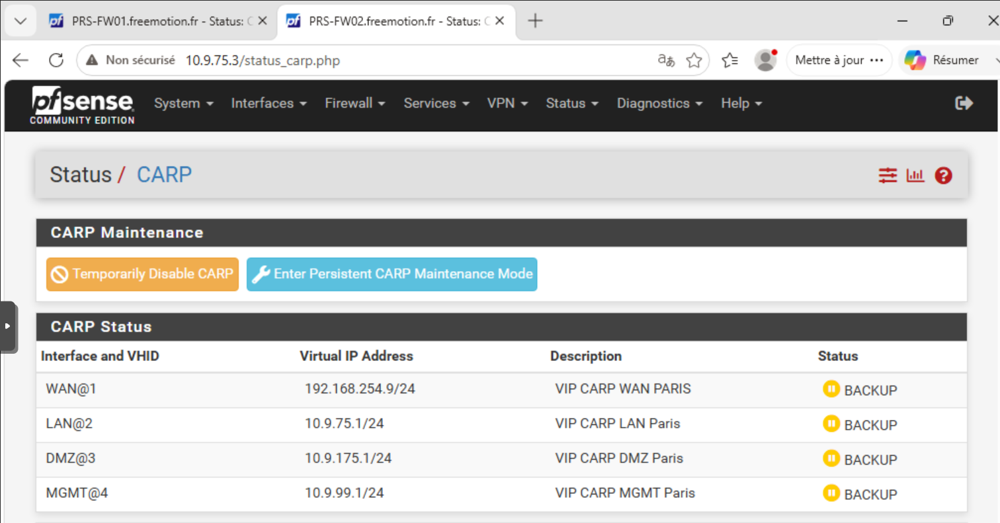 

##### Lyon 
**Master Lyon** (LY-FW01)
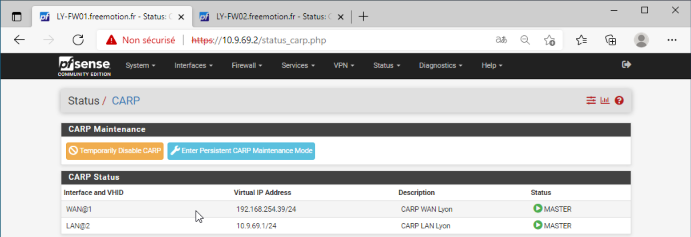 

**Slave Lyon** (LY-FW02)
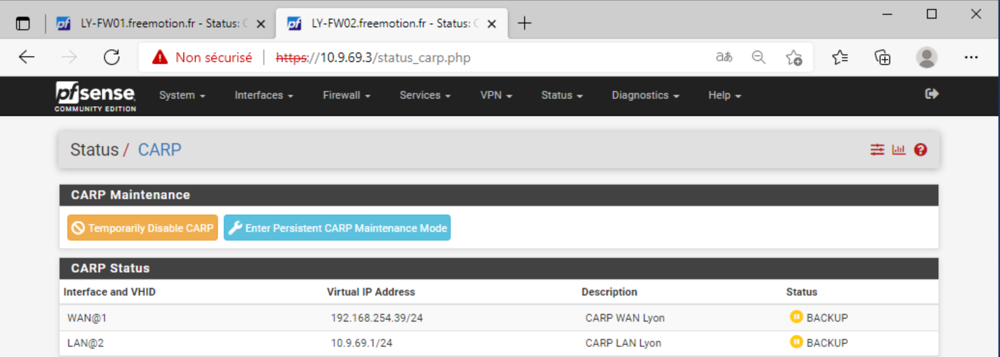 

### Configuration de la haute-disponibilité

<Steps>

    1. Dans **System > High Availability**.
    2. Cocher **Synchronize States** sur le Master et le Slave.
    3. Sélectionner **PFSYNC** comme interface de synchronisation (**Synchronize Interface**).
    4. Renseigner l'IP pfSync du nœud distant dans **pfSync Synchronize Peer IP** pour éviter les échanges en multicast.

</Steps>

La synchronisation pfSync est bidirectionnelle pour les états de connexion, mais la réplication de configuration via XMLRPC est quant à elle unidirectionnelle : seul le **Master** pousse sa configuration vers le **Slave**. 
Le champ **Synchronize Config to IP** doit donc rester vide sur le Slave pour éviter tout conflit de configuration.

##### Paris 
**Master Paris** (PRS-FW01)
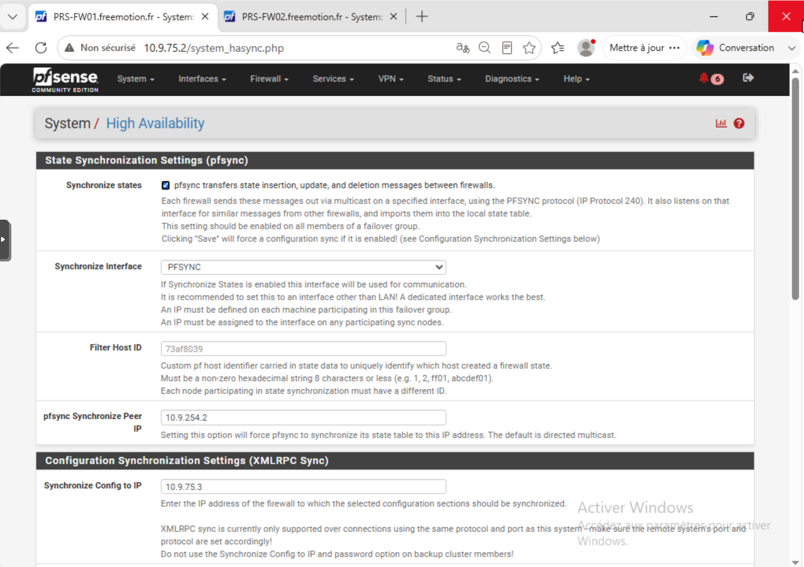 

**Slave Paris** (PRS-FW02)
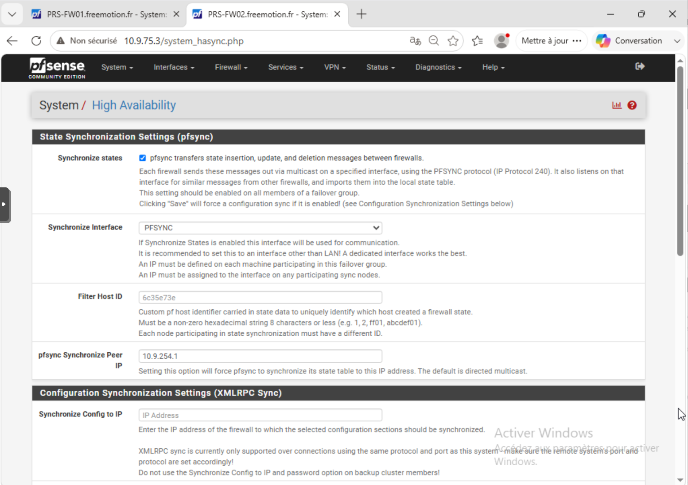 

##### Lyon 
**Master Lyon** (LY-FW01)
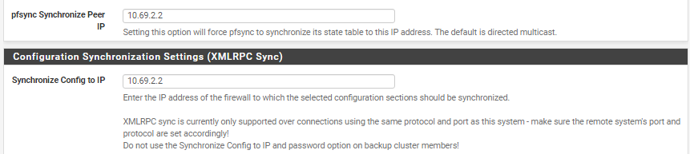 

**Slave Lyon** (LY-FW02)
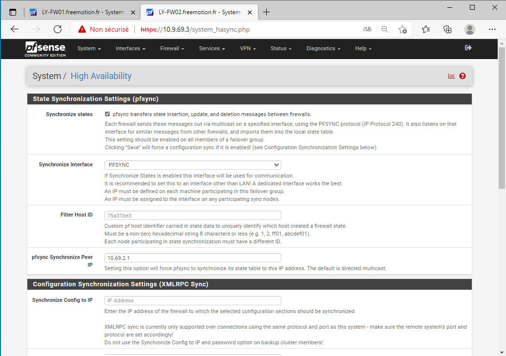 

Dans le bloc **XMLRPC Sync**, les éléments suivants sont cochés sur les deux nœuds :

    - Synchronize Firewall Rules
    - Synchronize Firewall Schedules
    - Synchronize NAT
    - Synchronize Aliases
    - Synchronize Static Routes
    - Synchronize Virtual IPs
    - Synchronize Traffic Shaper

### Règle de pare-feu pour pfSync

Par défaut, pfSense applique des règles de filtrage sur toutes les interfaces, y compris pfSync. 
Il est nécessaire d'ajouter une règle autorisant tout le trafic sur cette interface sur les deux nœuds.

<Steps>
1. Dans **Firewall > Rules > PFSYNC**.
2. Ajouter une règle avec les paramètres suivants :
   - **Action** : Pass
   - **Source** : any
   - **Destination** : any

</Steps>

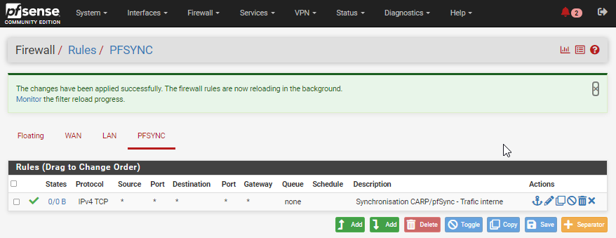 

:::note
Cette règle est créée sur les quatre nœuds : PRS-FW01, PRS-FW02, LY-FW01 et LY-FW02.
:::

L'ensemble de la configuration CARP et pfSync étant en place, 
l'infrastructure de pare-feu du projet Freemotion assure désormais une redondance locale complète sur les sites de Paris et de Lyon.