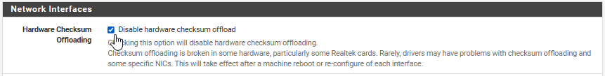
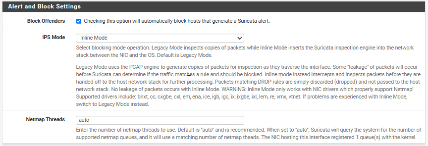
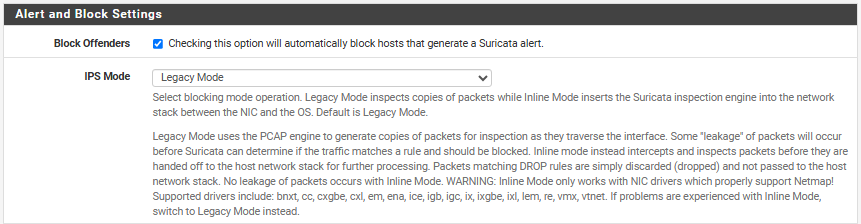
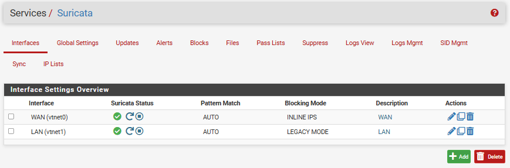
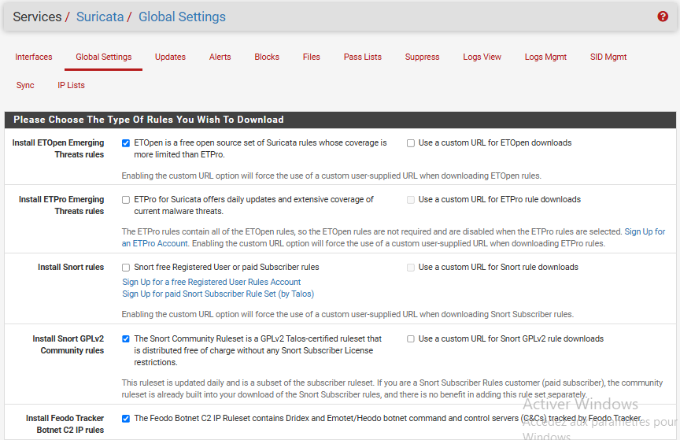
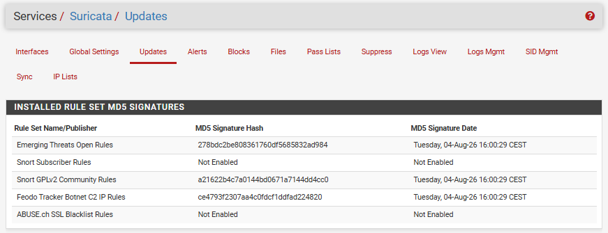

import {LinkButton, Steps, Badge, Aside, Card, CardGrid, StarlightIcon } from '@astrojs/starlight/components';

Cette section décrit la mise en œuvre de la détection et prévention d'intrusion (IDS/IPS) avec Suricata, ainsi que le géoblocage assuré par pfBlockerNG sur les pare-feu pfSense du projet Freemotion.

## Vue d'ensemble

Suricata et pfBlockerNG sont déployés sur les pare-feu pfSense de Paris et de Lyon. Suricata inspecte le trafic en coupure sur l'interface WAN (mode inline IPS), tandis que pfBlockerNG agit en amont via des règles de pare-feu basées sur des alias GeoIP, et au niveau du résolveur DNS (Unbound) pour le filtrage DNSBL. 


| Composant                  | Fonction                                               | Mode / Interface |
|----------------------------|--------------------------------------------------------|------------------|
| Suricata (moteur)          | Inspection et blocage du trafic                        | Inline (IPS) sur le WAN, Legacy (IDS) sur le LAN |
| Ruleset ET Open            | Base de signatures communautaire chargée dans Suricata | WAN et LAN |
| Règles custom Suricata     | Signatures spécifiques au périmètre Freemotion         | WAN et LAN |
| pfBlockerNG-devel (module) | Géoblocage par pays et filtrage DNSBL                  | WAN |

:::note
Suricata et pfBlockerNG sont deux packages pfSense complémentaires mais indépendants : Suricata inspecte le contenu des paquets, pfBlockerNG filtre en amont sur la base de réputation IP et de zones géographiques. Les deux réduisent la charge d'analyse de l'autre en écartant le trafic évident avant inspection approfondie.
:::

## Suricata IDS/IPS

:::note
Suricata s'installe et se configure sur **chaque nœud** de la paire HA (Master et Slave), le package n'étant pas poussé par la synchronisation XML-RPC. En mode CARP, seul le nœud actif inspecte le trafic en production : après tout test de failover, vérifier que Suricata démarre bien sur le nouveau Master, pour éviter un trou de protection.
:::
### Principe et modes de fonctionnement

Suricata fonction selon deux modes distincts, appliqués différemment selon l'interface :

- **Legacy (IDS)** : Suricata observe une copie du trafic et génère des alertes, sans intervenir sur les paquets. C'est un mode passif : une attaque est détectée mais pas empêchée.
- **Inline (IPS)** : le trafic est physiquement forcé de traverser le moteur Suricata avant d'être routé, via la fonctionnalité `netmap`/`inline` de pfSense. Suricata peut alors rejeter un paquet en temps réel.

Modes choisis :
- **WAN — Inline (IPS)** : le trafic entrant, externe et moins prévisible, se prête à un blocage actif une fois le tuning des faux positifs réalisé.
- **LAN — Legacy (IDS)** : un blocage erroné pourrait interrompre un flux métier (réplication AD, pfsync, accès GLPI). L'inspection reste donc passive, pour garder la visibilité sans risquer de couper un service.

:::note
En mode Legacy, la détection n'a de valeur que si les alertes sont exploitées. Les alertes Suricata du LAN sont destinées à être remontées vers Wazuh, sur le même principe que le pipeline déjà en place pour HAProxy, afin qu'une détection interne déclenche une réaction et ne reste pas cantonnée aux logs locaux.
:::

### Configuration des interfaces

<Steps>

1. **Ajout des interfaces à surveiller**

   Dans `Services > Suricata > Interfaces`, puis `+Add` et ajout des interfaces WAN et LAN.

2. **Désactivation du offloading matériel**

   Dans `System > Advanced > Networking`, cocher `Disable hardware checksum offload`. Un redémarrage est nécessaire pour la prise en compte du paramètre.

     
    Ce paramètre permet d’éviter des comportants anormaux dans l’analyse du trafic réseaux.

3. **Activation du blocage en Inline IPS Mode sur le WAN**

   Édition de l'interface WAN dans `Services > Suricata`.
   - Dans la section `Alert and Block Settings` 
   - Cocher la case de blocage automatique 
   - Sélection de **`Inline Mode`**. 

     

   Le trafic WAN est alors physiquement forcé de traverser le moteur avant routage, permettant un rejet en temps réel.

4. **Interface LAN en Legacy Mode, sans blocage**

   Édition de l'interface WAN dans `Services > Suricata`.
   - Dans la section `Alert and Block Settings` 
   - Cocher la case de blocage automatique 
   - Sélection de **`Legacy Mode`**. 
    
     
    
    Le trafic LAN est analysé à partir d'une copie des paquets, sans traverser physiquement le moteur Suricata. Les menaces sont détectées après leur passage, puis l'adresse IP source est ajoutée à la table de blocage de pfSense afin de bloquer les communications suivantes.

</Steps>

Cette configuration est réalisée sur **chaque nœud** des paires HA (Master et Slave) du site de Paris et de Lyon.
 

### Ruleset Emerging Threats Open

Le ruleset **ET Open** (Emerging Threats Open, maintenu par Proofpoint) constitue la base de signatures principale. Il est gratuit, mis à jour quotidiennement, et couvre un large spectre de menaces : scans, exploits connus, malwares, C2, trafic anormal de protocoles.

Dans `System > Advanced > Global Settings`

<Steps>

   1. **Installation d'ET Open Emerging Threats Open rules** et les rulesets complémentaires **Snort GPLv2 Community Rules** et **Feodo Tracker Botnet C2 IP Ruleset**
    

   2. Fréquence de mise à jour des règles 
      - `Update Interval` : **1 Day**
      - `Update Start Time` : **3:00**
   
   3. Enregistrement et premier téléchargement dans `Services > Suricata > Updates` 
    

</Steps>

Cette étape est répété sur **chaque nœud** des paires HA (Master et Slave) de Paris et de Lyon. 

### Sélection des catégories de règles par interface

Le ruleset complet représente plusieurs dizaines de milliers de signatures. Les charger toutes sur une interface génère un volume d'alertes ingérable et un risque de faux positifs élevé. 
La sélection se fait par interface, dans `Services > Suricata > Interfaces > [WAN/LAN] > Categories`

Le ruleset complet représente plusieurs dizaines de milliers de signatures ; les charger toutes sur une interface génère un volume d'alertes ingérable. La sélection se fait par interface, dans `Services > Suricata > Interfaces > [WAN/LAN] > Categories`.

Principe retenu :
- **WAN** : toutes les catégories orientées menaces externes sont activées (exploits, scans, malware, C2, DoS, phishing).
- **LAN** : mêmes catégories, à l'exception de `emerging-ciarmy` / `emerging-dshield` / `emerging-compromised`, désactivées côté LAN car redondantes avec le blocage GeoIP/réputation IP déjà assuré par pfBlockerNG sur le WAN.
- Catégories exclues sur les deux interfaces : `emerging-policy`, `emerging-games`, `emerging-chat` — fort taux de faux positifs, hors périmètre sécurité.

Une fois les catégories cochées, la configuration est **Save**, puis le service Suricata est redémarré  **Restart Suricata on this interface**.

{/*     
### Règles custom Suricata

La catégorie `custom.rules` permet d'ajouter des signatures propres au périmètre Freemotion, non couvertes par ET Open. Elle se retrouve dans `Services > Suricata > Interfaces > [WAN/LAN] > Rules`, en sélectionnant la catégorie **custom.rules** dans le menu déroulant.

<Steps>

   1. **Accès à l'éditeur de règles custom**

      Dans l'onglet `Rules` de l'interface concernée, sélectionner `custom.rules` dans la liste des catégories, puis cliquer sur l'icône d'édition (crayon) pour ouvrir l'éditeur de texte.

   2. **Ajout d'une signature dédiée à l'accès admin GLPI**

      Exemple de règle alertant sur une tentative de bruteforce du formulaire de connexion GLPI exposé en reverse proxy :

   3. **Ajout d'une signature de détection de scan ciblé sur le VIP HAProxy**

   4. **Enregistrement et rechargement**

      

</Steps>

Après avoir sauvegarder la configuration, le service doit est redémarré pour compiler et activer les nouvelles signatures.


:::note
Les `sid` (Signature ID) custom doivent rester dans la plage réservée aux règles locales (généralement à partir de 1 000 000 ou 9 000 000 selon la convention retenue) afin de ne jamais entrer en collision avec un `sid` du ruleset ET Open lors d'une mise à jour.
:::

### Vérification et test de la détection

<Steps>

   1. **Consultation des alertes**

      Dans `Services > Suricata > Interfaces > [Interface] > Alerts`, les alertes générées par Suricata s'affichent avec horodatage, signature déclenchée, IP source/destination et classification de sévérité.

   2. **Consultation des blocages (WAN Inline)**

      Dans l'onglet `Blocks`, les IP effectivement bloquées par le moteur en mode Inline apparaissent, avec la règle à l'origine du blocage.

   3. **Test de déclenchement contrôlé**

      Depuis un poste externe, une requête `curl` reproduisant un motif connu (par exemple un user-agent de scanner ou un chemin d'URI signé) permet de vérifier que la chaîne détection → alerte → blocage fonctionne de bout en bout, sans attendre une attaque réelle :

      ```bash
      curl -A "() { :; }; echo VULNERABLE" -sk https://<IP_WAN_PRS-FW01>/
      ```

      Cette requête simule une tentative d'exploitation Shellshock, couverte par une signature ET Open, et doit apparaître dans `Alerts` (LAN) ou déclencher un blocage visible dans `Blocks` (WAN).

</Steps>

Cette configuration est réalisée sur **chaque nœud** des paires HA (Master et Slave) du site de Paris et de Lyon ; après tout test de failover, vérifier que les catégories et règles custom sont bien chargées sur le nouveau nœud actif.

*/}