<<<<<<< HEAD
---
title: Détection et prévention d'intrusions & Géoblocage avec 
description: Mise en place de Suricata en mode IDS/IPS & Géoblocage avec pfBlockerNG sur les sites de Paris et Lyon pour le projet Scalia - FreeMotions.
---
import {LinkButton, Steps, Badge, Aside, Card, CardGrid, StarlightIcon } from '@astrojs/starlight/components';

Cette section décrit la mise en œuvre de la détection et prévention d'intrusion (IDS/IPS) avec Suricata, ainsi que le géoblocage assuré par pfBlockerNG sur les pare-feu pfSense du projet Freemotion.

## Vue d'ensemble

Suricata et pfBlockerNG sont déployés sur les pare-feu pfSense de Paris et de Lyon. Suricata inspecte le trafic en coupure sur l'interface WAN (mode inline IPS), tandis que pfBlockerNG agit en amont via des règles de pare-feu basées sur des alias GeoIP, et au niveau du résolveur DNS (Unbound) pour le filtrage DNSBL. 


| Composant                  | Fonction                                               | Mode / Interface |
|----------------------------|--------------------------------------------------------|------------------|
| Suricata (moteur)          | Inspection et blocage du trafic                        | Inline (IPS) sur le WAN, Legacy (IDS) sur le LAN |
| Ruleset ET Open            | Base de signatures communautaire chargée dans Suricata | WAN et LAN |
| Règles custom Suricata     | Signatures spécifiques au périmètre Freemotion         | WAN et LAN |
| pfBlockerNG-devel (module) | Géoblocage par pays et filtrage DNSBL                  | WAN |

:::note
Suricata et pfBlockerNG sont deux packages pfSense complémentaires mais indépendants : Suricata inspecte le contenu des paquets, pfBlockerNG filtre en amont sur la base de réputation IP et de zones géographiques. Les deux réduisent la charge d'analyse de l'autre en écartant le trafic évident avant inspection approfondie.
:::

## Suricata IDS/IPS

:::note
Suricata s'installe et se configure sur **chaque nœud** de la paire HA (Master et Slave), le package n'étant pas poussé par la synchronisation XML-RPC. En mode CARP, seul le nœud actif inspecte le trafic en production : après tout test de failover, vérifier que Suricata démarre bien sur le nouveau Master, pour éviter un trou de protection.
:::
### Principe et modes de fonctionnement

Suricata fonction selon deux modes distincts, appliqués différemment selon l'interface :

- **Legacy (IDS)** : Suricata observe une copie du trafic et génère des alertes, sans intervenir sur les paquets. C'est un mode passif : une attaque est détectée mais pas empêchée.
- **Inline (IPS)** : le trafic est physiquement forcé de traverser le moteur Suricata avant d'être routé, via la fonctionnalité `netmap`/`inline` de pfSense. Suricata peut alors rejeter un paquet en temps réel.

Modes choisis :
- **WAN — Inline (IPS)** : le trafic entrant, externe et moins prévisible, se prête à un blocage actif une fois le tuning des faux positifs réalisé.
- **LAN — Legacy (IDS)** : un blocage erroné pourrait interrompre un flux métier (réplication AD, pfsync, accès GLPI). L'inspection reste donc passive, pour garder la visibilité sans risquer de couper un service.

:::note
En mode Legacy, la détection n'a de valeur que si les alertes sont exploitées. Les alertes Suricata du LAN sont destinées à être remontées vers Wazuh, sur le même principe que le pipeline déjà en place pour HAProxy, afin qu'une détection interne déclenche une réaction et ne reste pas cantonnée aux logs locaux.
:::

### Configuration des interfaces

<Steps>

1. **Ajout des interfaces à surveiller**

   Dans `Services > Suricata > Interfaces`, puis `+Add` et ajout des interfaces WAN et LAN.

2. **Désactivation du offloading matériel**

   Dans `System > Advanced > Networking`, cocher `Disable hardware checksum offload`. Un redémarrage est nécessaire pour la prise en compte du paramètre.

     
    Ce paramètre permet d’éviter des comportants anormaux dans l’analyse du trafic réseaux.

3. **Activation du blocage en Inline IPS Mode sur le WAN**

   Édition de l'interface WAN dans `Services > Suricata`.
   - Dans la section `Alert and Block Settings` 
   - Cocher la case de blocage automatique 
   - Sélection de **`Inline Mode`**. 

    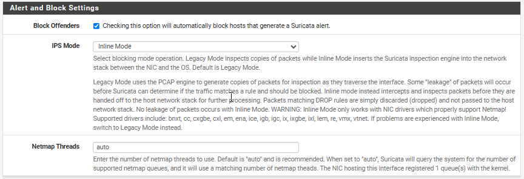 

   Le trafic WAN est alors physiquement forcé de traverser le moteur avant routage, permettant un rejet en temps réel.

4. **Interface LAN en Legacy Mode, sans blocage**

   Édition de l'interface WAN dans `Services > Suricata`.
   - Dans la section `Alert and Block Settings` 
   - Cocher la case de blocage automatique 
   - Sélection de **`Legacy Mode`**. 
    
     
    
    Le trafic LAN est analysé à partir d'une copie des paquets, sans traverser physiquement le moteur Suricata. Les menaces sont détectées après leur passage, puis l'adresse IP source est ajoutée à la table de blocage de pfSense afin de bloquer les communications suivantes.

</Steps>

Cette configuration est réalisée sur **chaque nœud** des paires HA (Master et Slave) du site de Paris et de Lyon.
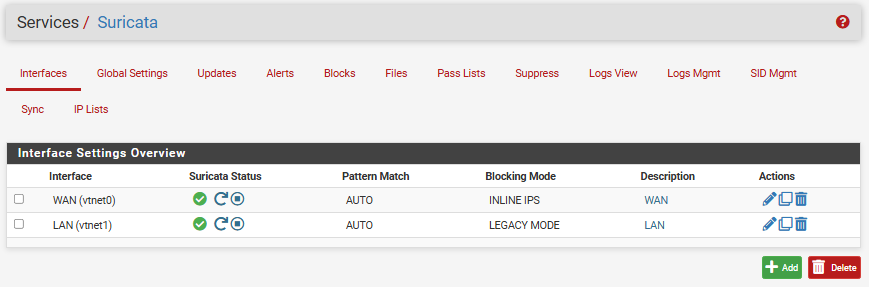 

### Ruleset Emerging Threats Open

Le ruleset **ET Open** (Emerging Threats Open, maintenu par Proofpoint) constitue la base de signatures principale. Il est gratuit, mis à jour quotidiennement, et couvre un large spectre de menaces : scans, exploits connus, malwares, C2, trafic anormal de protocoles.

Dans `System > Advanced > Global Settings`

<Steps>

   1. **Installation d'ET Open Emerging Threats Open rules** et les rulesets complémentaires **Snort GPLv2 Community Rules** et **Feodo Tracker Botnet C2 IP Ruleset**
   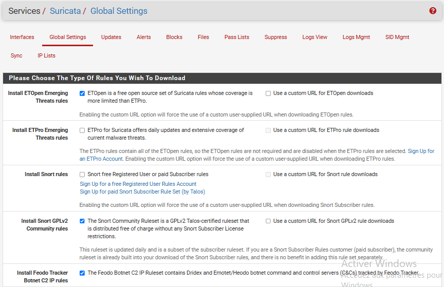 

   2. Fréquence de mise à jour des règles 
      - `Update Interval` : **1 Day**
      - `Update Start Time` : **3:00**
   
   3. Enregistrement et premier téléchargement dans `Services > Suricata > Updates` 
   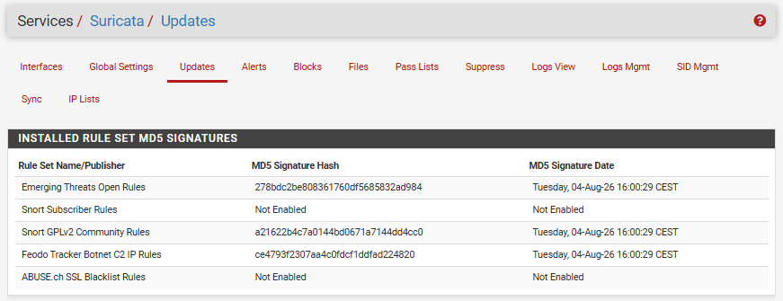 

</Steps>

Cette étape est répété sur **chaque nœud** des paires HA (Master et Slave) de Paris et de Lyon. 

### Sélection des catégories de règles par interface

Le ruleset complet représente plusieurs dizaines de milliers de signatures. Les charger toutes sur une interface génère un volume d'alertes ingérable et un risque de faux positifs élevé. 
La sélection se fait par interface, dans `Services > Suricata > Interfaces > [WAN/LAN] > Categories`

Le ruleset complet représente plusieurs dizaines de milliers de signatures ; les charger toutes sur une interface génère un volume d'alertes ingérable. La sélection se fait par interface, dans `Services > Suricata > Interfaces > [WAN/LAN] > Categories`.

Principe retenu :
- **WAN** : toutes les catégories orientées menaces externes sont activées (exploits, scans, malware, C2, DoS, phishing).
- **LAN** : mêmes catégories, à l'exception de `emerging-ciarmy` / `emerging-dshield` / `emerging-compromised`, désactivées côté LAN car redondantes avec le blocage GeoIP/réputation IP déjà assuré par pfBlockerNG sur le WAN.
- Catégories exclues sur les deux interfaces : `emerging-policy`, `emerging-games`, `emerging-chat` — fort taux de faux positifs, hors périmètre sécurité.

Une fois les catégories cochées, la configuration est **Save**, puis le service Suricata est redémarré  **Restart Suricata on this interface**.

{/*     
### Règles custom Suricata

La catégorie `custom.rules` permet d'ajouter des signatures propres au périmètre Freemotion, non couvertes par ET Open. Elle se retrouve dans `Services > Suricata > Interfaces > [WAN/LAN] > Rules`, en sélectionnant la catégorie **custom.rules** dans le menu déroulant.

<Steps>

   1. **Accès à l'éditeur de règles custom**

      Dans l'onglet `Rules` de l'interface concernée, sélectionner `custom.rules` dans la liste des catégories, puis cliquer sur l'icône d'édition (crayon) pour ouvrir l'éditeur de texte.

   2. **Ajout d'une signature dédiée à l'accès admin GLPI**

      Exemple de règle alertant sur une tentative de bruteforce du formulaire de connexion GLPI exposé en reverse proxy :

   3. **Ajout d'une signature de détection de scan ciblé sur le VIP HAProxy**

   4. **Enregistrement et rechargement**

      

</Steps>

Après avoir sauvegarder la configuration, le service doit est redémarré pour compiler et activer les nouvelles signatures.


:::note
Les `sid` (Signature ID) custom doivent rester dans la plage réservée aux règles locales (généralement à partir de 1 000 000 ou 9 000 000 selon la convention retenue) afin de ne jamais entrer en collision avec un `sid` du ruleset ET Open lors d'une mise à jour.
:::

### Vérification et test de la détection

<Steps>

   1. **Consultation des alertes**

      Dans `Services > Suricata > Interfaces > [Interface] > Alerts`, les alertes générées par Suricata s'affichent avec horodatage, signature déclenchée, IP source/destination et classification de sévérité.

   2. **Consultation des blocages (WAN Inline)**

      Dans l'onglet `Blocks`, les IP effectivement bloquées par le moteur en mode Inline apparaissent, avec la règle à l'origine du blocage.

   3. **Test de déclenchement contrôlé**

      Depuis un poste externe, une requête `curl` reproduisant un motif connu (par exemple un user-agent de scanner ou un chemin d'URI signé) permet de vérifier que la chaîne détection → alerte → blocage fonctionne de bout en bout, sans attendre une attaque réelle :

      ```bash
      curl -A "() { :; }; echo VULNERABLE" -sk https://<IP_WAN_PRS-FW01>/
      ```

      Cette requête simule une tentative d'exploitation Shellshock, couverte par une signature ET Open, et doit apparaître dans `Alerts` (LAN) ou déclencher un blocage visible dans `Blocks` (WAN).

</Steps>

Cette configuration est réalisée sur **chaque nœud** des paires HA (Master et Slave) du site de Paris et de Lyon ; après tout test de failover, vérifier que les catégories et règles custom sont bien chargées sur le nouveau nœud actif.

*/}
=======
---
title: Détection et prévention d'intrusions & Géoblocage avec 
description: Mise en place de Suricata en mode IDS/IPS & Géoblocage avec pfBlockerNG sur les sites de Paris et Lyon pour le projet Scalia - FreeMotions.
---
import {LinkButton, Steps, Badge, Aside, Card, CardGrid, StarlightIcon } from '@astrojs/starlight/components';

Cette section décrit la mise en œuvre de la détection et prévention d'intrusion (IDS/IPS) avec Suricata, ainsi que le géoblocage assuré par pfBlockerNG sur les pare-feu pfSense du projet Freemotion.

{/*     */}

## Vue d'ensemble

Suricata et pfBlockerNG sont déployés sur les pare-feu pfSense de Paris et de Lyon. Suricata inspecte le trafic en coupure sur l'interface WAN (mode inline IPS), tandis que pfBlockerNG agit en amont via des règles de pare-feu basées sur des alias GeoIP, et au niveau du résolveur DNS (Unbound) pour le filtrage DNSBL. 


| Composant                  | Fonction                                               | Mode / Interface |
|----------------------------|--------------------------------------------------------|------------------|
| Suricata (moteur)          | Inspection et blocage du trafic                        | Inline (IPS) sur le WAN, Legacy (IDS) sur le LAN et la DMZ, IDS sur le Management |
| Ruleset ET Open            | Base de signatures communautaire chargée dans Suricata | WAN, LAN, DMZ, Management |
| Règles custom Suricata     | Signatures spécifiques au périmètre Freemotion         | WAN, LAN, DMZ, Management |
| pfBlockerNG-devel (module) | Géoblocage par pays et filtrage DNSBL                  | WAN |

:::note
Suricata et pfBlockerNG sont deux packages pfSense complémentaires mais indépendants : Suricata inspecte le contenu des paquets, pfBlockerNG filtre en amont sur la base de réputation IP et de zones géographiques. Les deux réduisent la charge d'analyse de l'autre en écartant le trafic évident avant inspection approfondie.
:::

## Suricata IDS/IPS

:::note
Suricata s'installe et se configure sur **chaque nœud** de la paire HA (Master et Slave), le package n'étant pas poussé par la synchronisation XML-RPC. En mode CARP, seul le nœud actif inspecte le trafic en production : après tout test de failover, vérifier que Suricata démarre bien sur le nouveau Master, pour éviter un trou de protection.
:::
### Principe et modes de fonctionnement

Suricata fonction selon deux modes distincts, appliqués différemment selon l'interface :

- **Legacy (IDS)** : Suricata observe une copie du trafic et génère des alertes, sans intervenir sur les paquets. C'est un mode passif : une attaque est détectée mais pas empêchée.
- **Inline (IPS)** : le trafic est physiquement forcé de traverser le moteur Suricata avant d'être routé, via la fonctionnalité `netmap`/`inline` de pfSense. Suricata peut alors rejeter un paquet en temps réel.

Modes choisis :
- **WAN - Inline (IPS)** : le trafic entrant, externe et moins prévisible, se prête à un blocage actif une fois le tuning des faux positifs réalisé.
- **LAN - Legacy (IDS)** : un blocage erroné pourrait interrompre un flux métier (réplication AD, pfsync, accès GLPI). L'inspection reste donc passive, pour garder la visibilité sans risquer de couper un service.

:::note
En mode Legacy, la détection n'a de valeur que si les alertes sont exploitées. Les alertes Suricata du LAN sont destinées à être remontées vers Wazuh, sur le même principe que le pipeline déjà en place pour HAProxy, afin qu'une détection interne déclenche une réaction et ne reste pas cantonnée aux logs locaux.
:::

### Configuration des interfaces

<Steps>

1. **Ajout des interfaces à surveiller**

   Dans `Services > Suricata > Interfaces`, puis `+Add` et ajout des interfaces WAN, LAN, DMZ et MGMT.

2. **Désactivation du offloading matériel**

   Dans `System > Advanced > Networking`, cocher `Disable hardware checksum offload`. Un redémarrage est nécessaire pour la prise en compte du paramètre.

    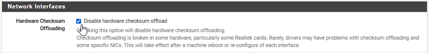 
    Ce paramètre permet d’éviter des comportants anormaux dans l’analyse du trafic réseaux.

3. **Activation du blocage en Inline IPS Mode sur le WAN**

   Édition de l'interface WAN dans `Services > Suricata`.
   Dans la section `Alert and Block Settings`, la case de blocage automatique est cochée, et **`Inline Mode`** est sélectioné.

     

   Le trafic WAN est alors physiquement forcé de traverser le moteur avant routage, permettant un rejet en temps réel.

4. **Interface LAN en Legacy Mode, sans blocage**

   Édition de l'interface LAN dans `Services > Suricata`.
   Dans la section `Alert and Block Settings`, la case de blocage automatique est cochée, et **`Legacy Mode`** est sélectioné.

    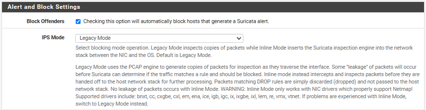 

5. **Interface DMZ en Legacy Mode, sans blocage**

   Édition de l'interface DMZ dans `Services > Suricata`. 
   Dans la section `Alert and Block Settings`, la case de blocage automatique est cochée, et **`Legacy Mode`** est sélectioné.

       

   Le service web exposé devant rester disponible, un blocage réactif (après identification de l'IP) est préféré à l'inline, qui risquerait de couper l'accès au service sur un faux positif.

6. **Interface Management, en IDS**

   Dans `Alert and Block Settings`, la case de blocage automatique est lassée **décochée**. 
   
   Ce réseau porte les flux de supervision (Zabbix, Grafana) et d'ingestion vers le SIEM Wazuh : un blocage erroné y interromprait la visibilité de sécurité au moment où elle est le plus nécessaire. L'inspection reste donc passive, en détection seule.
</Steps>

Cette configuration est réalisée sur **chaque nœud** des paires HA (Master et Slave) du site de Paris et de Lyon.
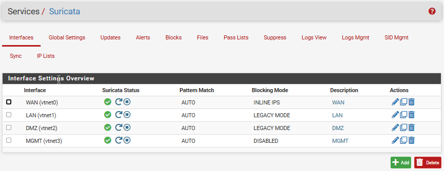 

### Ruleset Emerging Threats Open

La mise en place des sources de règles suit la même procédure sur les deux sites.

<Steps>

1. **Sélection des sources de règles**

   Dans `System > Advanced > Global Settings`, sont installé :
   - **ETOpen** (Emerging Threats Open) - ruleset communautaire gratuit, mis à jour quotidiennement.
   - **Snort Community Ruleset (Talos)** - ruleset GPLv2 certifié Talos, distribué sans restriction de licence.
   - **Feodo Tracker (Botnet C2 IP Ruleset)** - liste des serveurs C2 des botnets Dridex et Emotet/Heodo.
   
    

2. **Téléchargement des règles**

   Dans l'onglet `Updates`, le boutton `Update` permet de lancer le téléchargement initial des listes sélectionnées.

3. **Mise à jour automatique**

   Configuration une fréquence de mise à jour quotidienne dans ce même onglet, afin que les signatures restent à jour sans intervention manuelle.
      - `Update Interval` : **1 Day**
      - `Update Start Time` : **3:00**
</Steps>

### Choix des catégories de règles par interface

La sélection des catégories se fait indépendamment sur chaque interface, dans `Services > Suricata > Interfaces > [WAN/LAN] > Categories`. Le WAN, exposé en inline, et le LAN, orienté détection de compromission interne, n'ont pas les mêmes priorités.

#### Interface WAN

Catégories activées :

- `emerging-attack_response`, `emerging-botcc`, `emerging-botcc.portgrouped` - réponses à des attaques et communications vers des C2 connus
- `emerging-ciarmy`, `emerging-compromised`, `emerging-dshield` - listes de réputation IP (sources identifiées comme malveillantes)
- `emerging-coinminer` - minage de cryptomonnaie non autorisé
- `emerging-current_events` - signatures liées aux campagnes d'attaque en cours
- `emerging-dos` - déni de service
- `emerging-exploit` - exploitation de vulnérabilités connues
- `emerging-malware`, `emerging-mobile_malware` - communications malveillantes
- `emerging-phishing` - hameçonnage
- `emerging-scan` - reconnaissance et scan de ports
- `emerging-shellcode` - détection de shellcode, complémentaire à `exploit` pour les tentatives réussies suite à une exploitation web
- `emerging-worm` - propagation de vers
- `emerging-web_client`, `emerging-web_server` - attaques applicatives web, un service étant exposé en DMZ

#### Interface LAN

Catégories activées :

- `emerging-attack_response`, `emerging-botcc`, `emerging-botcc.portgrouped` - communications vers des C2 connus, symptôme d'un poste déjà compromis
- `emerging-ciarmy`, `emerging-compromised`, `emerging-dshield` - connexion sortante d'un poste vers une IP de réputation malveillante connue
- `emerging-coinminer` - minage de cryptomonnaie non autorisé
- `emerging-current_events` - signatures liées aux campagnes d'attaque en cours
- `emerging-exploit` - exploitation de vulnérabilités connues
- `emerging-malware`, `emerging-mobile_malware` - communications malveillantes
- `emerging-phishing` - hameçonnage
- `emerging-scan` - reconnaissance et scan latéral, révélateur d'un mouvement post-compromission
- `emerging-web_client` - la navigation sortante des postes passant par cette interface (via la VIP LAN), cette catégorie couvre les attaques côté client (drive-by download, exploit kit)
- `emerging-worm` - propagation de vers

:::note
`emerging-web_server` reste désactivée côté LAN : le service web exposé se trouve en DMZ, pas sur ce segment, l'inspection correspondante est donc portée par l'interface WAN.
:::

#### Interface DMZ

Catégories activées :

- `emerging-web_server` - attaques applicatives contre le service exposé (injections, RCE, exploitation de CMS)
- `emerging-web_client` - attaques côté client, si le serveur initie des requêtes sortantes
- `emerging-exploit`, `emerging-shellcode` - tentative d'exploitation et exécution de code suite à une exploitation réussie
- `emerging-scan` - scan latéral, révélateur d'une tentative de rebond depuis la DMZ
- `emerging-malware` - communications malveillantes depuis un service compromis
- `emerging-botcc`, `emerging-botcc.portgrouped`, `emerging-ciarmy`, `emerging-compromised`, `emerging-dshield` - communication vers une IP de réputation malveillante connue
- `emerging-current_events` - signatures liées aux campagnes d'attaque en cours
- `emerging-coinminer` - minage de cryptomonnaie non autorisé
- `emerging-worm` - propagation de vers

:::note
L'objectif sur la DMZ est double : couvrir les attaques directes contre le service exposé, et détecter une éventuelle tentative de rebond vers le LAN ou vers l'extérieur si le service venait à être compromis malgré tout.
:::

#### Interface Management

Catégories activées :

- `emerging-scan` - scan latéral vers ou depuis le réseau de supervision
- `emerging-malware` - communication d'un poste ou service compromis
- `emerging-botcc`, `emerging-botcc.portgrouped`, `emerging-ciarmy`, `emerging-compromised`, `emerging-dshield` - communication sortante vers une IP de réputation malveillante connue
- `emerging-attack_response` - signes de compromission déjà en cours
- `emerging-current_events` - signatures liées aux campagnes d'attaque en cours

Catégories désactivées : toutes les autres, notamment `web_client`/`web_server` et `exploit`/`shellcode`, liées à une exposition web ou une exploitation directe non pertinente sur ce réseau sans accès Internet entrant.

:::note
Réseau critique : compromettre le Management donnerait accès à la supervision et au SIEM eux-mêmes, permettant à un attaquant de masquer ses traces. L'interface reste en IDS pur (pas de blocage automatique) pour ne jamais risquer de couper le pipeline de supervision, mais les alertes qui y remontent doivent être traitées en priorité.
:::

Une fois les catégories cochées, la configuration est sauvegardé, le service Suricata est redémarré.

### Tuning des faux positifs

Le passage en blocage actif (Inline sur le WAN, Legacy sur le LAN et la DMZ) nécessite une phase de réduction des faux positifs, sous peine de bloquer du trafic légitime - d'autant plus critique sur le WAN, où le blocage se fait en coupure du flux, et sur la DMZ, où un blocage erroné couperait l'accès au service exposé. 

L'interface Management en IDS pur et n'entre donc pas dans cette phase de bascule vers le blocage, mais ses alertes doivent tout de même être passées en revue pour écarter les faux positifs qui noieraient les vraies alertes.

<Steps>

1. **Observation en amont, sans blocage**

   Avant d'activer la case de blocage automatique sur une interface, elle est laissé en détection seule (case décochée) pendant au moins une semaine, incluant sauvegardes nocturnes, synchronisation pfsync entre Master et Slave, et réplication Active Directory.

2. **Analyse des alertes récurrentes**

   Dans `Services > Suricata > [Interface] > Alerts`, trier par SID et par fréquence pour repérer les signatures qui se déclenchent sur du trafic connu et légitime plutôt que sur une menace réelle. Sur le Management, cette étape reste permanente puisque l'interface ne passera jamais en blocage.

3. **Suppression ciblée via la Suppress List**

   Pour chaque faux positif identifié, une entrée est ajouté dans `Services > Suricata > [Interface] > Suppress List` (IP + SID) plutôt que de désactiver la catégorie entière : la détection reste active pour toute autre source, seule l'IP légitime identifiée est exclue.

4. **Pass List pour les flux de confiance**

   Ajout dans `Services > Suricata > Pass Lists` des flux devant systématiquement traverser sans inspection ni risque de blocage : tunnel IPsec IKEv2 Paris-Lyon, réplication Active Directory, synchronisation pfsync, flux de supervision Zabbix/Grafana vers le Management, ingestion de logs vers Wazuh.

5. **Activation progressive du blocage**

   Une fois la phase d'observation concluante, la case de blocage automatique est cochée sur le WAN (Inline IPS Mode), le LAN et la DMZ (Legacy Mode), puis une sruveillance est assurée dans l'onglet `Blocks` dans les heures suivantes pour confirmer l'absence d'impact sur le trafic métier et sur la disponibilité du service exposé en DMZ.

6. **Réévaluation après chaque mise à jour de ruleset**

   Une mise à jour ETOpen, Snort Community ou Feodo Tracker peut réintroduire une signature déjà traitée, ou en ajouter une nouvelle génératrice de faux positifs. Un contrôle des alertes est assuré après chaque mise à jour majeure, sur les quatre interfaces.

</Steps>

:::caution
Sur le WAN, un faux positif bloquant en Inline Mode coupe immédiatement le flux concerné. Sur le LAN et la DMZ en Legacy Mode, l'IP n'est bloquée qu'après coup - l'impact est moins immédiat mais reste réel une fois la table de blocage alimentée. 
Sur la DMZ en particulier, une IP légitime bloquée à tort coupe l'accès jusqu'à retrait manuel de la table.
:::

{/*     
### Règles personnalisées

En complément des rulesets, des règles custom sont ajoutées par interface pour couvrir des scénarios spécifiques à l'architecture du projet. Elles ne nécessitent pas de phase d'observation préalable, contrairement au tuning des catégories : elles s'appuient sur des IP, ports et plages déjà connus.

**WAN - tentative IPsec hors tunnel déclaré**

```
alert udp any any -> $WAN_IP 500 (msg:"Tentative IKE depuis IP hors tunnel Paris-Lyon déclaré"; content:!$IPSEC_PEER; sid:1000010; rev:1; classtype:attempted-admin;)
```

**LAN - accès admin GLPI hors VPN**

```
alert tcp ![10.9.75.0/24,10.9.69.0/24] any -> [10.9.75.22] 8080 (msg:"Tentative accès admin GLPI hors LAN Paris et hors tunnel IPsec Lyon"; flow:to_server,established; sid:1000011; rev:1; classtype:attempted-admin;)
```

Cette règle part du principe que **GLPI n'a aucune raison d'être accessible autrement que depuis le LAN Paris (accès direct) ou depuis le LAN Lyon via le tunnel IPsec** (accès distant chiffré). 
Aucun accès public, aucun accès VPN utilisateur nomade, aucune autre source n'est prévue dans l'architecture. Toute connexion vers GLPI provenant d'une IP en dehors de ces deux plages est donc, par définition, anormale : soit une IP mal filtrée en amont (règle de pare-feu manquante ou trop permissive), soit une tentative d'accès non légitime.

**DMZ - accès à un port d'administration du service web depuis l'extérieur de la DMZ**

```
alert tcp any any -> $GLPI_HOST 8080 (msg:"Tentative accès admin GLPI hors VPN"; flow:to_server,established; sid:1000011; rev:1; classtype:attempted-admin;)
```

**Management - connexion depuis un hôte hors liste blanche de supervision**

```
alert tcp any any -> $GLPI_HOST 8080 (msg:"Tentative accès admin GLPI hors VPN"; flow:to_server,established; sid:1000011; rev:1; classtype:attempted-admin;)
```

**DMZ - scan interne ciblant la plage DMZ**
```
alert tcp any any -> $DMZ_NET any (msg:"Scan de ports détecté sur la plage DMZ"; flags:S; threshold:type both, track by_src, count 20, seconds 10; sid:1000014; rev:1; classtype:attempted-recon;)
```

:::note
Les SID personnalisés (plage 1000010-1000014 ici) sont documentés dans un fichier de suivi partagé par l'équipe projet, afin d'éviter toute collision avec une mise à jour future des rulesets ETOpen, Snort Community ou Feodo Tracker. Les variables (`$DMZ_NET`, `$MGMT_NET`, `$MGMT_ALLOWED`, `$IPSEC_PEER`, `$GLPI_HOST`, `$DMZ_WEB_HOST`) sont définies dans `Services > Suricata > Variables`, communes à toutes les interfaces.
:::

:::caution
Toutes ces règles sont écrites en mode `alert` : elles génèrent une notification sans bloquer le trafic, ce qui permet de les déployer immédiatement sans phase de validation. Le passage en `drop` (blocage effectif) pour une règle donnée n'est envisagé qu'après avoir déclenché volontairement le scénario au moins une fois, pour confirmer qu'elle capture bien ce qu'elle doit et rien d'autre.
:::

*/}

## Géoblocage avec pfBlockerNG

pfBlockerNG-devel est le second mécanisme de défense périmétrique du projet, complémentaire à Suricata. Contrairement à Suricata qui inspecte le **contenu** du trafic, pfBlockerNG filtre en amont sur la base de deux critères simples et peu coûteux en ressources :

- **l'origine géographique** de l'IP source (via des listes GeoIP) ;
- **la réputation du domaine** interrogé en DNS (via des listes DNSBL).

Ce filtrage en amont réduit mécaniquement le volume de trafic à inspecter par Suricata : une connexion bloquée par pfBlockerNG sur la base du pays d'origine n'a pas besoin d'être analysée en profondeur ensuite.

:::note
pfBlockerNG s'installe et se configure comme Suricata sur **chaque nœud** de la paire HA (Master et Slave). Les listes et alias GeoIP/DNSBL peuvent être inclus dans la synchronisation XML-RPC (`System > High Avail. Sync`), mais la clé de licence MaxMind, elle, doit être renseignée séparément sur chaque nœud.
:::

### Politique de blocage géographique

Plutôt qu'un blocage par continent complet (trop large - l'Europe inclut par exemple la Russie), la politique retenue s'appuie sur une **sélection de pays au sein de chaque continent GeoIP** :

- **Europe** : bloqué, à l'exception des 27 pays membres de l'Union européenne.
- **Amérique du Nord** : bloqué, à l'exception des États-Unis, du Canada et du Mexique.
- **Autres continents** (Afrique, Antarctique, Asie, Océanie, Amérique du Sud) : bloqués intégralement.

Les pays exclus de ces sélections (UE, US, Canada, Mexique) ne sont soumis à aucune règle de blocage GeoIP et restent donc autorisés en entrée sur le WAN.

Dans `Firewall > pfBlockerNG > IP > GeoIP`

<Steps>

1. **Blocage sélectif du continent Europe**

   L'entrée `Europe` est éditée.
   Dans la sélection des pays, tous les pays du continent **à l'exception des 27 membres de l'UE** sont cochés, puis l'action est defini sur `Deny Inbound`.
   
   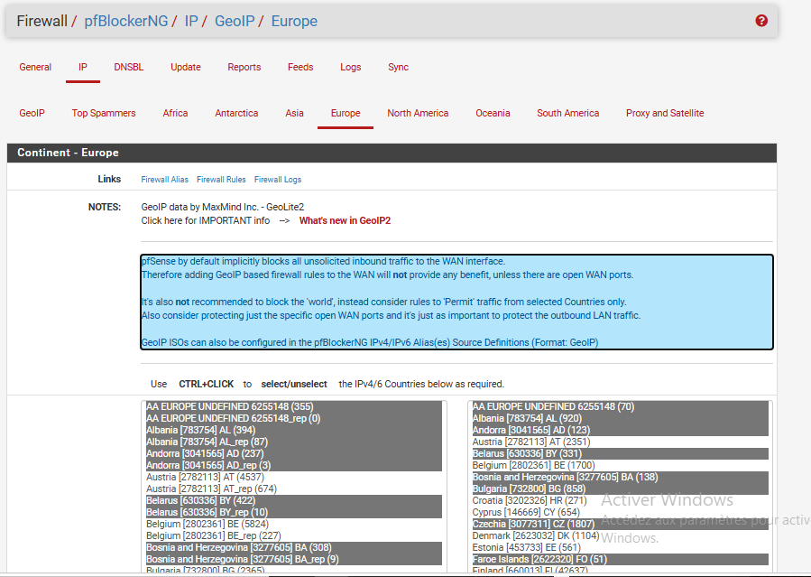 

2. **Blocage sélectif du continent North America**

   L'entrée `North America` est éditée de la même façon.
   Tous les pays du continent **à l'exception des États-Unis, du Canada et du Mexique** sont cochés, puis l'action est defini `Deny Inbound`.
   
   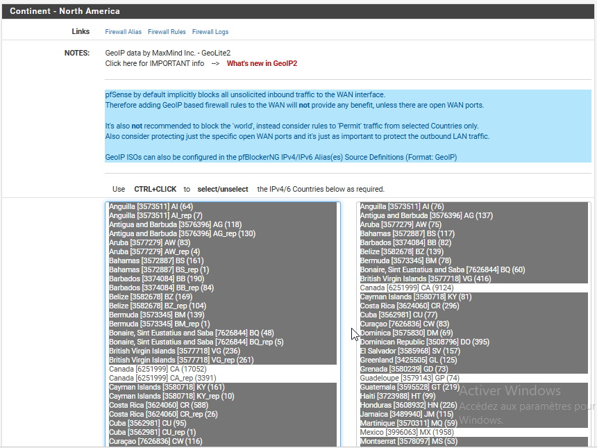 

3. **Blocage des autres continents et catégories à risque**

   L'ensemble des autres continents `Africa`, `Antarctica`, `Asia`, `Oceania`, `South America` avec tous leurs pays cochés, ainsi que `Top Spammers` et `Proxy and Satellite` sont en `Deny Inbound`.

   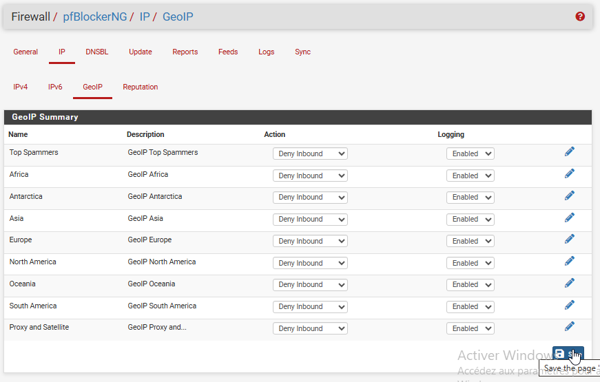 

</Steps>

   pfBlockerNG est mise à jour pour régénérer les listes IP et les règles de pare-feu associées des nouvelles configurations.

:::note
Les pays exclus de la sélection (UE, US, Canada, Mexique) ne sont soumis à aucune règle de blocage GeoIP. 
:::

### Flux DNSBL

En complément du blocage par IP, pfBlockerNG-devel intègre un module **DNSBL** (DNS Black List) qui agit au niveau de la résolution DNS plutôt qu'au niveau du paquet IP. Toute requête DNS vers un domaine référencé comme malveillant (phishing, C2, publicité malveillante) est interceptée et redirigée vers une page de blocage locale, avant même qu'une connexion ne soit établie.

:::caution
Le DNSBL ne fonctionne que si les postes du réseau utilisent bien le résolveur DNS de pfSense (Unbound). Il est recommandé de bloquer ou rediriger le trafic sortant sur le port 53/853 depuis les postes clients vers autre chose que pfSense.
:::

Feeds retenus :

- **EasyList / EasyPrivacy** - publicité et traqueurs
- **URLhaus** - domaines hébergeant activement des malwares, en cohérence avec Feodo Tracker déjà utilisé côté IP
- **Phishing Army** - domaines de phishing actif

<Steps>

1. **Vérification de la chaîne DNS**

   Dans `Services > DNS Resolver > General Settings`, le DNS Resolver doit être activé.
   
   Les postes du domaine utilise l'Active Directory comme DNS primaire (nécessaire au fonctionnement de l'AD), les contrôleurs de domaine forwardent les requêtes externes vers pfSense (`Get-DnsServerForwarder` côté AD est configuré), et leur IP est autorisée dans `Services > DNS Resolver > Access Lists`. 
      
      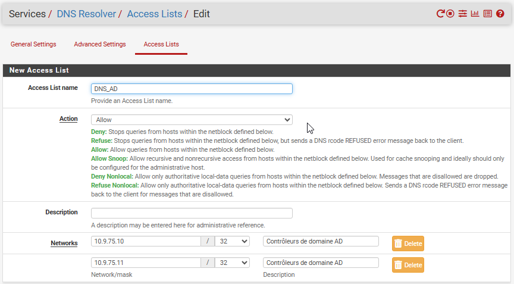 

   C'est cette chaîne AD vers Unbound qui permet au DNSBL de filtrer les requêtes des postes sans interférer avec le fonctionnement de l'AD.

2. **Activation du module DNSBL**

   Dans `Firewall > pfBlockerNG > DNSBL`, le module est activé et lié au résolveur DNS Unbound.
      
      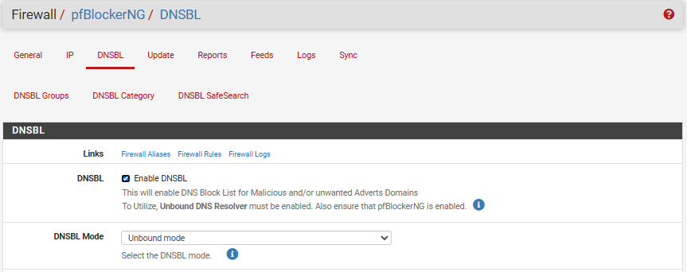 

3. **Ajout des feeds**

   EasyList, EasyPrivacy, URLhaus et Phishing Army à partir de la liste des sources sont ajouté, avec une fréquence de mise à jour quotidienne.
   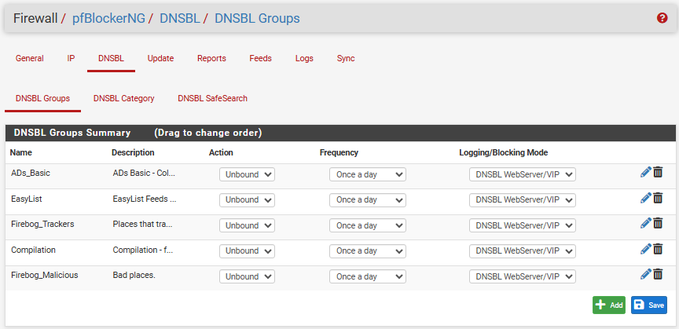 

4. **Vérification du fonctionnement**

   Résoudre un domaine de test connu comme malveillant depuis un poste du réseau et confirmer la redirection vers la page de blocage locale pfBlockerNG.

</Steps>
>>>>>>> 1082c9f (ADD Docs Serveur de Fichiers ; ADD Docs Serveur RDS ; UPDATE Doc GPO ; UPDATE assets Docs pfSense)
