import {LinkButton, Steps, Badge, Aside, Card, CardGrid, StarlightIcon } from '@astrojs/starlight/components';

{/*     */}

## Architecture

Le tunnel IPsec relie les deux sites Freemotion via une liaison chiffrée établie entre les pare-feux pfSense de chaque site. 
Le protocole IKEv2 a été retenu pour sa robustesse et sa compatibilité avec les mécanismes modernes d'authentification.

Chaque site étant configuré en haute disponibilité (CARP), le tunnel s'établit entre les adresses IP virtuelles (VIP) de chaque paire Master/Slave, garantissant la continuité du VPN en cas de bascule.

| Site  | Rôle       | IP WAN (VIP)      | Réseau local |
|-------|------------|-------------------|--------------|
| Paris | Initiateur | 192.1638.254.9    | 10.9.75.0/24  |
| Lyon  | Répondeur  | 192.168.254.39    | 10.9.69.0/24  |

## Création de la CA et des certificats

L'authentification par certificats a été privilégiée par rapport à une clé pré-partagée (PSK) afin de renforcer la sécurité du tunnel : 
elle évite le partage d'un secret statique entre les sites, permet une révocation individuelle en cas de compromission d'un pare-feu, et s'aligne avec les recommandations ANSSI en matière de liaisons site-à-site.

<Aside type="note">
Cette étape est réalisé une seule fois, sur le site Paris, puis le certificat du site Lyon est exporté/importé ou généré séparément.
</Aside>

### Création de l'autorité de certification (CA)

<Steps>

1. Dans **System > Certificate > Authorities**, puis **Add**.

2. Les paramètres de la CA sont renseigné :
   - **Descriptive name** : `Freemotion-VPN-CA`
   - **Method** : `Create an internal Certificate Authority`
   - **Key type** : `RSA` 
   - **Digest Algorithm** : `SHA256`
   - **Common Name** : `Freemotion-VPN-CA`
    
    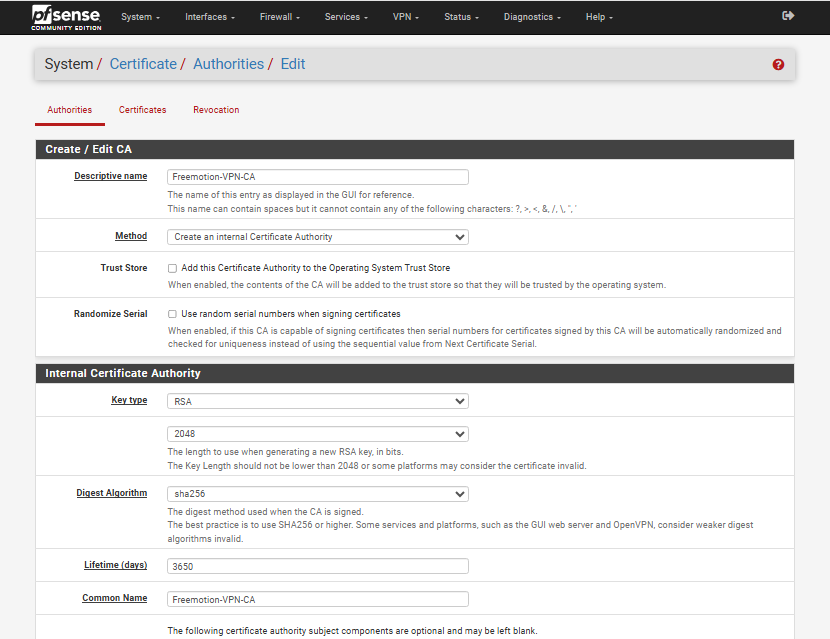 

</Steps>

La CA apparaît dans la liste et peut désormais signer des certificats.
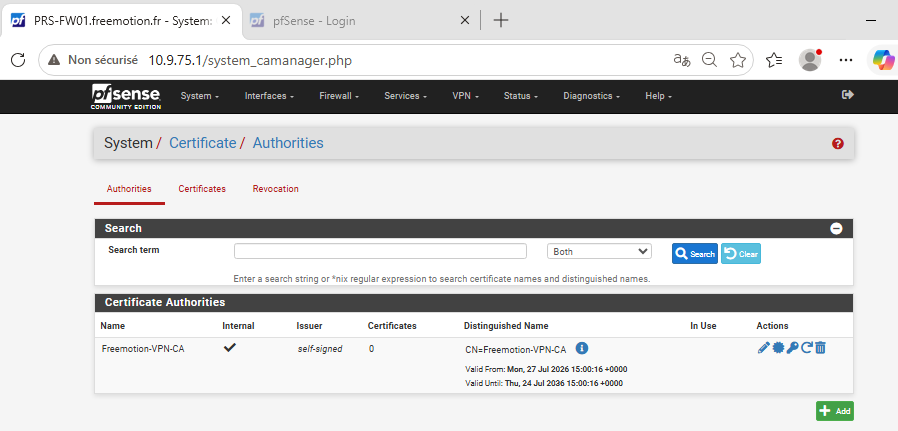

:::caution
La clé privée de la CA reste strictement confidentielle. Si la CA est compromise, tous les certificats qui en dépendent doivent être révoqués et régénérés.
:::

### Génération du certificat pour le pare-feu Paris

<Steps>

1. Dans **System > Certificate > Certificates**, puis **Add/Sign**.

2. Configuration du certificat :
   - **Method** : Create an internal Certificate
   - **Descriptive name** : `pfsense-paris-vpn`
   - **Certificate authority** : `Freemotion-VPN-CA`
   - **Key type** : `RSA 2048 bits`
   - **Digest Algorithm** : `SHA256`
   - **Common Name** : `PRS-FW`
   - **Certificate Type** : `Server Certificate`
   - **Alternative Names** : `192.168.254.9`

</Steps>

Le Certificat VPN du site de Paris apparaît dans la liste signée des certificats.
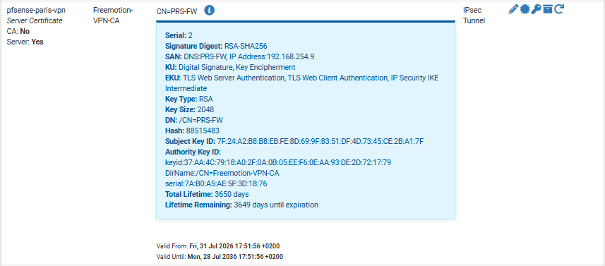 

### Génération du certificat pour le pare-feu Lyon

<Steps>

1. La même procédure que pour Paris est répété pour le certificat de Lyon :
   - **Descriptive name** : `pfsense-lyon-vpn`
   - **Common Name** : `LY-FW`
   - **Alternative Names** : `192.168.254.39`

   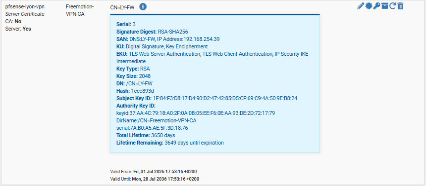 

2. Le certificat de la CA `Freemotion-VPN-CA`, depuis Paris est exporté et l'importé dans **System > Certificate Manager > CAs** sur le pare-feu Lyon, afin que les deux sites fassent confiance à la même autorité.

3. Le certificat serveur signé et sa clé privée correspondante sur le pare-feu concerné est également exporté/importé.

    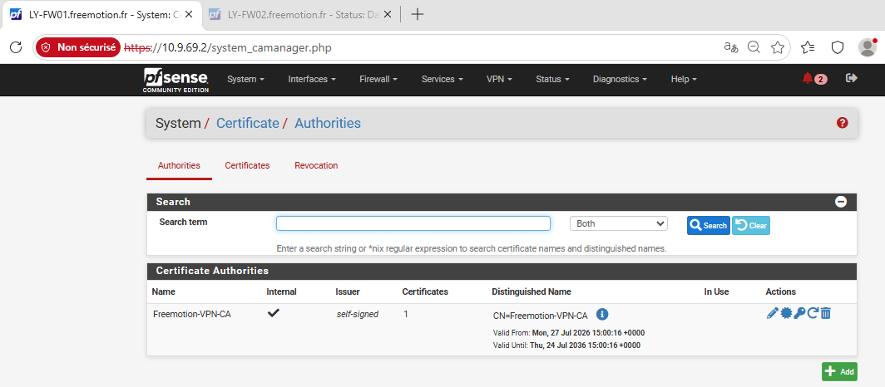 
    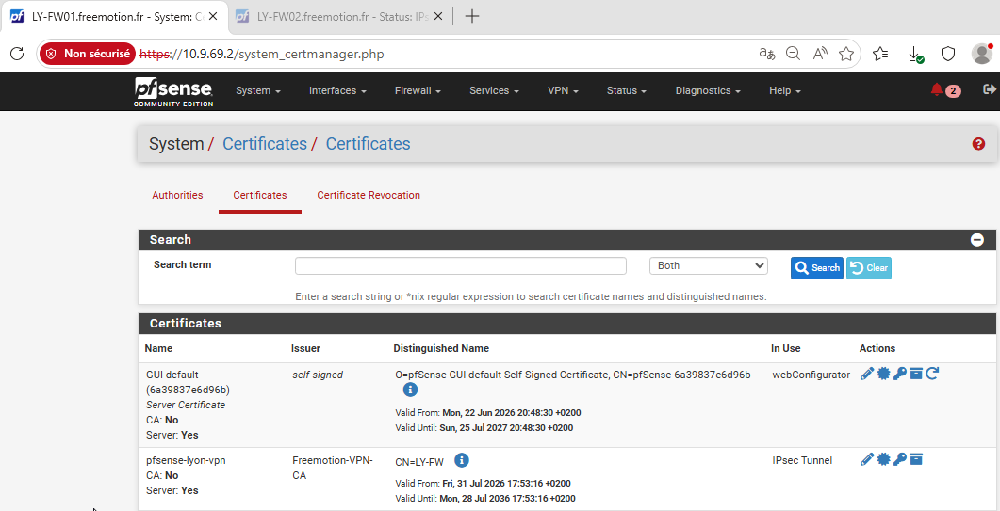 

</Steps>

:::note
Le transfert des certificats et clés privées entre sites se fait par un canal sécurisé (SCP, support chiffré).
:::

## Phase 1 (IKE)

<Steps>

1. Dans **VPN > IPsec > Tunnels**, ajouter une nouvelle phase 1.

2. Configuration des paramètres généraux :
   - **Key Exchange version** : `IKEv2`
   - **Internet Protocol** : `IPv4`
   - **Interface** : `192.168.254.9 (VIP CARP WAN Paris)`
   - **Remote Gateway** : `192.168.254.39`
   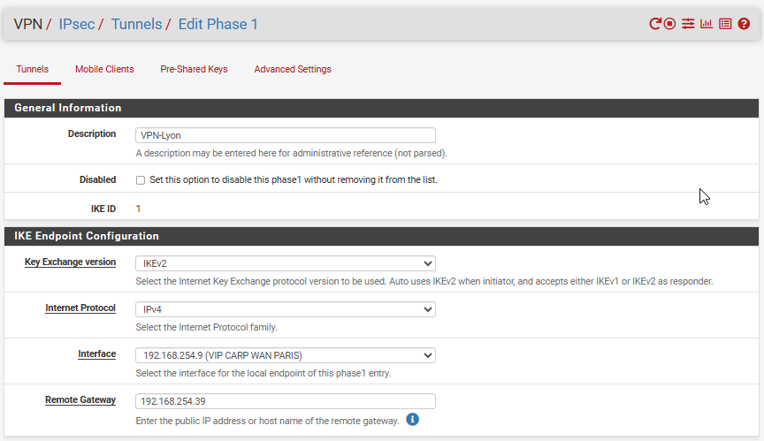 

3. Définination de l'authentification :
   - **Authentication Method** : `Mutual Certificate`
   - **My identifier** : `ASN.1 distinguised Name` / `CN=PRS-FW`
   - **Peer identifier** : `ASN.1 distinguised Name` / `CN=LY-FW`
   - **My Certificate** : `pfsense-paris-vpn`
   - **Peer Certificate Authority** : `Freemotion-VPN-CA`

   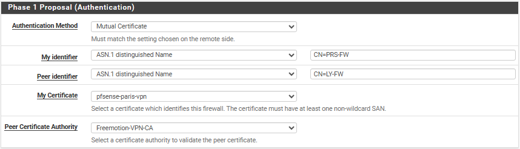 

4. Paramétrage de la négociation :
   - **Encryption Algorithm** : `AES`
   - **Hash Algorithm** : `SHA256`
   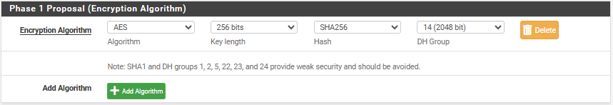 

</Steps>

La configuration de la Phase 1 est désormais finalisée. 
   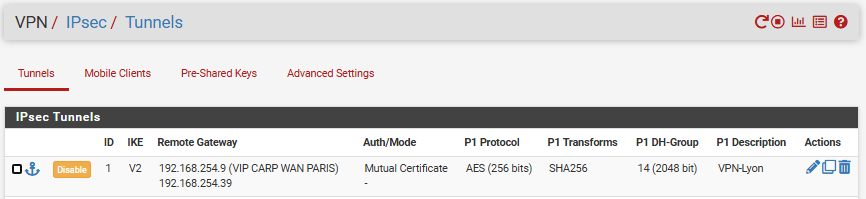

:::caution
Les paramètres de phase 1 (algorithmes, DH group, durée de vie) est configuré de manière strictement identiques sur les deux pare-feux, sous peine d'échec de négociation.
:::

## Tunnel VPN - Réseau LAN
### Phase 2 (IPsec) - LAN 

<Steps>

   1. Ajout d'une entrée de phase 2 associée au tunnel.

   2. Définition du mode et réseaux concernés :
      - **Mode** : Tunnel IPv4
      - **Local Network** : `Network` / `10.9.75.0/24`
      - **Remote Network** : `Network` / `10.9.69.0/24`
      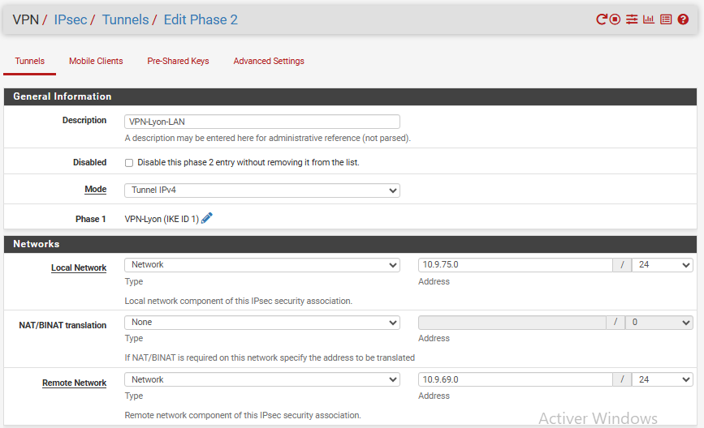 

   3. Configuration du chiffrement :
      - **Protocol** : `ESP`
      - **Encryption Algorithm** : `AES256-GCM`
      - **PFS key group** : `14`
      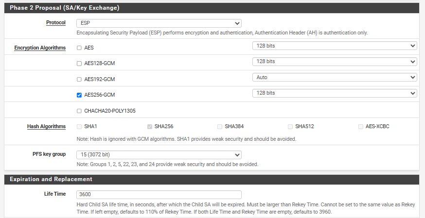 

</Steps>

La configuration de la Phase 2 pour le réseau LAN de Paris
   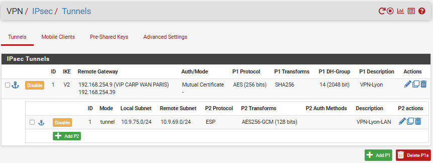 

Cette même configuration a été reproduite sur le pare-feu Lyon, en inversant les réseaux local et distant.
   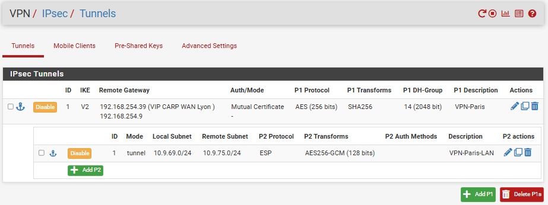 

À l'issue de cette configuration, les tunnels VPN IPsec sont opérationnels et permettent d'établir une liaison sécurisée entre les deux sites.

### Règle de pare-feu IPsec
Le trafic circulant à travers le tunnel IPsec est filtré par des règles dédiées sur l'interface **IPsec**, indépendantes des règles WAN/LAN classiques. Ces règles déterminent quels flux sont autorisés à transiter entre les réseaux locaux de Paris et de Lyon.
   
#### ICMP

Une règle autorisant le protocole ICMP est créée entre les réseaux locaux Paris et Lyon. Elle permet de valider la connectivité inter-sites à travers le tunnel lors des tests et du diagnostic, indépendamment des flux applicatifs.
   {/*    
        
   */}

#### Flux Active Directory (Paris ↔ Lyon)

Le site de Lyon héberge un contrôleur de domaine en lecture seule (RODC), qui réplique depuis les contrôleurs de domaine de Paris. Les flux Active Directory suivants sont donc autorisés entre les deux réseaux locaux :

| Port | Protocole | Service |
|------|-----------|---------|
| 53   | TCP/UDP | DNS       |
| 88   | TCP/UDP | Kerberos  |
| 123  | UDP     | NTP       |
| 135  | TCP     | RPC Endpoint Mapper |
| 389  | TCP/UDP | LDAP      |
| 445  | TCP     | SMB (réplication SYSVOL) |
| 636  | TCP     | LDAPS     |
| 49152–65535| TCP | RPC dynamique (réplication AD) |

Ces ports ont été regroupés au sein d'un alias `AD_Ports_Freemotion` (Firewall > Aliases > Ports), référencé directement dans la règle de pare-feu correspondante afin de simplifier la maintenance et la lisibilité de la configuration.   
   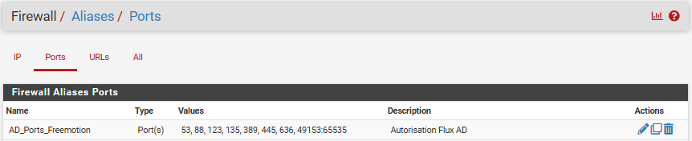 

#### Flux GLPI (Paris ↔ Lyon)

L'outil de gestion de parc GLPI est hébergé sur le réseau LAN Paris et doit être accessible depuis le site Lyon. Les flux web nécessaires sont autorisés :

| Port | Protocole | Service |
|------|-----------|---------|
| 80   | TCP       | HTTP (redirection éventuelle) |
| 443  | TCP       | HTTPS (accès GLPI) |

Ces ports sont regroupés au sein d'un alias `Web_Services_Freemotion` (**Firewall > Aliases > Ports**), référencé dans la règle de pare-feu associée sur l'interface IPsec.
   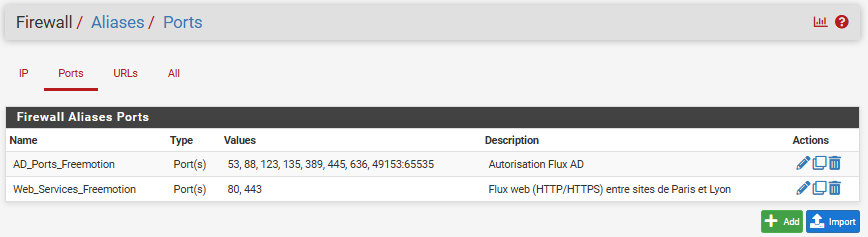 
   
Ces règles ont bien été créées et appliquées sur les deux pare-feux Paris et Lyon.
   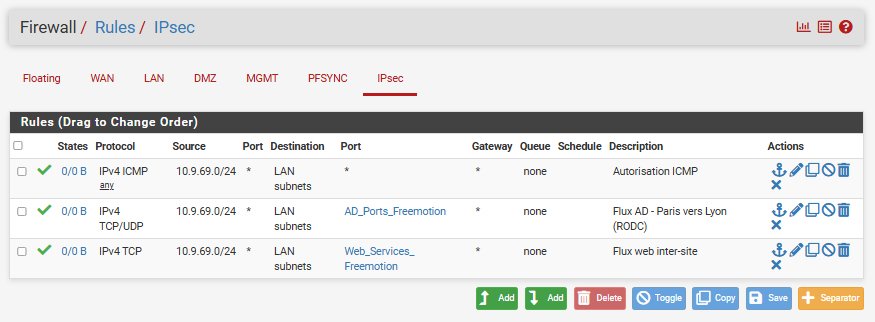 
  

## Vérification

### Statut des phases IPsec

Dans **Status > IPsec > Overview** permet de vérifier l'état des phases 1 et 2. 
La Phase 1 doit afficher le statut **"Established"**, et la Phase 2 le statut **"Connected"**.

#### Etat de connexion coté Paris 
   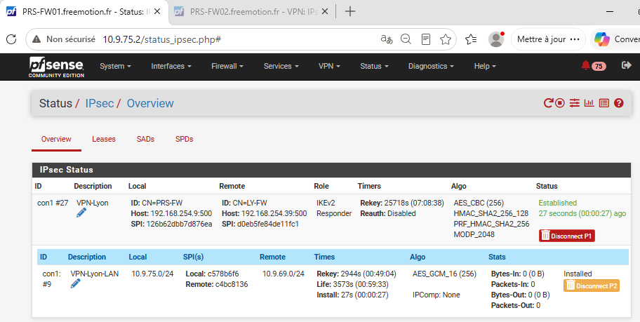 

#### Etat de connexion coté Lyon 
   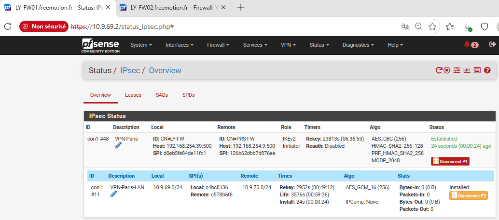 

L'établissement du tunnel IPsec, avec les phases 1 et 2 en statut "Established"/"Connected", est ainsi confirmé.

### Test de connectivité inter-sites
Dans **Diagnostics > Ping** permet le test de la connectivité en effectuant un ping entre une machine du réseau local Paris et une machine du réseau local Lyon, à travers le tunnel.

#### Ping depuis Paris vers Lyon 
   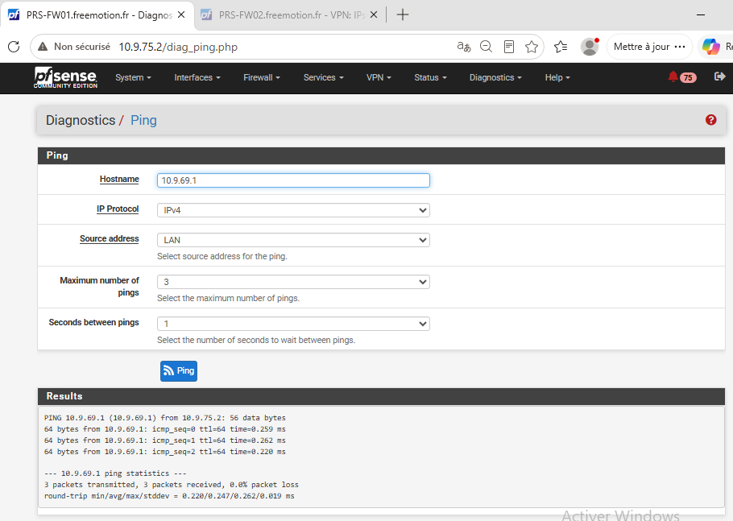 

#### Ping depuis Lyon vers Paris
   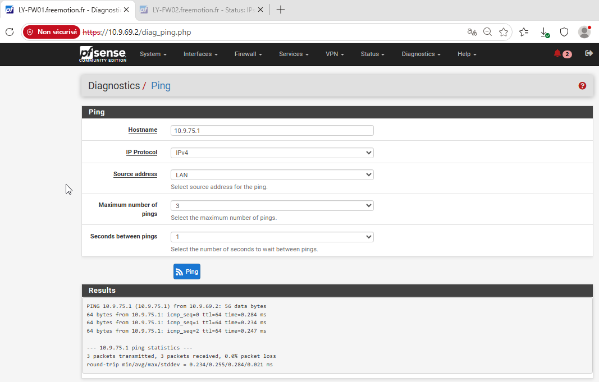 

La connectivité entre les réseaux locaux Paris et Lyon à travers le tunnel IPsec est ainsi validée.

## Tunnel VPN - Réseau MGMT
   ### Phase 2 (IPsec) - Réseau MGMT
   Le réseau Management, hébergeant les outils de supervision (Zabbix, Grafana) sur le site Paris, doit être joignable depuis les agents de supervision installés sur le site Lyon. Une seconde entrée de Phase 2 est donc créée sur le tunnel existant, dédiée à ce flux.

<Steps>

1. Sur le tunnel Paris-Lyon, ajout d'une nouvelle entrée de Phase 2 (**Add P2**).

2. Définition du mode et des réseaux concernés :
   - **Mode** : `Tunnel IPv4`
   - **Local Network** : `10.9.99.0/24`
   - **Remote Network** : `10.9.69.0/24`

3. Configurer le chiffrement, à l'identique de la Phase 2 LAN :
   - **Protocol** : `ESP`
   - **Encryption Algorithm** : AES256-GCM
   - **PFS key group** : 14 

4. **Description** : `VPN-Lyon-MGMT`

</Steps>
   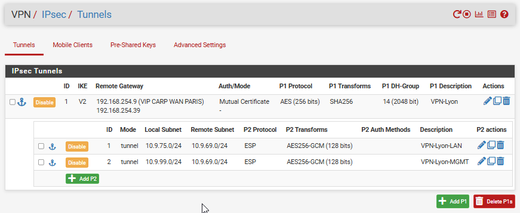 

:::note
Cette Phase 2 est indispensable en complément des règles de pare-feu sur l'interface IPsec : sans elle, le réseau MGMT n'est pas inclus dans le domaine de chiffrement négocié, et le trafic vers ce réseau ne peut pas transiter par le tunnel, quelles que soient les règles de pare-feu configurées.
:::

Sur le pare-feu Lyon, la même Phase 2 est créée en inversant les réseaux local et distant :
   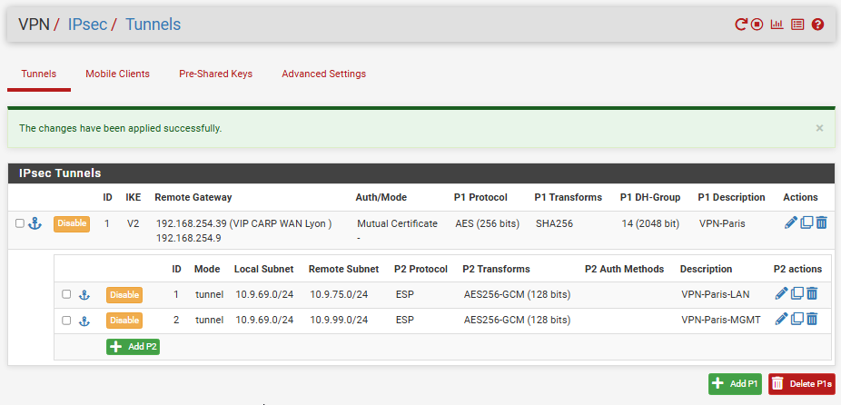 

### Justification de l'accès au réseau MGMT depuis Lyon

Le réseau MGMT (`10.9.99.0/24`) est une zone d'administration strictement isolée, dont l'accès est nativement restreint au LAN Paris. L'ouverture d'un flux depuis Lyon via le tunnel IPsec constitue une exception à cette isolation, justifiée par la nécessité de centraliser la supervision et la corrélation de logs (Wazuh SIEM) sur l'ensemble du système d'information, Paris comme Lyon.

Cette exception est strictement encadrée :

- **Aucun accès aux interfaces d'administration** (Zabbix, Grafana, Wazuh Dashboard) n'est autorisé depuis Lyon. Ces interfaces restent accessibles uniquement depuis le LAN Paris, avec authentification MFA.
- **Seuls les flux techniques agent-vers-manager** (Zabbix Agent/Trapper, Wazuh Agent/Enrollment) sont autorisés depuis le réseau LAN Lyon vers le réseau MGMT, via l'alias `Supervision_Freemotion`.
- Ce flux transite exclusivement par le tunnel IPsec chiffré (AES256-GCM) et authentifié par certificat, garantissant l'intégrité et la confidentialité des données de supervision remontées depuis Lyon.

L'isolation du réseau MGMT est ainsi maintenue pour toute action d'administration humaine, tout en permettant la remontée technique des logs et métriques nécessaires à la détection d'intrusion centralisée.

### Règle de pare-feu IPsec - Supervision

Les flux nécessaires à la supervision centralisée (Zabbix, Grafana, Wazuh) sont autorisés entre le réseau LAN Lyon et le réseau MGMT Paris, conformément aux restrictions définies dans la justification d'accès ci-dessus. Seuls les flux techniques agent-vers-manager sont ouverts ; les interfaces d'administration restent réservées au LAN Paris.

Dans **Firewall > Rules > IPsec**, ajout d'une nouvelle règle.

| Port | Protocole | Service |
|------|-----------|---------|
| 10050 | TCP | Zabbix Agent |
| 10051 | TCP | Zabbix Trapper |
| 1514 | TCP | Wazuh Agent |
| 1515 | TCP | Wazuh Agent Enrollment |
| 55000 | TCP | Wazuh API |

Ces ports sont regroupés au sein d'un alias `Supervision_Freemotion` (**Firewall > Aliases > Ports**), référencé dans la règle de pare-feu autorisant le trafic depuis le LAN Lyon vers le réseau MGMT Paris.
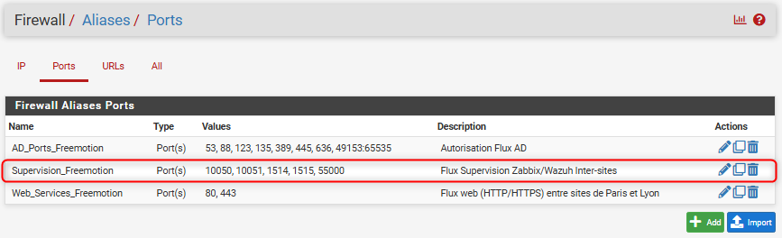

Ces règles ont bien été créées et appliquées sur les deux pare-feux Paris et Lyon.

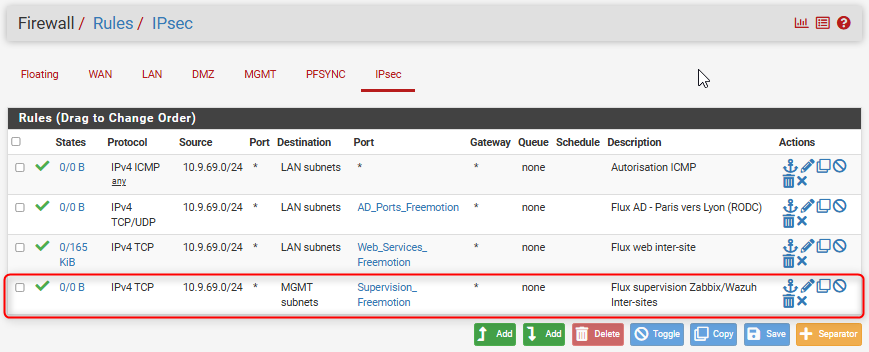

   ### Vérification
#### Statut de la Phase 2 MGMT

Dans **Status > IPsec > Overview** permet de vérifier l'état des phases 1 et 2. 
La Phase 1 doit afficher le statut **"Established"**, et la Phase 2 le statut **"Connected"**.

#### Etat de connexion coté Paris   
   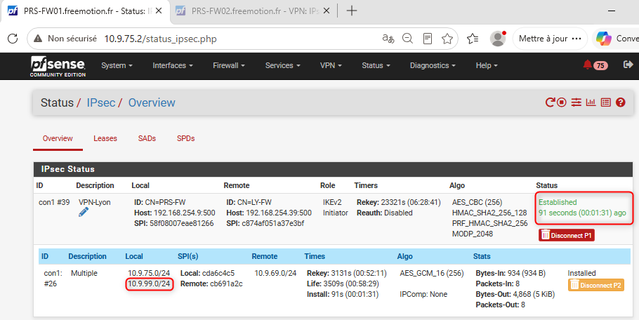 

#### Etat de connexion coté Lyon    
   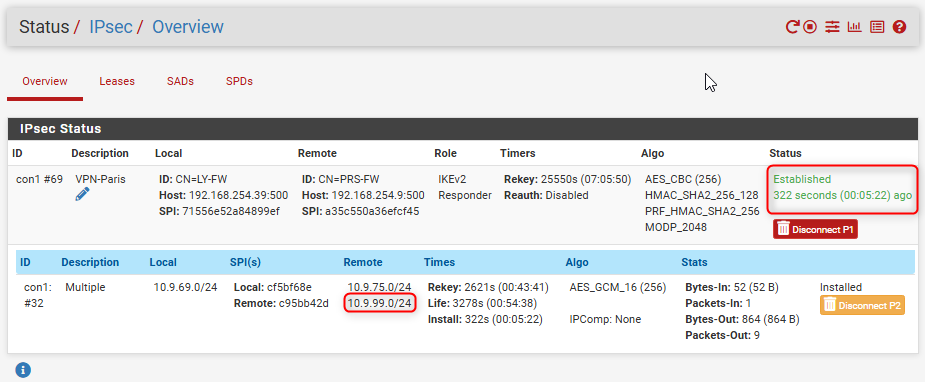 

L'établissement du tunnel IPsec, avec les phases 1 et 2 en statut "Established"/"Connected", est ainsi confirmé.

### Test de connectivité - Ping
Une règle ICMP temporaire a été ajoutée entre le réseau LAN Lyon et le réseau MGMT Paris, afin de valider la connectivité à travers le tunnel avant le test des flux applicatifs de supervision. Cette règle est désactivée une fois la validation effectuée, conformément au principe de moindre privilège.

Dans **Diagnostics > Ping** permet le test de la connectivité en effectuant un ping entre une machine du réseau management de Paris et une machine du réseau local Lyon, à travers le tunnel.

#### Ping depuis Paris vers Lyon 
   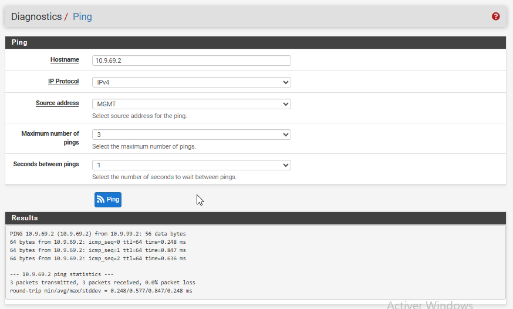 

#### Ping depuis Lyon vers Paris  
   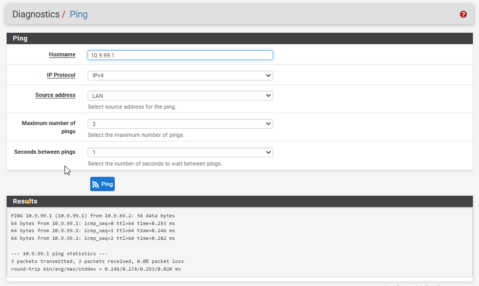 

La connectivité entre le réseau LAN Lyon et le réseau MGMT Paris à travers le tunnel IPsec est ainsi validée.

{/*
### Test de connectivité - Agents de supervision

   Au-delà de la validation de la connectivité réseau par ICMP, un test applicatif est réalisé afin de confirmer que les agents de supervision installés sur le site Lyon communiquent correctement avec les outils centralisés sur le réseau MGMT Paris, à travers le tunnel IPsec.

   <Steps>

   1. Vérifier depuis l'interface Zabbix (**Configuration > Hosts**) que l'agent installé sur un hôte du site Lyon apparaît avec un statut disponible (icône verte "ZBX").

   2. Vérifier depuis le dashboard Wazuh (**Agents**) que l'agent du site Lyon apparaît avec le statut **Active**, et qu'il remonte des événements.

   3. Générer un événement de test (par exemple une tentative de connexion échouée) sur un hôte Lyon, et confirmer sa remontée dans Wazuh SIEM pour corrélation.

   </Steps>

   La communication des agents de supervision entre le site Lyon et le réseau MGMT Paris à travers le tunnel IPsec est ainsi validée.

   
   
   
  

*/}

## Test de Bascule 
A l'état initial (**Status > CARP (failover)**) : le pare-feu principal affiche le statut **MASTER** sur ses interfaces VIP, son homologue **BACKUP**.

<Steps>

1. Création d’une bascule volontaire sur le pare-feu Master, en activant le mode maintenance persistant **(Status > CARP (failover) > Enter Persistent CARP Maintenance Mode)**.

   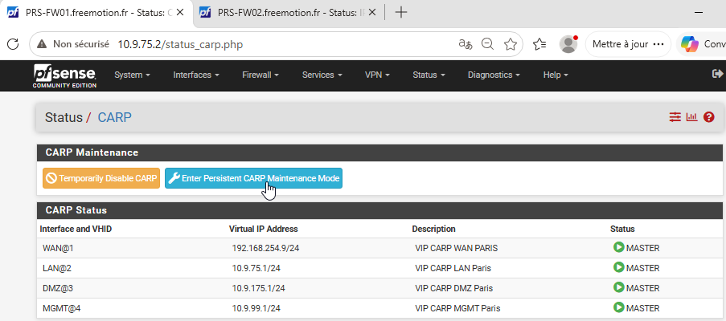

2. Observation du pare-feu Backup : il bascule en **MASTER** et reprendre l'adresse VIP.

   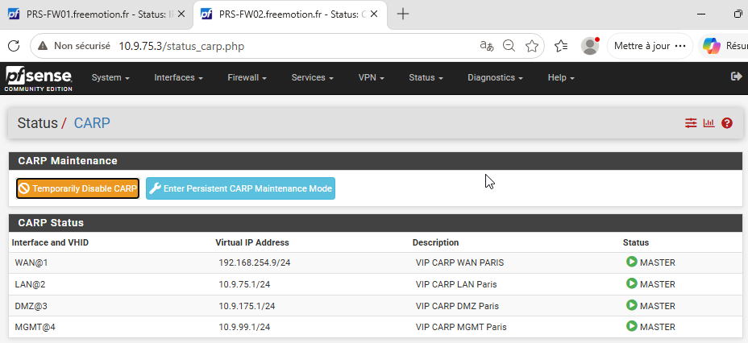

3. Vérification sur **Status > IPsec > Overview** que le tunnel se rétablise automatiquement sur le nouveau Master, sans intervention manuelle.

   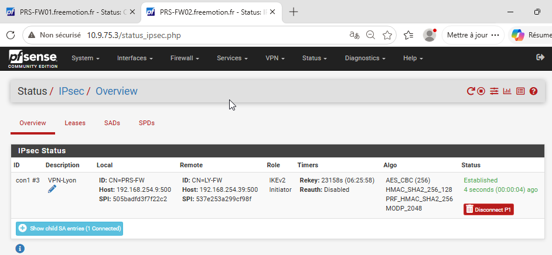

4. Nouveau teste de connectivité par un ping entre les réseaux locaux Paris et Lyon, ainsi qu'entre Lyon et le réseau MGMT, pour confirmer la reprise effective du trafic.
   
   **Ping depuis le réseau local de Paris vers Lyon** 

   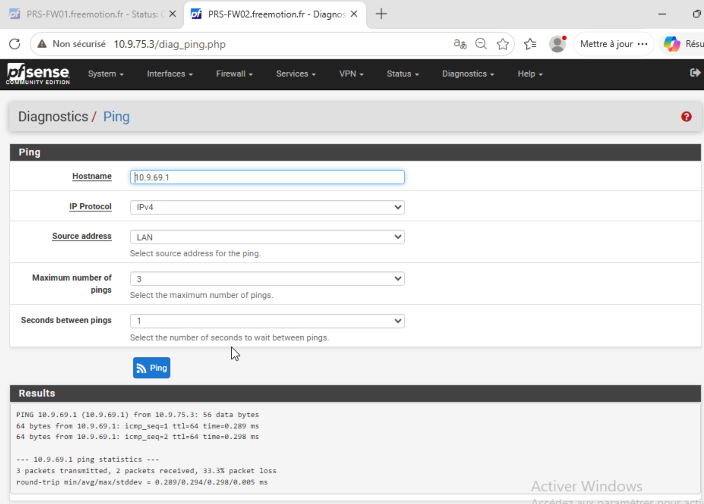 
   
   **Ping depuis Lyon vers le réseau management de Paris** 

    

5. Désactivation du mode maintenance pour revenir à l'état nominal, et vérification que la bascule inverse s'effectue correctement.
    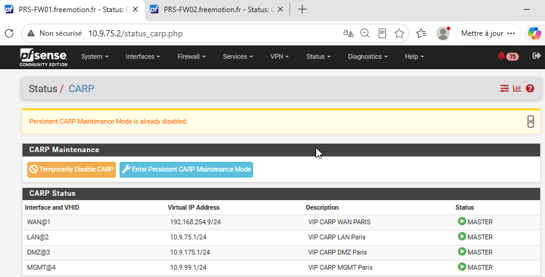

</Steps>
:::note
Un léger temps d'interruption est normal le temps que le nouveau Master reprenne la VIP et que la Phase 1 se renégocie. La durée de cette interruption dépend des timers CARP (Skew, Advertisement Base) configurés.
:::

La continuité du tunnel IPsec lors de la bascule CARP entre les pare-feux Master et Backup est ainsi validée, confirmant la résilience de l'interconnexion Paris-Lyon.

## Conclusion

L'interconnexion IPsec IKEv2 entre les sites de Paris et Lyon a été mise en place avec une authentification par certificats, choix privilégié par rapport à une clé pré-partagée pour renforcer la sécurité du tunnel et s'aligner avec les recommandations ANSSI en matière de liaisons site-à-site. 
Deux domaines de chiffrement distincts ont été négociés : un premier couvrant les réseaux LAN de Paris et Lyon, un second dédié au réseau MGMT, restreint aux flux techniques de supervision (Zabbix, Wazuh) conformément au principe de moindre privilège.

Les tests réalisés - validation des phases IKE/IPsec, connectivité inter-sites{/*, remontée effective des agents de supervision,*/} et résilience lors d'une bascule CARP - confirment le bon fonctionnement du tunnel ainsi que sa capacité à assurer la continuité de service en cas d'indisponibilité d'un pare-feu, grâce à la synchronisation de configuration entre les pare-feux de chaque site.

Cette interconnexion constitue le socle de communication sécurisée entre les deux sites du projet Freemotion, sur lequel s'appuient les flux Active Directory, applicatifs (GLPI) et de supervision centralisée.

