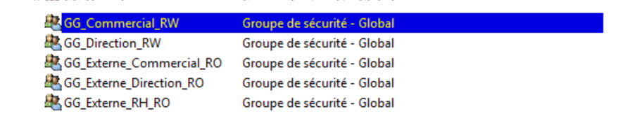
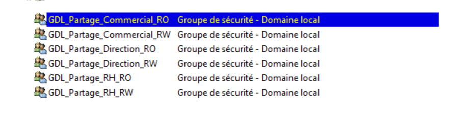
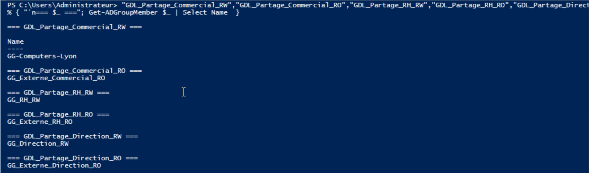
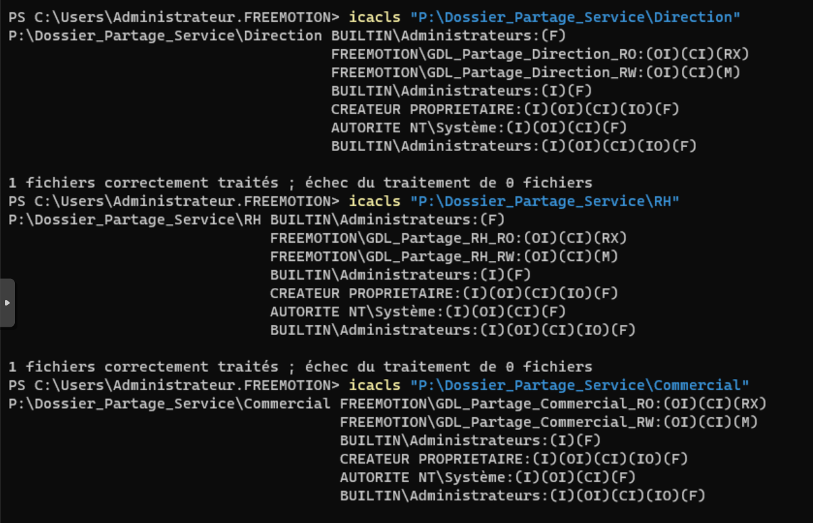
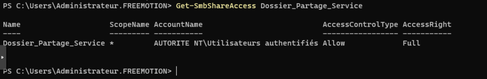
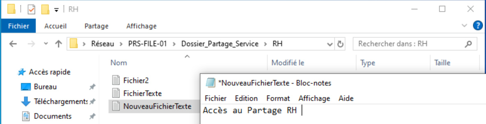
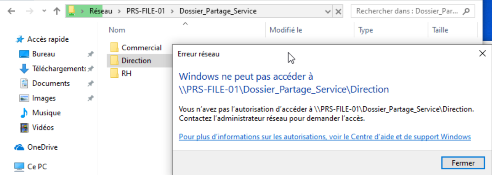
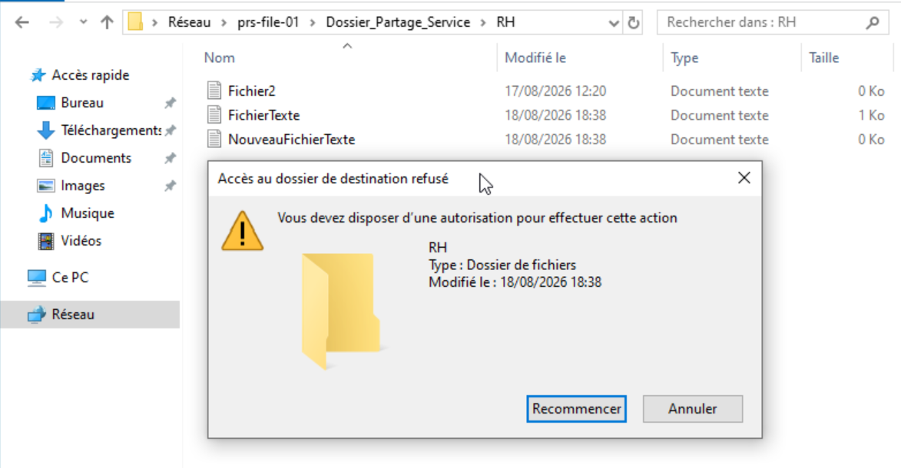

import {LinkButton, Steps, Badge, Aside, Card, CardGrid, StarlightIcon } from '@astrojs/starlight/components';

## Présentation
 
Le serveur de fichiers **PRS-FILE-01** héberge les partages de service du site de Paris. L'ensemble des dossiers métier est centralisé sous un dossier racine unique, avec une gestion des droits basée sur le modèle **AGDLP** (Account → Global Group → Domain Local Group → Permission), conformément aux bonnes pratiques Active Directory.

## Arborescence
 
```
PRS-FILE-01
└── D:\Dossier_Partage_Service (partagé en \\PRS-FILE-01\Dossier_Partage_Service)
    ├── RH
    ├── Commercial
    └── Direction
```
 
Chaque sous-dossier de service constitue un point de partage logique distinct en matière de permissions NTFS, même s'il est physiquement regroupé sous une seule arborescence et un seul partage réseau.
 
## Modèle de permissions AGDLP
 
Le principe AGDLP appliqué ici suit la logique suivante :
 
- **A (Account)** : les comptes utilisateurs du domaine
- **GG (Global Group)** : un groupe global par service, regroupant les comptes utilisateurs concernés (ex. `GG_RH_RW`, `GG_Commercial_RW`, `GG_Direction_RW`)
- **DL (Domain Local Group)** : un groupe local de domaine par dossier et par niveau de droit, sur lequel sont imbriqués les groupes globaux
- **P (Permission)** : les permissions NTFS sont assignées uniquement aux groupes DL, jamais directement aux GG ni aux comptes utilisateurs
Cette approche permet de dissocier la gestion des appartenances métier (GG) de la gestion des droits sur les ressources (GDL), et facilite la délégation ainsi que l'audit.
 
### Groupes globaux (GG)
 
| Groupe                     | Contenu                                                         |
|----------------------------|-----------------------------------------------------------------|
| `GG_RH_RW`                 | Utilisateurs du service RH                                      |
| `GG_Commercial_RW`         | Utilisateurs du service Commercial                              |
| `GG_Direction_RW`          | Utilisateurs du service Direction                               |
| `GG_Externe_RH_RO`         | Utilisateurs externes autorisés en lecture seule sur RH         |
| `GG_Externe_Commercial_RO` | Utilisateurs externes autorisés en lecture seule sur Commercial |
| `GG_Externe_Direction_RO`  | Utilisateurs externes autorisés en lecture seule sur Direction  |
 
 
### Groupes locaux de domaine (GDL)
 
Un groupe GDL est créé par dossier de service et par niveau d'accès, puis appliqué directement sur les permissions NTFS du dossier correspondant.
 
| Groupe GDL                  | Dossier ciblé                        | Niveau de droit | Membres (GG)               |
|-----------------------------|--------------------------------------|-----------------|----------------------------|
| `GDL_Partage_RH_RW`         | `Dossier_Partage_Service\RH`         | Modification    | `GG_RH_RW`                 |
| `GDL_Partage_RH_RO`         | `Dossier_Partage_Service\RH`         | Lecture seule   | `GG_Externe_RH_RO`         |
| `GDL_Partage_Commercial_RW` | `Dossier_Partage_Service\Commercial` | Modification    | `GG_Commercial_RW`         |
| `GDL_Partage_Commercial_RO` | `Dossier_Partage_Service\Commercial` | Lecture seule   | `GG_Externe_Commercial_RO` |
| `GDL_Partage_Direction_RW`  | `Dossier_Partage_Service\Direction`  | Modification    | `GG_Direction_RW`          |
| `GDL_Partage_Direction_RO`  | `Dossier_Partage_Service\Direction`  | Lecture seule   | `GG_Externe_Direction_RO`  |
 
Chaque dossier de service dispose ainsi de deux GDL distincts : un pour l'accès en modification (personnel du service), un pour l'accès en lecture seule (groupe externe). Cette séparation évite d'accorder par erreur des droits d'écriture à un groupe destiné à la simple consultation.
 
## Permissions du partage réseau (niveau SMB)
 
Le partage `Dossier_Partage_Service` est configuré en Contrôle total pour Utilisateurs authentifiés, afin de ne jamais plafonner l'accès effectif des groupes RW en dessous de leur permission NTFS Modification. 
Le droit effectif final correspondant toujours au plus restrictif entre le partage et le NTFS. La restriction fine (lecture seule vs écriture, par service) est appliquée exclusivement au niveau NTFS via les groupes GDL. 

| Portée                                                    | Groupe                      | Droit                         |
|-----------------------------------------------------------|-----------------------------|-------------------------------|
| Partage `Dossier_Partage_Service`                         | `Utilisateurs authentifiés` | Controle Total                       |
| NTFS `RH`                                                 | `GDL_Partage_RH_RW`         | Modification                  |
| NTFS `RH`                                                 | `GDL_Partage_RH_RO`         | Lecture seule                 |
| NTFS `Commercial`                                         | `GDL_Partage_Commercial_RW` | Modification                  |
| NTFS `Commercial`                                         | `GDL_Partage_Commercial_RO` | Lecture seule                 |
| NTFS `Direction`                                          | `GDL_Partage_Direction_RW`  | Modification                  |
| NTFS `Direction`                                          | `GDL_Partage_Direction_RO`  | Lecture seule                 |
 
Le dossier racine `Dossier_Partage_Service` conserve des permissions NTFS minimales (Lecture seule pour `Utilisateurs authentifiés`, afin de permettre la traversée du dossier sans donner accès au contenu des sous-dossiers non autorisés).
 
## Étapes de mise en œuvre

<Steps>
    1. **Création des groupes GG** dans l'OU dédiée aux groupes de sécurité métier, ajout des comptes utilisateurs concernés.

         

    2. **Création des groupes GDL** dans l'OU dédiée aux groupes de ressources, avec un groupe par dossier/niveau de droit.

         

    3. **Imbrication** des GG dans les GDL correspondants.

         

    4. **Application des permissions NTFS** sur chaque sous-dossier via les groupes GDL uniquement.

         
</Steps>

        Les dossiers P:\Dossier_Partage_Service\Direction, RH et Commercial présentent une ACL NTFS conforme au modèle AGDLP mis en place sur PRS-FILE-01. 
        
        L'accès en lecture seule est bien porté par les groupes GDL_Partage_Direction_RO, GDL_Partage_RH_RO, GDL_Partage_Commercial_RO avec le **droit RX (Lecture et exécution)**. 
        
        Ce droit permet aux membres des groupes de **naviguer dans le dossier, de lister son contenu et d'ouvrir les fichiers en lecture, sans possibilité de créer, modifier ou supprimer** quoi que ce soit. 
        Il s'agit du droit standard pour un accès purement consultatif, contrairement au droit R seul qui interdirait même le listage du contenu du dossier.

        L'accès en écriture est porté par GDL_Partage_Direction_RW, GDL_Partage_RH_RW et GDL_Partage_Commercial_RW avec le droit **M (Modification), qui autorise en plus la création, la modification et la suppression de fichiers**. 
        
        Les deux groupes portent les indicateurs (OI)(CI), ce qui signifie que ces permissions se propagent automatiquement à tous les sous-dossiers et fichiers créés ultérieurement dans Direction.


<Steps>

    5. **Configuration du partage SMB** avec des permissions (la restriction réelle étant portée par NTFS).
        
         
        
        Configuration du partage SMB en Contrôle total pour Utilisateurs authentifiés, afin de ne pas restreindre l'accès en écriture des groupes RW en dessous de leur droit NTFS.
</Steps>

### Vérification des Accès 

Une phase de test a été menée pour valider le bon fonctionnement du modèle AGDLP mis en place, en confirmant à la fois les accès attendus et les refus attendus pour chaque profil.

Pour chaque service (RH, Commercial, Direction), un compte membre du groupe `GDL_..._RW` a été testé en lecture et en écriture sur le dossier correspondant via `\\PRS-FILE-01\Dossier_Partage_Service`, tout comme un compte membre du groupe `GDL_..._RO`, limité à la consultation. Un compte n'appartenant à aucun groupe métier a également été testé afin de confirmer qu'il peut traverser `Dossier_Partage_Service` sans pouvoir accéder au contenu des sous-dossiers.

L'onglet **Accès effectif** (Sécurité avancée > Accès effectif) a été utilisé en complément des tests réels pour visualiser précisément quels droits sont accordés à un compte donné, et surtout pour identifier la couche responsable en cas de refus (colonne **« Accès limité par »** : `Partage`, `Autorisations de fichiers`, ou les deux).


##### L'utilisateur RH a bien accès au dossier `RH`, avec des droits de modification.


##### Ce même utilisateur n'a pas accès aux autres dossiers de service.


##### L'utilisateur externe ayant besoin d'un accès en lecture au dossier `RH` y a bien accès, mais ne peut pas créer de nouveau fichier.


## Conclusion

Les tests réalisés confirment que le modèle AGDLP mis en place sur `PRS-FILE-01` fonctionne conformément aux attentes : chaque utilisateur dispose exactement du niveau d'accès correspondant à son appartenance aux groupes `GG_` et `GDL_`, ni plus ni moins. 
L'accès en modification reste circonscrit au dossier de service concerné, l'accès en lecture seule empêche toute création ou modification de contenu, et l'absence d'appartenance à un groupe métier se traduit bien par un refus d'accès au contenu - tout en conservant la possibilité de traverser le dossier racine `Dossier_Partage_Service`.
