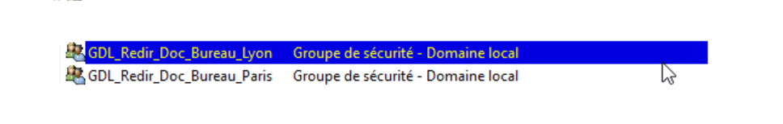
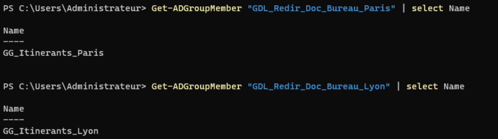
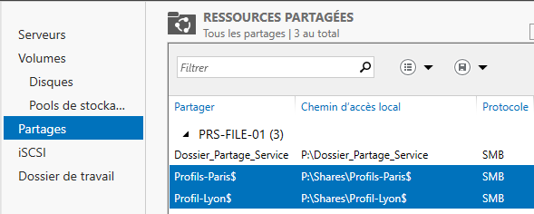
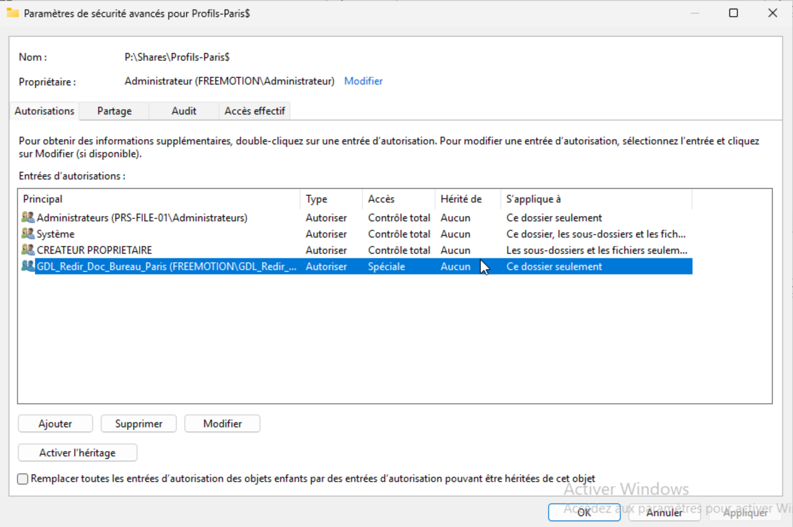
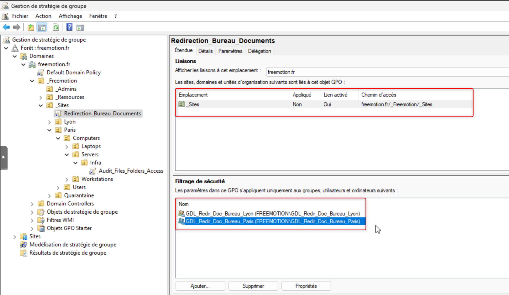
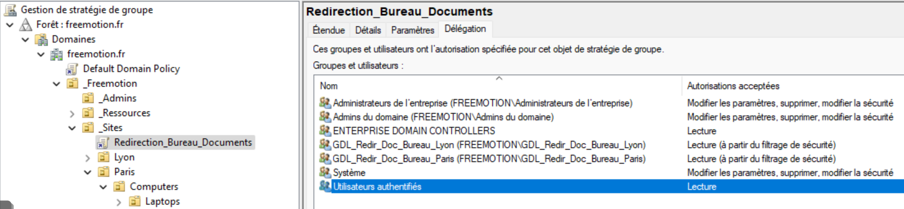
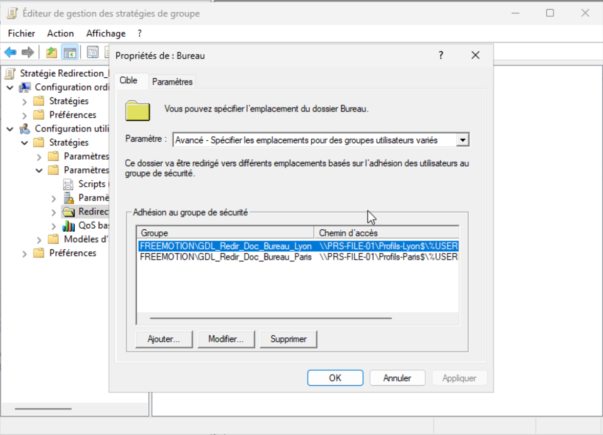
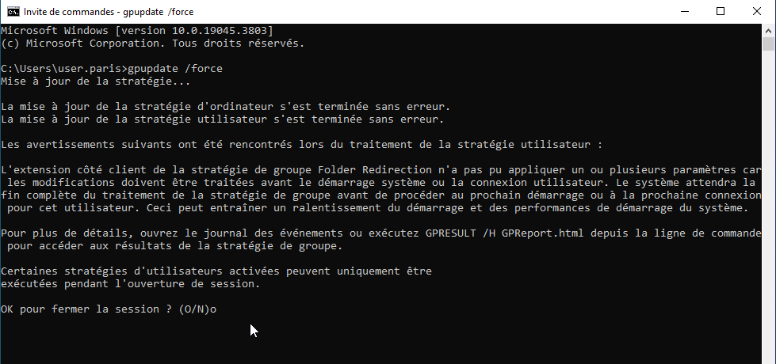
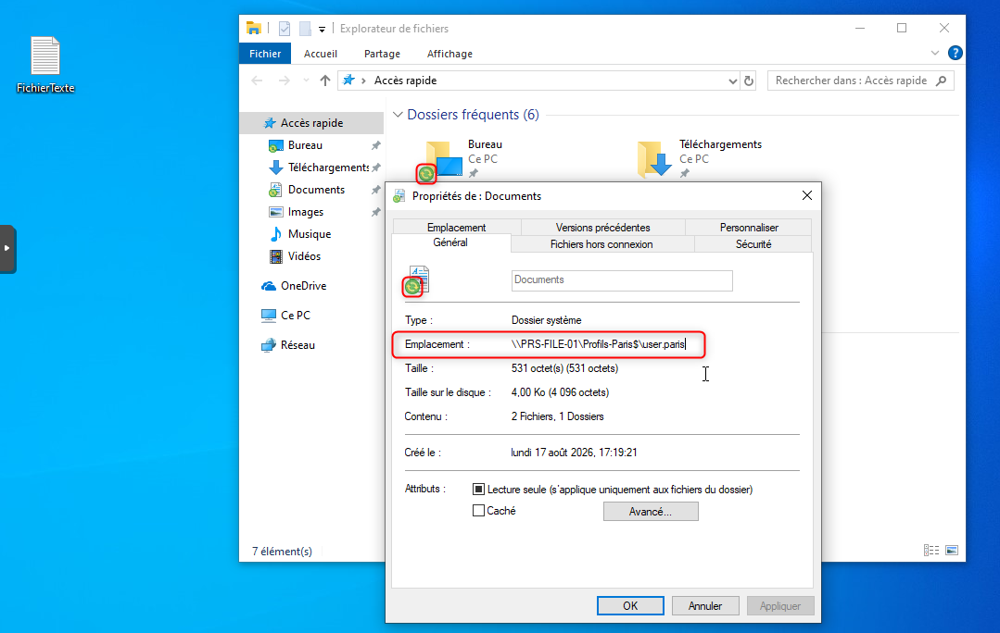

import {LinkButton, Steps, Badge, Aside, Card, CardGrid, StarlightIcon } from '@astrojs/starlight/components';

Les collaborateurs itinérants de Freemotion se connectent indifféremment sur les postes de Paris ou de Lyon. 
Pour qu'ils retrouvent leurs fichiers à l'identique quel que soit le poste utilisé, les dossiers **Documents** et **Bureau** de leur profil sont redirigés vers le serveur de fichiers, au lieu de rester stockés en local.

Contrairement à un profil itinérant complet (qui télécharge tout le profil à l'ouverture de session), la redirection de dossiers laisse les données sur le serveur et n'impacte que les dossiers ciblés. 
Elle est combinée ici avec les **fichiers hors connexion** pour garantir un accès aux données en cas de coupure réseau ou de déplacement hors site.

<Aside type="note" title="Choix d'architecture">
    Le projet ne compte qu'un seul serveur de fichiers (`PRS-FILE-01`). Deux partages distincts y sont néanmoins créés, un par site, pour garder une séparation logique claire entre les profils Paris et Lyon et conserver la possibilité de faire évoluer vers un serveur par site sans changer la structure des GPO et des groupes.
</Aside>

<Aside type="caution" title="Pas de résilience locale par site">
    Avec un serveur unique, un itinérant de Lyon dépend du lien VPN vers Paris (ou inversement, selon l'emplacement du serveur) pour accéder à ses dossiers Documents/Bureau au quotidien. 
    Une coupure du lien inter-sites impacte donc l'accès aux données du site distant tant que le cache hors connexion n'a pas pris le relais.
</Aside>

## Modèle de groupes AGDLP

Plutôt que d'ajouter les utilisateurs directement dans un groupe de sécurité porteur des permissions, le projet applique le modèle **AGDLP** (Accounts → Global → Domain Local → Permissions) :

- Un **groupe global** par site regroupe les comptes utilisateurs concernés. Il répond à la question « qui est itinérant sur ce site ? » et ne porte aucune permission lui-même.
- Un **groupe de domaine local** par ressource reçoit les permissions NTFS ou le filtrage de sécurité GPO, et contient le groupe global correspondant comme seul membre. Il répond à la question « quel droit sur quelle ressource ? ».

| Rôle                              | Paris                        | Lyon                        |
|-----------------------------------|------------------------------|-----------------------------|
| Groupe global (comptes)           | `GG-Itinerants-Paris`        | `GG-Itinerants-Lyon`        |
| Groupe domaine local (GPO + NTFS) | `GDL-Redir-Doc-Bureau-Paris` | `GDL-Redir-Doc-Bureau-Lyon` |

<Aside type="tip" title="Pourquoi AGDLP ici">
    Le groupe global `GG-Itinerants-<Site>` porte uniquement la liste des utilisateurs et peut être réutilisé pour d'autres ressources du site (RDS, ITAM, futurs partages) sans dupliquer la gestion des membres. Le groupe domaine local `GDL-Redir-Doc-Bureau-<Site>` est dédié à cette redirection et peut être recréé pour un futur serveur de fichiers par site sans toucher à la composition des groupes globaux ni à la GPO.
</Aside>

<Aside type="caution" title="Contrôleur de domaine en écriture">
    Lyon héberge un RODC : la création des groupes (globaux et domaine locaux) et l'ajout des membres sont réalisés depuis un contrôleur de domaine en écriture (le DC de Paris), le RODC ne pouvant pas répliquer une écriture qu'il n'a pas lui-même reçue.
</Aside>

<Steps>
    1. Création des deux groupes globaux, contenant les comptes utilisateurs itinérants :
        **GG-Itinerants-Paris** et **GG-Itinerants-Lyon**, en tant que Groupe de sécurité **Global**.
            
             

    2. Ajout des utilisateurs concernés à leur groupe global respectif, selon leur site 
            
    3. Création des deux groupes de domaine local, porteurs des permissions et du filtrage GPO :
        **GDL-Redir-Doc-Bureau-Paris** et **GDL-Redir-Doc-Bureau-Lyon**, en tant que Groupe de sécurité de **Domaine Local**.
            
            
    
    4. Imbrication de chaque groupe global dans le groupe de domaine local correspondant :
        `GG-Itinerants-Paris` est ajouté comme membre de `GDL-Redir-Doc-Bureau-Paris`, et `GG-Itinerants-Lyon` comme membre de `GDL-Redir-Doc-Bureau-Lyon`.
            
            

</Steps>
 
## Partages et permissions NTFS
 
Sur chaque serveur de fichiers, un partage dédié accueille les profils redirigés :
 
| Site  | Serveur              | Partage             |
|-------|----------------------|---------------------|
| Paris | `PRS-FILE-01`        | `Profils-Paris$`    |
| Lyon  | `PRS-FILE-01`        | `Profils-Lyon$`     |
 
<Aside type="note">
    Le `$` masque le partage de la découverte réseau, cohérent avec le fait qu'il n'a pas vocation à être parcouru directement par les utilisateurs.
</Aside>

<Steps>
    1. Dans le Gestionnaire de serveur sur `PRS-FILE-01`, création de deux partages SMB rapides : `Profils-Paris$` et `Profils-Lyon$`.
        Les deux options suivantes sont activées à la création :
            - **Activer l'énumération basée sur l'accès**, pour qu'un utilisateur ne voie que son propre dossier de profil en parcourant le partage.
            - **Autoriser la mise en cache du partage**, indispensable pour permettre la synchronisation hors connexion côté poste client.
                
                 

    2. L'héritage des permissions NTFS sur le dossier partagé est désactivé, puis les permissions héritées sont converties en permissions explicites pour repartir d'une base propre.

    3. Ajout des permissions suivantes sur le dossier `Profils-Paris$` :
    
        | Principal                           | Droits                                                        | S'applique à                              |
        |-------------------------------------|---------------------------------------------------------------|-------------------------------------------|
        | `GDL-Redir-Doc-Bureau-Paris`        | Créer des dossiers / ajouter des données ; Lire les attributs  | Ce dossier seulement                      |
        | `CRÉATEUR PROPRIÉTAIRE`             | Contrôle total                                                | Les sous-dossiers et fichiers seulement   |
        | `SYSTEM`                            | Contrôle total                                                | Ce dossier, sous-dossiers et fichiers     |
        | `Administrateurs du domaine`        | Contrôle total                                                | Ce dossier seulement                      |

         

    4. La même configuration NTFS est répétée sur le partage `Profils-Lyon$`, en remplaçant le groupe par `GDL-Redir-Doc-Bureau-Lyon`.
</Steps>
 
## GPO de redirection de dossiers
 
Une seule GPO gère la redirection pour les deux sites, en ciblant chaque groupe vers le partage de son propre site via l'option de redirection avancée.
 
<Steps>

    1. Création d'une GPO nommée `Redirection_Bureau_Documents` dans la console de gestion de stratégie de groupe, liée au niveau du conteneur `_Sites`, qui regroupe les OU `Paris` et `Lyon` où se trouvent les utilisateurs itinérants.
    
    2. Restriction du filtrage de sécurité aux deux groupes `GDL-Redir-Doc-Bureau-Paris` et `GDL-Redir-Doc-Bureau-Lyon` (`Utilisateurs authentifiés` est retiré du filtrage de sécurité).
        
         

        Grâce à l'imbrication AGDLP, l'appartenance effective au filtrage de sécurité est portée par les groupes globaux `GG-Itinerants-Paris`/`GG-Itinerants-Lyon`, qui contiennent les comptes ; le filtrage GPO n'a besoin de référencer que les groupes de domaine local.
    
    3. Dans l'onglet **Délégation** de la GPO, le groupe `Utilisateurs authentifiés` est ajouté avec le droit **Lecture** uniquement.
        
         

    4. Édition de la GPO : **Configuration utilisateur > Stratégies > Paramètres Windows > Redirection de dossiers**.
        
        Dans les propriétés de la redirection de dossiers **Documents** et **Bureau** :
        
        Le paramètre choisi est **Avancé - Spécifier les emplacements pour des groupes d'utilisateurs variés**, puis l'ajout des deux règles est répété pour les deux dossiers :
    
        | Groupe de sécurité               | Chemin d'accès à la racine                     |
        |----------------------------------|------------------------------------------------|
        | `GDL-Redir-Doc-Bureau-Paris`     | `\\PRS-FILE-01\Profils-Paris$`                 |
        | `GDL-Redir-Doc-Bureau-Lyon`      | `\\PRS-FILE-01\Profils-Lyon$`                  |
    
        Pour chaque règle, l'option choisie est **Créer un dossier pour chaque utilisateur sous le chemin d'accès racine**, afin que le sous-dossier `Documents` soit généré automatiquement.
        
         

    5. Dans l'onglet **Paramètres** de chaque dossier, la case **Accorder à l'utilisateur des droits exclusifs sur le dossier** est cochée, pour qu'aucun autre compte que l'utilisateur n'y accède.
    
    6. La GPO est enregistrée et a déjà été liée à la création. 

</Steps>
  
## Test de la redirection

    Depuis un poste client rattaché à un utilisateur du groupe : 

<Steps>
    1. Exécution de la commande `gpupdate /force` dans une invite en tant qu'administrateur.
    2. La GPO a été détecté, la fermeture de session est alors demandée lorsque Windows signale l'application de la redirection de dossiers.
        
         

    3. Rouverture de la session avec le même utilisateur. Les fichiers précédemment présents dans Documents et Bureau sont conservés, mais désormais stockés sur le partage du site.
    
    4. Vérification de **l'emplacement réel** du dossier dans les propriétés, ainsi que la présence de **l'icône de synchronisation** dans l'explorateur, confirmant que Windows a bien configuré le partenariat de fichiers hors connexion.
        
         

</Steps>
