import {LinkButton, Steps, Badge, Aside, Card, CardGrid, StarlightIcon } from '@astrojs/starlight/components';

## Présentation
 
Le serveur de fichiers FreeMotion centralise les données communes à plusieurs utilisateurs et plusieurs services. Les profils, bureaux et documents des utilisateurs y sont redirigés.
 
Le rôle **FSRM** (File Server Resource Manager) est utilisé pour maîtriser et sécuriser cet espace de stockage partagé, à travers quatre volets :
 
- **Quotas** : limitation de l'espace disque par dossier de service.
- **Filtrage des extensions** : blocage de certains types de fichiers (multimédia par exemple).
- **Classification automatique** : catégorisation des fichiers selon des règles définies.
- **Audit d'accès** : suivi des accès aux données stockées.

## Gestion des quotas
 
FSRM propose deux types de quotas :
 
- **Quota conditionnel** : l'utilisateur peut dépasser la limite, une alerte est envoyée à l'administrateur.
- **Quota inconditionnel** : la limite est stricte, l'écriture est bloquée une fois le quota atteint.

### Configuration des quotas
 
Chaque service dispose d'un quota **inconditionnel de 1 Go** sur son dossier dédié. Le blocage est strict : une fois la limite atteinte, plus aucune écriture n'est possible dans le dossier concerné.
 
Le modèle par défaut "**Limite de 2 Go**" est modifié pour correspondre à ce besoin, plutôt que de créer un modèle dédié.
 
<Steps>

    1. Dans la console FSRM, section **Gestion de quota > Modèles de quotas**. Modification des propriété du modèle "**Limite de 2 Go**". 
        - Le modèle est renommé et la limite est fixé à **1 Go**. 
        - Le quota reste **inconditionnel**.

            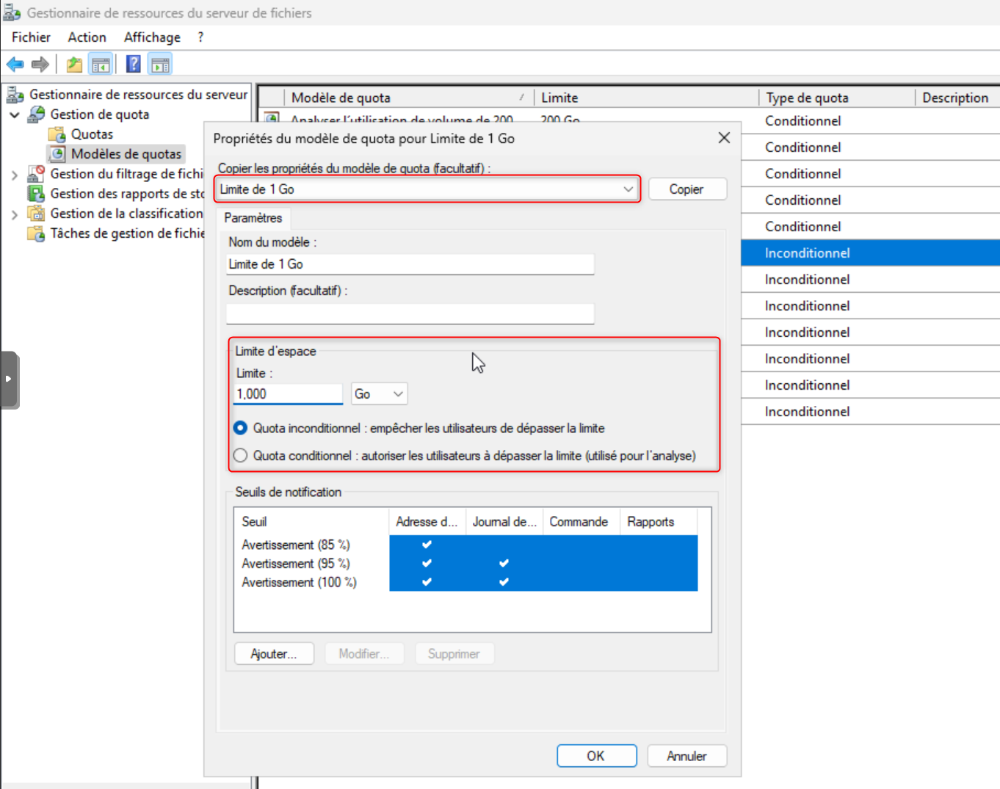

    2. Création d'un nouveau quotas. 
        - Sélection du dossier racine des services
        - Les propriétés du modèle positionnées sur le nouveau modèle "**Limite de 1 Go**"
        - Puis **Appliquer automatiquement le modèle et créer des quotas sur les sous-dossiers existants et nouveaux**.
        
            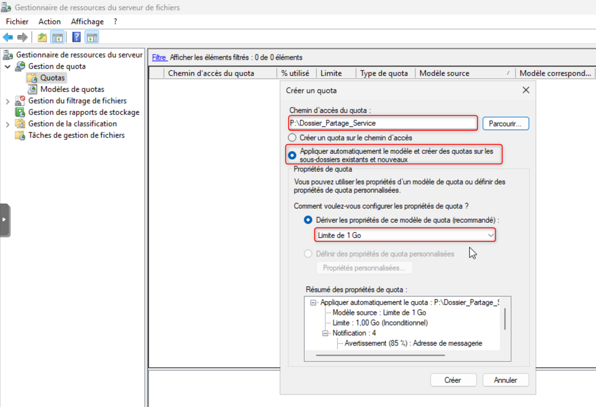 
        
        Cette option applique le quota de 1 Go à chaque sous-dossier de service, existant ou futur, sans configuration manuelle par dossier.

</Steps>

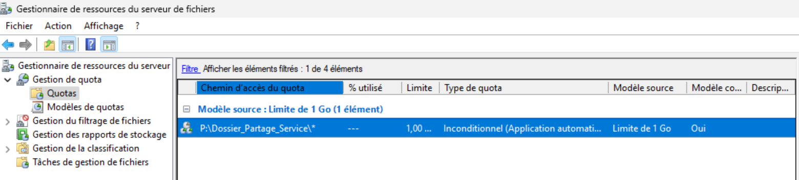 

Chaque dossier de service apparaît ensuite dans la liste des quotas, avec le pourcentage d'espace utilisé par rapport à la limite de 1 Go.
 
### Test du quota
 
Le dépôt d'un fichier faisant dépasser la limite de 1 Go dans un dossier de service échoue avec le message "**Espace disque insuffisant**".

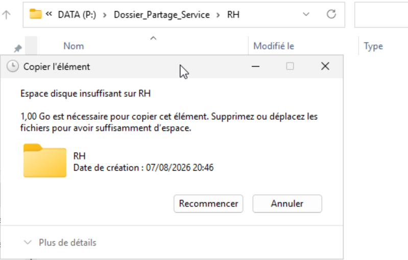 

Un événement est généré dans le journal **Application** de l'Observateur d'événements, avec la source `SRMSVC`, et une notification par e-mail est envoyée conformément à la configuration du modèle.

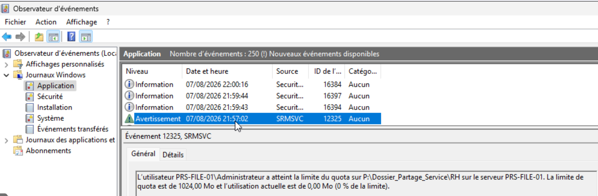 

## Filtrage des extensions de fichiers

Un filtrage **actif** est appliqué sur chaque dossier de service : tout fichier correspondant à un groupe de fichiers bloqué est refusé au dépôt.
 
FSRM structure le filtrage en trois éléments, dans la section "**Gestion du filtrage de fichiers**" :
 
- **Groupes de fichiers** : liste d'extensions regroupées par catégorie.
- **Modèles de filtres de fichiers** : règle (active ou passive) qui s'appuie sur un ou plusieurs groupes de fichiers.
- **Filtres de fichiers** : application concrète d'un modèle sur un dossier.

### Configuration du filtrage des extensions de fichiers

Le groupe **exécutables + images ISO** est bloqué, en réutilisant le modèle "**Fichiers exécutables**" fourni par défaut.
 
<Steps>
    1. Dans la console FSRM, section **Gestion du filtrage de fichiers > Groupes de fichiers**, édition du groupe "**Fichiers exécutables**" 
        - Ajout de l'extension `*.iso` à la liste des extensions à faire correspondre.

        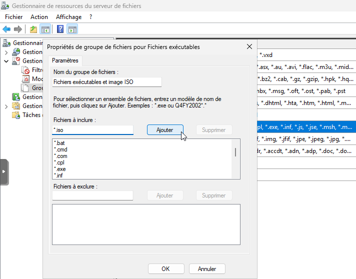 

    2. Section **Modèles de filtres de fichiers**. 
        - Édition du modèle "**Fichiers exécutables**"
        - Filtrage **actif**
        - Sélection du groupe de fichiers modifié.

            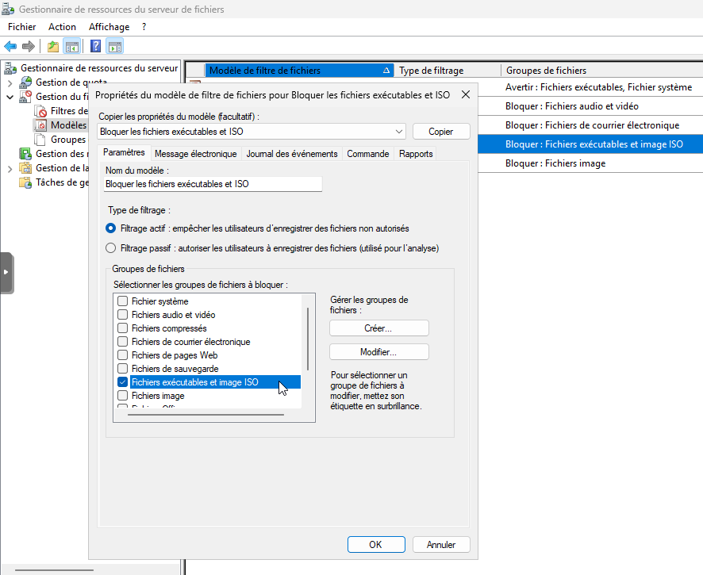 

    3. Section **Filtres de fichiers** > **Créer un filtre de fichiers**.
        - Sélection du premier dossier de service
        - Définition des propriétés du modèle "**Bloquer exécutables et ISO**"

        <Aside type="caution">
            Contrairement aux quotas, FSRM ne propose pas d'application automatique d'un filtre de fichiers aux sous-dossiers existants et futurs. Chaque dossier de service nécessite la création d'un filtre dédié.
        </Aside>
            
        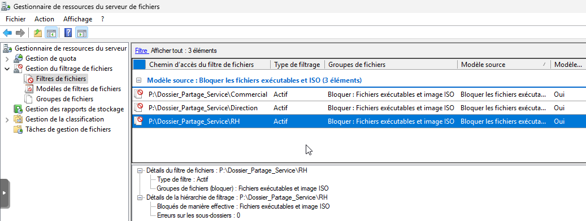 
        
</Steps>
### Test du filtrage
 
Le dépôt d'un fichier exécutable (`.exe`) dans un dossier de service échoue avec un message d'erreur relatif aux autorisations.

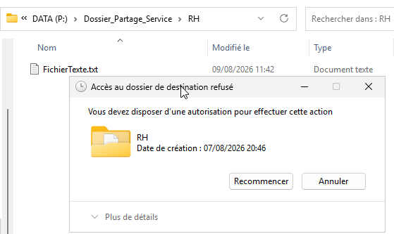 

 
Un événement est généré dans le journal **Application** de l'Observateur d'événements, indiquant le fichier concerné, le groupe de fichiers correspondant et le dossier visé.

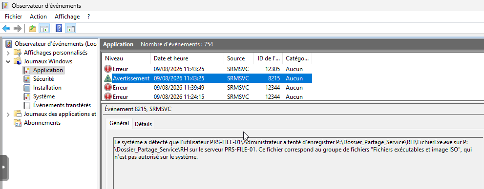 

## Classification automatique

La classification automatique permet d'ajouter des propriétés personnalisées aux fichiers, évaluées selon leur contenu. Une propriété "**Confidentiel**" (Oui/Non) est mise en place sur le dossier **Direction**, en recherchant la présence du terme "**Confidentiel**" dans le contenu des fichiers.

### Configuration de la classification automatique

<Steps>
    1. Dans la console FSRM, section **Gestion de la classification > Propriétés de la classification**
        - Création d'une propriété locale 
        - Choix du type "**Oui/Non**" 

        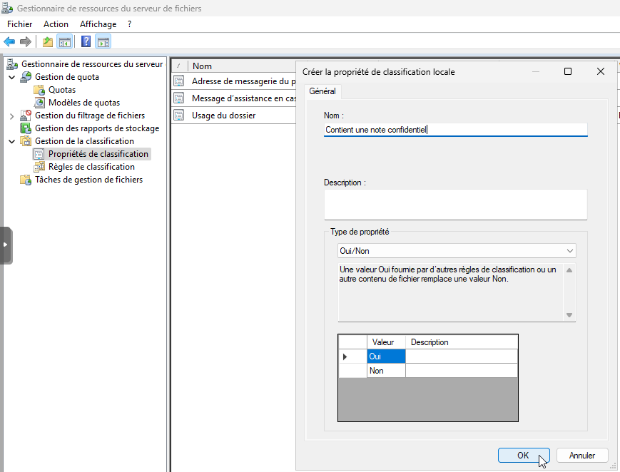 

    2. Section **Règles de classification**, puis **Créer une règle de classification**
        - Onglet **Portée** : sélection du dossier "**Direction**".
        - Onglet **Classification** : méthode "**Classifieur de contenus**", propriété "**Confidentiel**", valeur "**Oui**". 
        - Configuration du paramètre classification : choix du type "**Chaîne**" et  renseignement de l'expression `Confidentiel`, avec un nombre d'occurrences minimales de 1.
        - Onglet **Type d'évaluation** : activation de la réévaluation des propriétés existantes, pour prendre en compte les modifications de fichiers.

            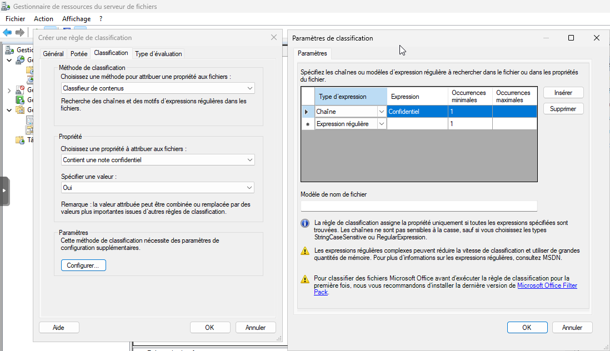 

    3. Création d'une seconde règle "**Fichiers confidentiels (non)**" sur le même dossier et la même propriété, valeur "**Non**", avec un nombre d'occurrences minimales et maximales fixé à 0.
        <Aside type="note">
        Les deux règles sont nécessaires : la présence du terme définit la valeur "Oui", son absence définit la valeur "Non".
        </Aside>
    4. Pour les fichiers Microsoft Office, **Microsoft Office Filter Packs** (Filter Pack 2.0 et SP2) sur le serveur de fichiers, permet que leur contenu soit analysable par la classification.
    5. Dans "**Gestion de la classification**" puis **Configurer la planification de la classification**, définition d'une exécution récurrente (quotidienne, en dehors des heures ouvrées).
</Steps>

### Test de la classification
 
Après exécution de la tâche planifiée (ou déclenchement manuel via **Exécuter la classification avec toutes les règles**), les propriétés des fichiers du dossier **Direction** sont mises à jour dans l'onglet **Classification** de leurs propriétés Windows : "**Confidentiel**" est positionné sur "**Oui**" pour les fichiers contenant le terme, "**Non**" pour les autres.
    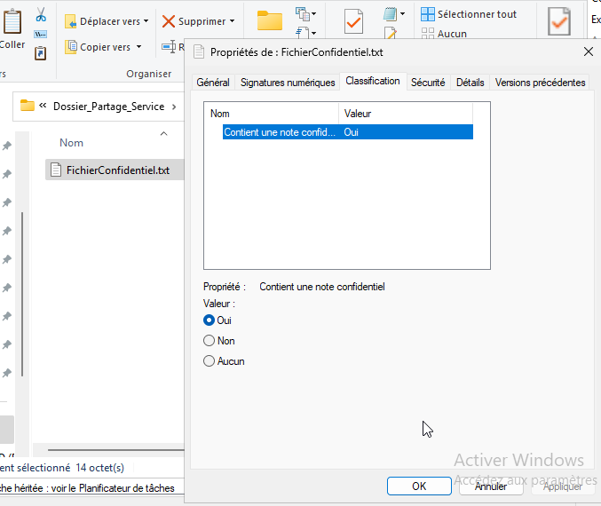 

## Audit d'accès
 
L'audit d'accès repose sur deux éléments complémentaires : une **stratégie d'audit** (GPO), qui active la journalisation au niveau du serveur, et des **SACL** (System Access Control List) posées sur chaque dossier de service, qui définissent précisément quoi journaliser.
 
Sur chaque dossier de service, les réussites et les échecs sont audités pour : la lecture, l'écriture, la suppression et la modification des permissions NTFS.

### Stratégie d'audit (GPO)
 
<Steps>
    1. Dans la console de Gestion de stratégies de groupe, création d'une nouvelle GPO "**Audit_Files_Folders_Access**".
        - Édition de la GPO : **Configuration ordinateur > Stratégies > Paramètres Windows > Paramètres de sécurité > Stratégie d'audit**.
        - Configuration du paramètre "**Auditer l'accès aux objets**" en cochant **Réussite** et **Échec**.

            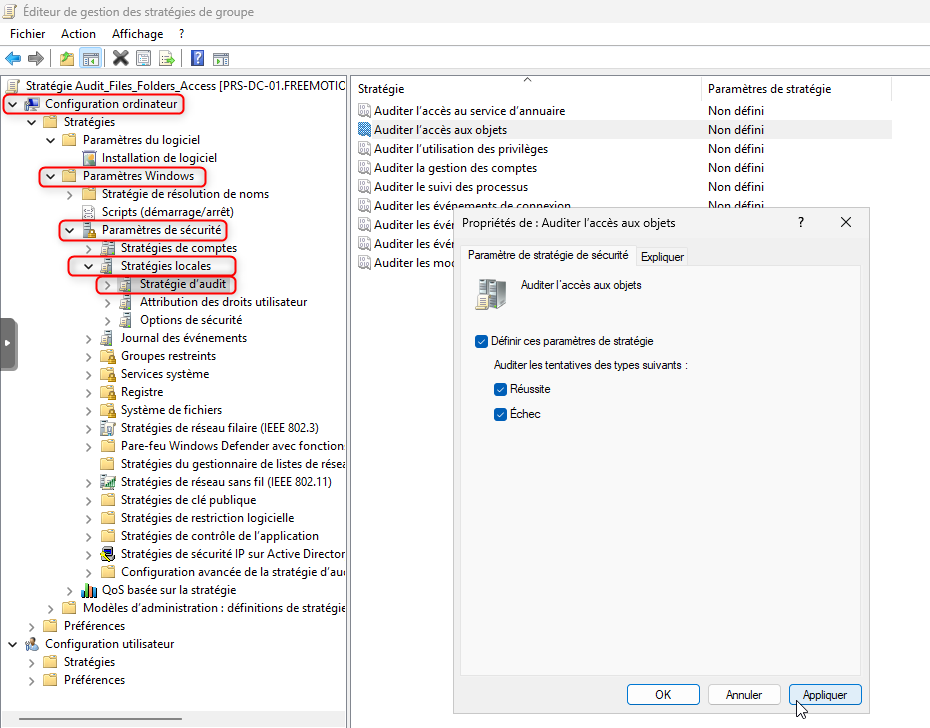 

    2. Liaison de la GPO à l'unité d'organisation contenant le serveur de fichiers, avec un filtrage de sécurité limité au serveur concerné.
            
            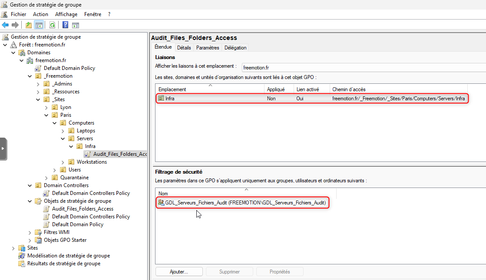 

</Steps>
### SACL sur les dossiers de service
 
<Steps>
1. Sur le dossier de partage, dans les propriétés, onglet "**Sécurité**", bouton "**Avancé**", onglet "**Audit**".
2. Bouton "**Ajouter**", puis sélection des "**Utilisateurs du domaine**" comme principal audité (couvre l'ensemble des utilisateurs AD).
    - Sélectionner "**Tout**" (réussites et échecs).
    - Champ "**S'applique à**" : sélection de l'option "**Ce dossier, les sous-dossiers et les fichiers**", pour que l'audit se propage automatiquement à chaque dossier de service, existant ou futur.
    - Via "**Afficher les autorisations avancées**", les éléments suivants sont cochés :
        - Liste du dossier/lecture de données
        - Création de fichier/écriture de données
        - Création de dossier/ajout de données
        - Suppression de sous-dossier et fichier
        - Suppression
        - Modifier les autorisations
    
        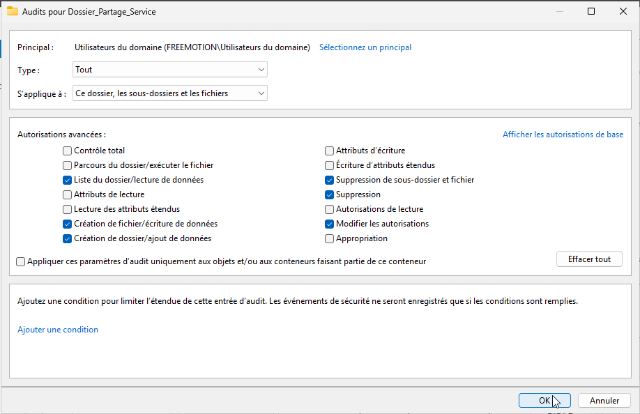 

</Steps>

### Consultation des logs
 
Les événements sont journalisés dans **Observateur d'événements > Journaux Windows > Sécurité**, avec la source "**Microsoft Windows security auditing**" et la catégorie de tâches "**File System**".
 
- L'accès à un fichier (lecture, écriture, suppression) 
- La modification des permissions NTFS
    
    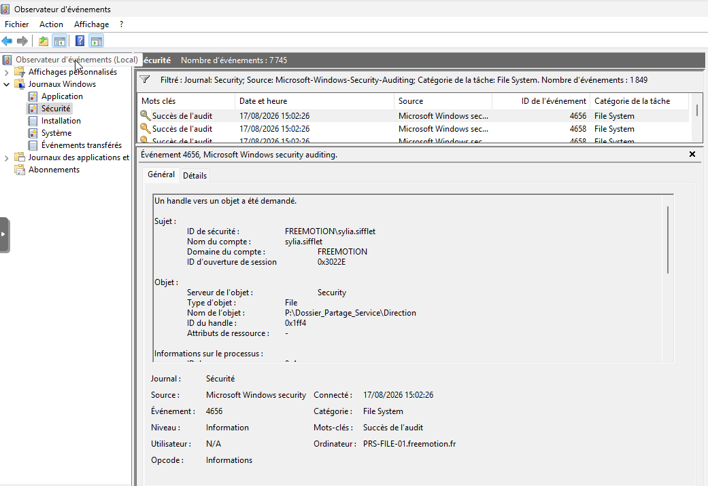 

 
## Conclusion
 
Le rôle FSRM apporte une réponse complète à la gestion et à la sécurisation des données du serveur de fichiers FreeMotion. Les quotas contiennent la croissance de l'espace consommé par service, le filtrage d'extensions empêche le dépôt de fichiers non désirés, la classification automatique identifie les documents sensibles pour en faciliter le suivi, et l'audit d'accès trace les actions effectuées sur les dossiers de service.
 
Ces quatre mécanismes se complètent : la classification et l'audit apportent la visibilité nécessaire pour ajuster, si besoin, les règles de quotas et de filtrage définies en amont.
