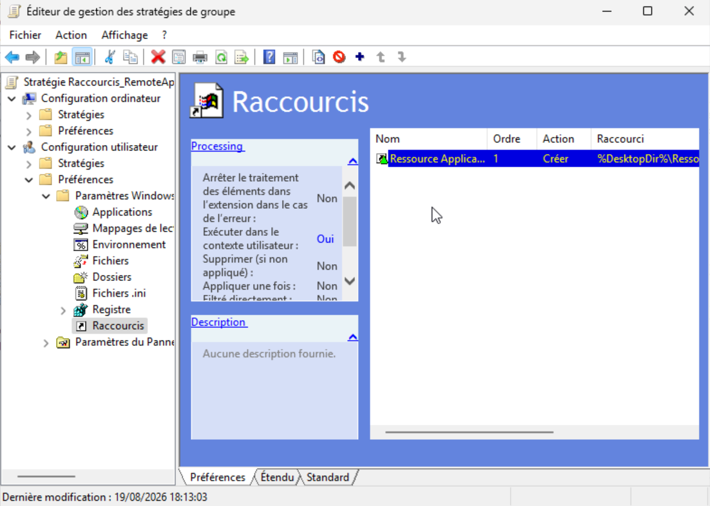
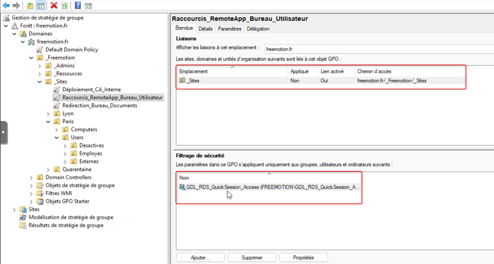
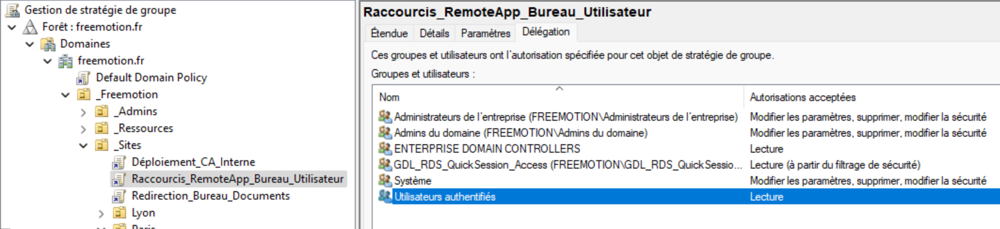
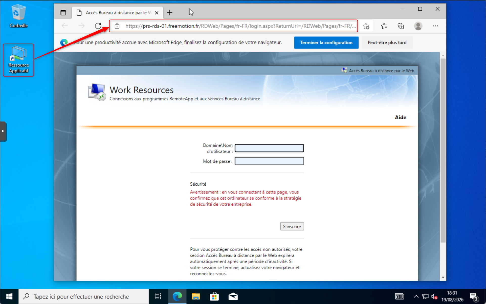

import {LinkButton, Steps, Badge, Aside, Card, CardGrid, StarlightIcon } from '@astrojs/starlight/components';

## Présentation

Plutôt que de demander à chaque utilisateur de saisir manuellement l'URL du portail RDWeb, un raccourci est déployé directement sur son bureau via une GPO **Préférences**, nommée `Raccourcis_RemoteApp_Bureau_Utilisateur`. Ce raccourci pointe vers `https://PRS-RDS-01.freemotion.fr/RDWeb` et n'est distribué qu'aux utilisateurs membres du groupe `GDL_RDS_QuickSession_Access`, suivant le modèle AGDLP déjà en place sur le projet Freemotion.

### Prérequis

- GPO liée à une OU contenant les **comptes utilisateurs** concernés (les Préférences de raccourcis relèvent de `Configuration utilisateur`).
- Groupe `GDL_RDS_QuickSession_Access` existant, avec les groupes globaux métier imbriqués selon le modèle AGDLP.
- Accès à la console `Gestion des stratégies de groupe` (`gpmc.msc`).

## Création du raccourci

Le raccourci est configuré dans les Préférences de la GPO, avec l'action **Créer** pour garantir sa création même s'il n'existe pas encore sur le poste :

<Steps>

    1. Édition de la GPO `Raccourcis_RemoteApp_Bureau_Utilisateur`, accès à `Configuration utilisateur > Préférences > Paramètres Windows > Raccourcis`.
    2. Clic droit → `Nouveau > Raccourci`.
    3. Configuration des champs suivants :
       - **Action** : `Créer`.
       - **Nom** : `Ressource Applicatif`.
       - **Type de cible** : `URL`.
       - **Emplacement** : `Bureau`.
       - **URL cible** : `https://PRS-RDS-01.freemotion.fr/RDWeb`.
    4. Validation avec `OK`.

         

</Steps>

## Liaison et filtrage de la GPO

La GPO est liée à l'OU `_Sites`, avec un filtrage de sécurité restreignant son application au groupe `GDL_RDS_QuickSession_Access` :

<Steps>

    1. Liaison de la GPO à l'OU `_Sites`.
    2. Vérification que **Lien activé** est bien réglé sur `Oui`.
    3. Dans l'onglet **Étendue**, ajout de `GDL_RDS_QuickSession_Access` dans le **Filtrage de sécurité**.

         

</Steps>

## Délégation

Dans l'onglet **Délégation**, `Utilisateurs authentifiés` est ajouté avec l'autorisation **Lecture** en plus de `GDL_RDS_QuickSession_Access`, afin que la GPO s'applique correctement :

<Steps>

    1. Sélection de la GPO dans `gpmc.msc`, onglet **Délégation**.
    2. Ajout de `Utilisateurs authentifiés` avec l'autorisation **Lecture** uniquement.
    3. Vérification que `GDL_RDS_QuickSession_Access` conserve ses autorisations **Lecture** et **Appliquer la stratégie de groupe**.

         

</Steps>

:::tip
Le filtrage de sécurité sur `GDL_RDS_QuickSession_Access` continue de restreindre la distribution réelle du raccourci à ce seul groupe. L'ajout de `Utilisateurs authentifiés` en lecture seule permet à la GPO d'être correctement évaluée par le moteur de stratégie de groupe, sans étendre son application à l'ensemble du domaine.
:::

## Tests effectués

Un test de validation a été réalisé depuis un poste client afin de vérifier le déploiement du raccourci et l'accès au service RDS.

La procédure de test consiste à ouvrir une session sur un poste client avec un utilisateur membre du groupe `GG_Acces_RDP`. Après l'ouverture de session, le bureau de l'utilisateur est contrôlé afin de vérifier la présence du raccourci `Ressource Applicatif`.

     

Le raccourci est bien présent sur le bureau et pointe vers le portail RDWeb configuré dans la GPO : `https://PRS-RDS-01.freemotion.fr/RDWeb`

L'utilisateur ouvre ensuite le raccourci. Le portail RDWeb est accessible et les ressources RemoteApp disponibles s'affichent correctement. La connexion à la ressource RDS est établie avec succès.

Ce test confirme les éléments suivants :

- La GPO est correctement appliquée à l'utilisateur concerné.
- Le raccourci est bien créé sur le bureau.
- L'URL configurée dans le raccourci est fonctionnelle.
- L'utilisateur membre du groupe `GG_Acces_RDP` dispose bien des autorisations nécessaires.
- L'accès au service RDS fonctionne correctement depuis le poste client.

Le déploiement du raccourci et l'accès à RDS sont donc validés.

## Conclusion

La GPO `Raccourcis_RemoteApp_Bureau_Utilisateur` déploie avec succès le raccourci vers le portail RDWeb sur le bureau des utilisateurs autorisés, sans intervention manuelle. Le filtrage de sécurité sur `GDL_RDS_QuickSession_Access` restreint correctement la distribution au périmètre visé, tandis que l'ajout de `Utilisateurs authentifiés` en lecture dans la Délégation garantit l'évaluation correcte de la GPO par le moteur de stratégie de groupe. 
Le test réalisé avec un utilisateur du groupe `GG_Acces_RDP` confirme le bon fonctionnement de bout en bout, de l'affichage du raccourci jusqu'à l'accès effectif à RDS.