import {LinkButton, Steps, Badge, Aside, Card, CardGrid, StarlightIcon } from '@astrojs/starlight/components';

## Présentation

Publier une application en **RemoteApp** ne suffit pas si la connexion n'est pas sécurisée correctement : un certificat auto-signé génère des avertissements de sécurité sur chaque poste client, ce qui n'est pas viable en production.

Sur **PRS-RDS-01** (domaine `freemotion.fr`), la solution retenue consiste à signer le certificat TLS avec une **CA interne pfSense** dédiée, `Freemotion_Interne_CA`, distincte de la CA `CA_VPN` déjà utilisée pour les connexions VPN.

Une fois la CA racine `Freemotion_Interne_CA` distribuée aux postes via GPO, tous les certificats qu'elle signe sont automatiquement approuvés - la connexion RemoteApp se fait alors sans aucun avertissement, sans devoir importer un certificat serveur sur chaque machine.

### Prérequis

- Rôle **Remote Desktop Services** (Session Host + Web Access + Connection Broker) installé sur `PRS-RDS-01.freemotion.fr`.
- Accès administrateur sur `PRS-RDS-01` et sur l'interface pfSense.
- Résolution DNS interne fonctionnelle pour `PRS-RDS-01.freemotion.fr`.

## Création de la CA interne dédiée

Une nouvelle CA distincte de `CA_VPN` est créée sur pfSense pour signer le certificat du serveur RDS :

<Steps>
    1. Connexion à l'interface pfSense.
    
    2. Accès à `System > Cert. Manager > CAs` → **Add**.
        - Saisie d'un **Descriptive name**, par exemple `Freemotion_Interne_CA`.
        - Choix de la méthode **Create an internal Certificate Authority**.
        
        Configuration des paramètres de la CA :
            - **Key length** : 2048 bits minimum (4096 recommandé).
            - **Digest algorithm** : SHA256 minimum.
            - **Lifetime** : 3650 jours (10 ans) recommandé pour une CA racine.
    
    3. Validation de la création.
        
        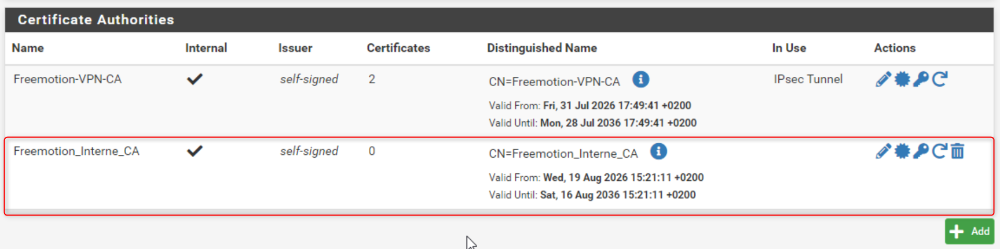 

</Steps>

## Création du certificat serveur sur pfSense

Le certificat du serveur RDS est créé directement sur pfSense, sans passer par une CSR générée sous Windows :

<Steps>
    1. Accès à `System > Cert. Manager > Certificates` → **Add/Sign**.
    2. Choix de la méthode **Create an internal Certificate**.
        - **Descriptive name** : `cert-prs-rds-01`.
        - Sélection de `Freemotion_Interne_CA` comme **Certificate Authority** signataire.
        
        Configuration des paramètres du certificat :
            - **Key length** : 2048 bits minimum.
            - **Digest algorithm** : SHA256 minimum.
            - **Common Name (CN)** : `PRS-RDS-01.freemotion.fr`.
            - **Alternative Names (SAN)** : ajout de `PRS-RDS-01.freemotion.fr` en type DNS.
    3. Validation de la création du certificat.

        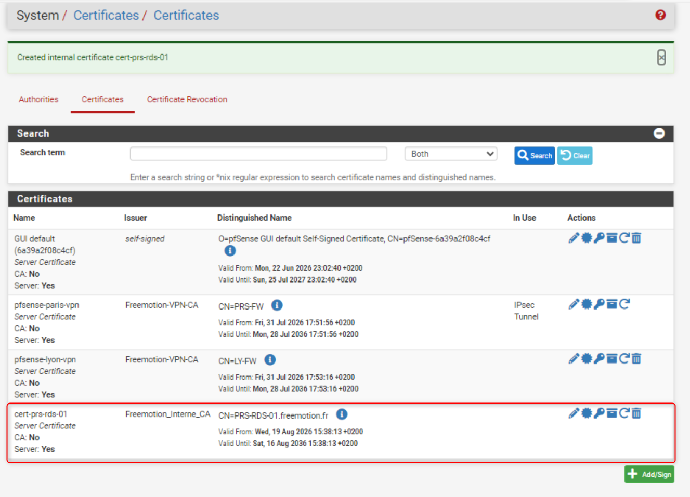 

</Steps>

Le certificat, sa clé privée et le certificat de `Freemotion_Interne_CA` sont désormais disponibles dans pfSense pour l'export.

## Export du certificat au format PKCS#12

Pour être importé sur Windows avec sa clé privée, le certificat est exporté au format `.p12`, incluant la CA, le certificat et la clé privée :

<Steps>
    1. Accès à `System > Cert. Manager > Certificates`.
    2. Repérage de la ligne correspondant à `cert-prs-rds-01`.
    3. Clic sur l'icône d'export **PKCS#12** (fichier `.p12` regroupant CA + certificat + clé privée).
        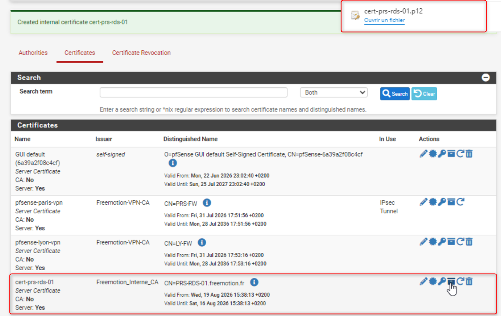 

</Steps>

:::note
L'export PKCS#12 regroupe en un seul fichier tout ce qui est nécessaire à l'import sur Windows : pas besoin d'exporter séparément la clé privée ou le certificat de la CA à ce stade.
:::

## Import du certificat sur PRS-RDS-01

Le fichier `.p12` est ensuite importé dans le magasin de certificats de l'ordinateur local sur `PRS-RDS-01` :

<Steps>

    1. Copie du fichier `.p12` sur `PRS-RDS-01` (copie sécurisée).
    2. Ouverture de `mmc` via `Exécuter`, puis `Fichier > Ajouter/Supprimer un composant logiciel enfichable`.
    3. Ajout du composant **Certificats**, avec le choix **Un compte d'ordinateur** → **Ordinateur local**.
    4. Clic droit sur `Certificats (Ordinateur local) > Personnel` → `Toutes les tâches > Importer`.
    5. Sélection du fichier `.p12`.
    6. Coche de l'option **Marquer cette clé comme exportable** pour permettre une sauvegarde ultérieure.
    7. Choix de **Placer automatiquement les certificats dans le magasin en fonction du type** (le certificat de `Freemotion_Interne_CA` est alors placé automatiquement dans les autorités de certification racines de confiance de la machine).
    8. Vérification de la présence du certificat dans `Personnel > Certificats`, avec une **clé privée associée** (icône avec une clé).

        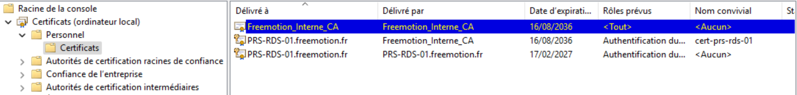 

</Steps>

:::Note
Cet import place aussi automatiquement le certificat de `Freemotion_Interne_CA` dans le magasin local de `PRS-RDS-01`. Cela ne remplace pas la distribution via GPO aux autres postes du domaine, décrite à l'étape suivante.
:::

## Distribution de la Freemotion_Interne_CA aux postes clients via GPO

Pour que les autres postes et serveurs du domaine freemotion.fr fassent confiance au certificat sans avertissement, la CA racine Freemotion_Interne_CA est déployée en amont sur l'ensemble du parc, via une GPO nommée Déploiement_CA_Interne, liée à l'OU _Site regroupant les serveurs et ordinateurs des sites Paris et Lyon :

<Steps>

    1. Export du certificat de `Freemotion_Interne_CA` depuis pfSense : `System > Cert. Manager > CAs` → bouton **Export CA**.
    2. Création d'une GPO nommée Déploiement_CA_Interne, liée à l'OU _Site, avec configuration du paramètre suivant :
        - `Configuration ordinateur > Paramètres Windows > Paramètres de sécurité > Stratégies de clés publiques > Autorités de certification racines de confiance`.
        - Import du certificat de `Freemotion_Interne_CA` à cet emplacement.
            
            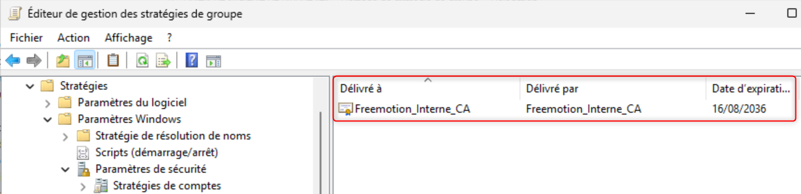 

    3. Mise à jour forcée des GPO sur les machines concernées (`gpupdate /force`), ou attente du cycle habituel.

</Steps>

:::tip
Configuration ordinateur s'applique à tout objet ordinateur présent dans l'OU liée, serveurs comme postes de travail. Lier Déploiement_CA_Interne à _Site permet donc de couvrir en un seul endroit les serveurs (dont PRS-RDS-01) et les postes des deux sites Paris et Lyon.
:::

:::note
Si un serveur ou poste ne reçoit pas la CA après application de la GPO, vérifier son emplacement exact dans l'annuaire (bonne OU ou sous-OU sous `_Sites`) et l'absence de filtrage de sécurité ou de blocage d'héritage sur cette branche.
:::

### Vérification sur un poste client

Une fois la GPO appliquée, sa prise en compte est vérifiée directement sur un poste client du domaine, en confirmant la présence du certificat `Freemotion_Interne_CA` dans le magasin **Autorités de certification racines de confiance** :

<Steps>

    1. Ouverture de `certlm.msc` (magasin de certificats de l'ordinateur local) sur un poste client.
    2. Accès à `Autorités de certification racines de confiance > Certificats`.
    3. Repérage du certificat `Freemotion_Interne_CA` dans la liste, avec vérification de son nom et de sa date de validité.

</Steps>

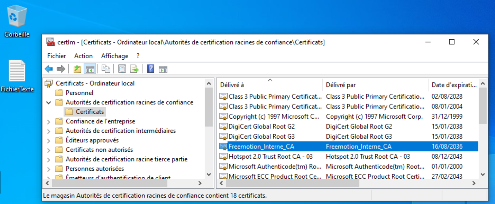

Cette vérification confirme que la GPO `Déploiement_CA_Interne` a bien été appliquée avec succès sur le poste, et que celui-ci fait désormais confiance à `Freemotion_Interne_CA`.

## Liaison du certificat TLS à RDWeb (IIS)

Le portail RDWeb, qui repose sur IIS, est ensuite configuré pour utiliser le nouveau certificat :

<Steps>

    1. Ouverture du **Gestionnaire des services Internet (IIS)** sur `PRS-RDS-01`.
    2. Clic droit sur **Default Web Site** > **Modifier les liaisons** 
    3. Modification de la liaison **HTTPS** sur le port `443`.
        - **Nom d'hôte** : PRS-RDS-01.freemotion.fr
        - Sélection du certificat importé précédentement dans le menu déroulant **Certificat SSL**.
        
        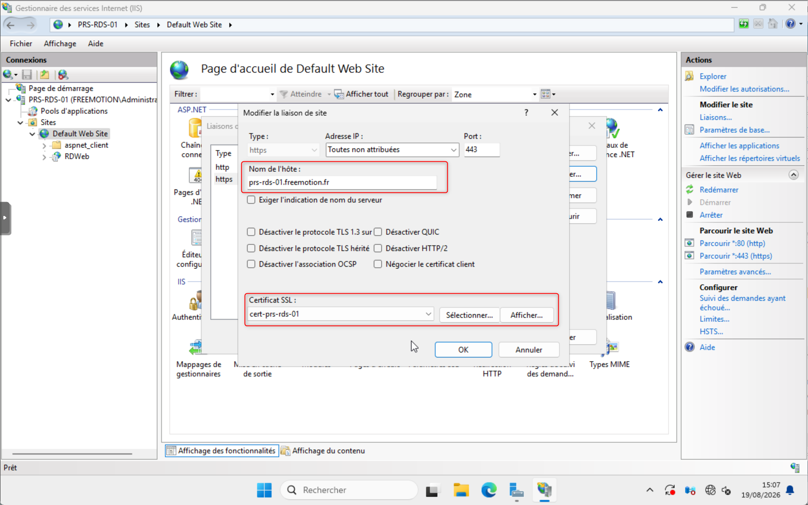
 
    4. Validation et redémarrage du site IIS.

</Steps>

## Configuration du certificat pour les rôles RDS

Au-delà d'IIS, chaque rôle du déploiement RDS référence explicitement le certificat pour couvrir l'ensemble des flux (Connection Broker, Web Access, etc.) :

<Steps>

    1. Accès à `Gestionnaire de serveur > Services Bureau à distance > Collections`.
    2. Ouverture de `Tâches > Modifier les propriétés de déploiement`.
    3. Dans l'onglet **Certificats**, sélection de chaque rôle (RD Connection Broker - Enable Single Sign On, RD Connection Broker - Publishing, RD Web Access, RD Gateway si présent).
    4. Pour chaque rôle, choix de **Sélectionner un certificat existant** et import direct du fichier `.pfx` exporté depuis pfSense.
    5. Cochage de l'option **Placer le certificat dans le magasin de certificats sur le serveur de destination**.
    6. Application du certificat à chaque rôle.

        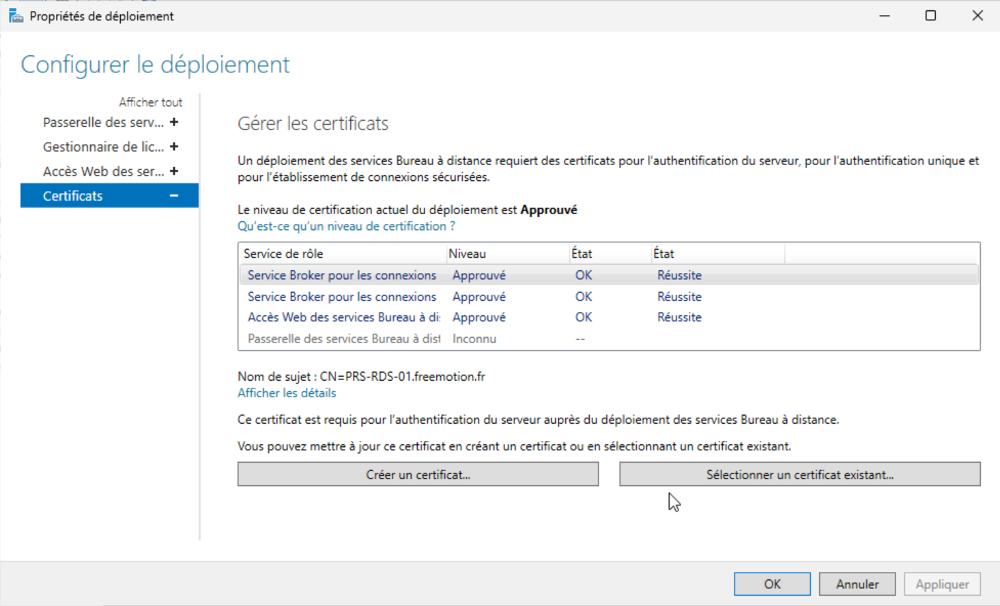

</Steps>

## Publication de l'application en RemoteApp

Une fois l'infrastructure TLS en place, l'application est publiée aux utilisateurs :

<Steps>

    1. Accès à `Gestionnaire de serveur > Services Bureau à distance > Collections`, avec création ou sélection d'une **collection de sessions**.
    2. Ouverture de `Tâches > Programmes RemoteApp > Publier des programmes RemoteApp`.
    3. Choix de l'application à publier.
    4. Validation de l'assistant de publication.

        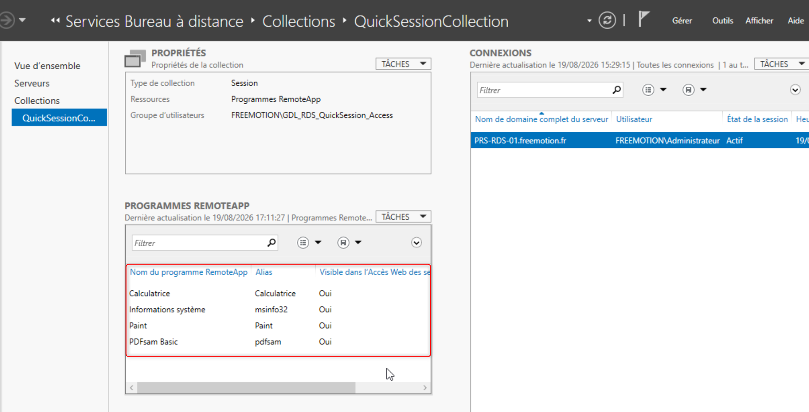

</Steps>

### Gestion des accès

L'accès à la RemoteApp est contrôlé via un groupe de sécurité dédié, suivant le modèle **AGDLP** (Account → Global → Domain Local → Permission) déjà en place sur les autres ressources Freemotion : les comptes utilisateurs sont ajoutés à un groupe global, lui-même membre d'un groupe local de domaine (`GDL_`) qui reçoit directement le droit d'accès sur la ressource RDS.

<Steps>

    1. Création du groupe local de domaine `GDL_QuickSession_Access` dans l'AD `freemotion.fr`, destiné à recevoir le droit d'accès sur la collection RDS.
    2. Ajout de ce groupe dans les autorisations d'accès de la collection RDS (`Propriétés de la collection > Groupes d'utilisateurs`).
    3. Ajout des groupes globaux concernés (regroupant les comptes utilisateurs) en tant que membres de `GDL_QuickSession_Access`.

        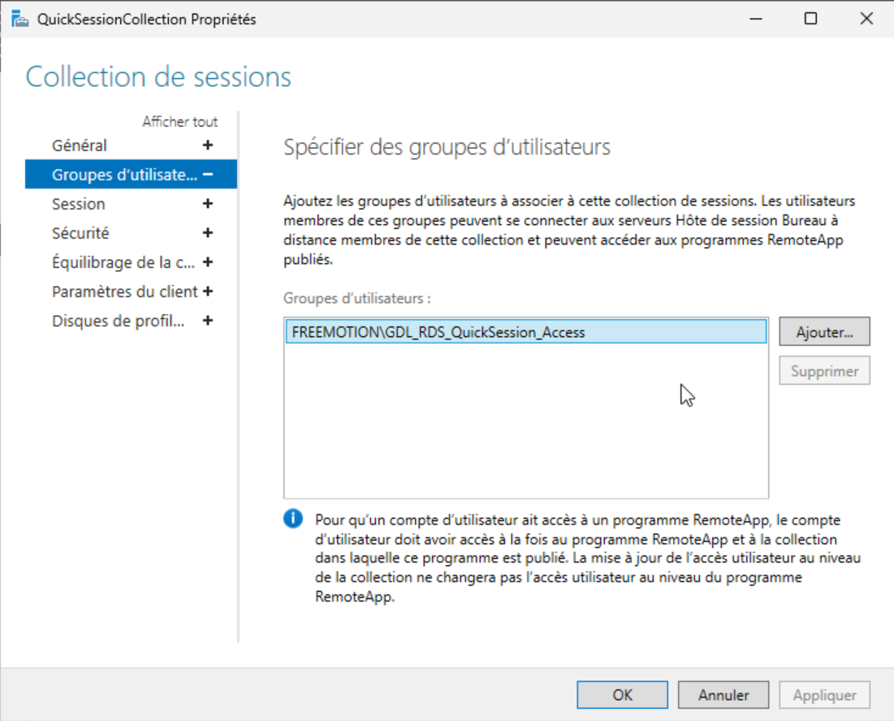

</Steps>

:::tip
Suivre le modèle AGDLP évite d'ajouter des comptes utilisateurs individuels directement dans `GDL_QuickSession_Access`. Les utilisateurs sont ajoutés dans leur groupe global métier habituel, et c'est ce groupe global qui est intégré à `GDL_QuickSession_Access` — la gestion des droits RDS reste ainsi centralisée et cohérente avec la structure de groupes déjà utilisée sur les autres ressources (fichiers, GPO, etc.).
:::

## Test côté client

La dernière étape vérifie que l'ensemble de la chaîne fonctionne correctement, sans avertissement de sécurité :
<Steps>

    1. Ouverture d'un navigateur vers `https://PRS-RDS-01.freemotion.fr/RDWeb`, depuis un poste du domaine ayant reçu la CA racine `Freemotion_Interne_CA` via GPO.
    2. Vérification de l'absence d'avertissement de certificat.
    3. Connexion avec un compte membre du groupe `GDL_QuickSession_Access`.
    4. Lancement de l'application RemoteApp publiée et vérification de son bon fonctionnement.

        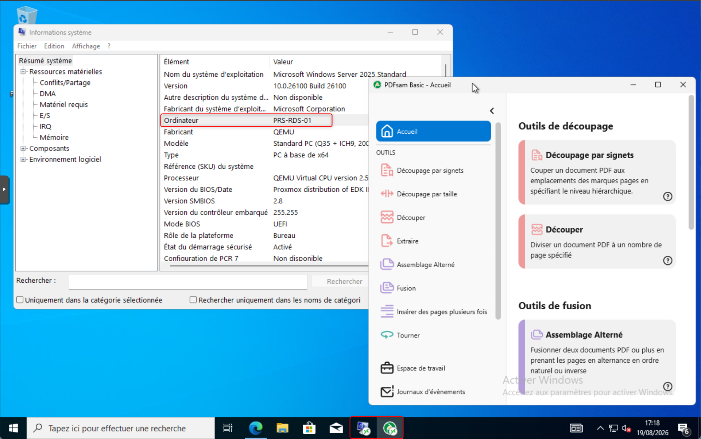

</Steps>

Alternative : utilisation de **Connexions RemoteApp et Bureau à distance** (`Panneau de configuration > Centre de connexion RemoteApp et Bureau à distance`) en pointant vers l'URL de la source `https://PRS-RDS-01.freemotion.fr/RDWeb/Feed/webfeed.aspx`.

## Conclusion

La publication de l'application RemoteApp sur `PRS-RDS-01.freemotion.fr` est sécurisée par un certificat TLS signé par la CA interne pfSense `Freemotion_Interne_CA`.

La CA racine est distribuée automatiquement aux postes et serveurs du domaine grâce à la GPO `Déploiement_CA_Interne`. Les utilisateurs peuvent ainsi accéder au portail RDWeb sans avertissement de sécurité lié au certificat.

Le certificat serveur est également associé à IIS et aux différents rôles RDS afin de sécuriser l'ensemble des flux nécessaires au fonctionnement de l'infrastructure RemoteApp. L'application est publiée depuis la collection RDS et son accès est contrôlé par le groupe local de domaine `GDL_QuickSession_Access`, conformément au modèle AGDLP.

Le test réalisé depuis un poste client confirme le bon fonctionnement de la configuration : le portail RDWeb est accessible en HTTPS, aucun avertissement de certificat n'est affiché et l'application RemoteApp peut être lancée par un utilisateur autorisé.

La solution mise en place fournit donc un accès RemoteApp sécurisé, centralisé et maîtrisé, tout en simplifiant la gestion de la confiance des certificats sur l'ensemble du domaine `freemotion.fr`.