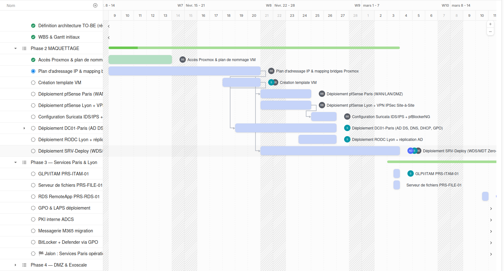
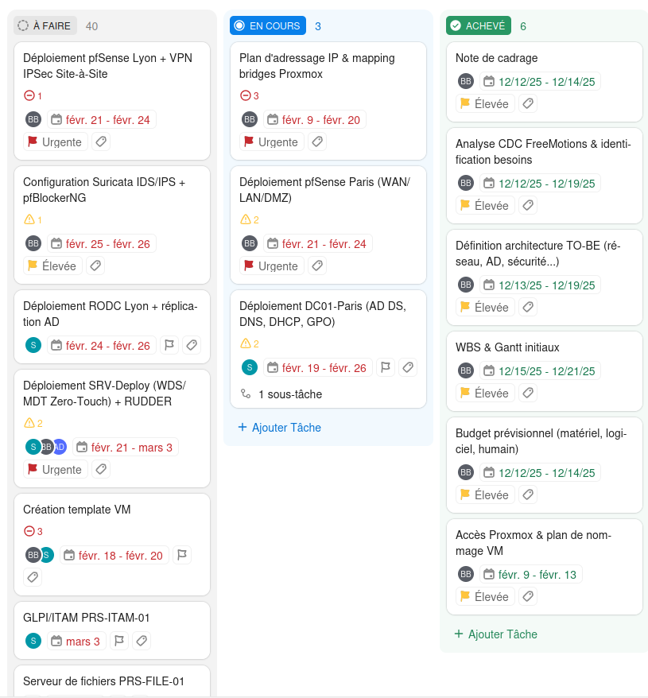

import { Aside, Badge } from '@astrojs/starlight/components';

## Méthodologie de planification

La conduite du projet Scalia repose sur une approche **hybride Agile/Cycle en V**, adaptée aux contraintes d'un projet d'infrastructure sécurisée. Les grandes phases suivent la logique séquentielle du cycle en V (audit → conception → déploiement → recette), tandis que l'exécution interne de chaque phase est organisée en **sprints de 2 semaines** pour conserver l'agilité nécessaire à un contexte d'intégration continue.

### Outil de gestion : ClickUp

L'équipe Scalia utilise **ClickUp** comme plateforme centrale de suivi de projet. Ce choix a été motivé par plusieurs facteurs : la richesse fonctionnelle de l'outil (vues Kanban, Gantt, gestion des dépendances, assignation par membre), sa gratuité pour les petites équipes, et sa capacité à centraliser en un seul endroit le backlog, les sprints et les jalons.

Chaque tâche est assignée à un membre, liée à un sprint et à une phase. Le Gantt ClickUp constitue la **source de vérité** pour le suivi opérationnel quotidien, tandis que ce document reflète les jalons macro et les livrables attendus par phase.

<Aside type="tip" title="Mise à jour">
  Le Gantt détaillé est géré sur ClickUp. Ce document reflète les jalons macro. Il est mis à jour à chaque sprint review, le samedi en réunion d'équipe.
</Aside>

## Jalons clés

| Jalon | Date cible | Statut |
|---|---|---|
| Socle réseau validé (pfSense CARP Paris + Lyon, VPN IPSec opérationnel, Suricata actif) | 28/02/2026 | 🔵 En cours |
| Services Paris opérationnels (AD DS/DNS/DHCP, GLPI, RDS, serveur de fichiers, GPO appliquées) | 31/03/2026 | 🔴 À venir |
| DMZ + cloud Exoscale opérationnels (HAProxy HA, Terraform déployé, Bastion SSH, S3 Veeam) | 30/04/2026 | 🔴 À venir |
| Supervision active (Zabbix agents déployés, Grafana dashboards, Wazuh rules MITRE ATT&CK) | 31/05/2026 | 🔴 À venir |
| 0 CVE critique : recette sécurité (pentest Nmap/Nessus, PingCastle score < 10, remédiation complète) | 31/07/2026 | 🔴 À venir |
| 🏁 Livraison finale (PV recette signé, documentation complète, soutenance) | 23/08/2026 | 🔴 À venir |

## Phases & périodes

| Phase | Période | Responsables | Livrables |
|---|---|---|---|
| Lancement & Conception | Déc. 2025 – Jan. 2026 | Équipe complète | Note de cadrage, budget, CDC, architecture TO-BE, WBS/Gantt, RACI |
| Maquettage : socle réseau | Fév. 2026 | Benjamin | pfSense CARP x4, VPN IPSec, Suricata, pfBlockerNG, plan d'adressage validé |
| Maquettage : AD & services Paris | Mars 2026 | Axel / Sylia / Tristan | DC01/DC02, forêt AD, GPO, LAPS, PKI, GLPI, RDS, serveur fichiers |
| DMZ + Exoscale Terraform | Avr. 2026 | Benjamin | HAProxy x2, serveurs web, VPC Exoscale, Bastion SSH, Split-DNS, S3 Veeam |
| Déploiement Lyon + VPN | Mai 2026 | Benjamin / Axel | RODC Lyon, réplication AD, VPN site-à-site validé, tests bascule CARP Lyon |
| Supervision + Hardening ANSSI | Juin 2026 | Benjamin / Sylia | Zabbix, Grafana, Wazuh SIEM, hardening BP028 Linux, hardening AD PingCastle |
| PRA/PCA + Pentest + Recette | Juil. 2026 | Benjamin / Axel | Tests CARP, restauration Veeam, pentest Nmap/Nessus, remédiation, cahier de recette |
| Documentation finale + Soutenance | Août 2026 | Équipe complète | DocScalia complète, DAT, procédures MCO, rapport sécurité, slides soutenance |

## Gantt visuel

## Sprints Agile

| Sprint | Période | Focus | Statut |
|---|---|---|---|
| Sprint 0 | Déc. 2025 | Cadrage & GP (note de cadrage, RACI, WBS, matrice risques) | ✅ Terminé |
| Sprint 1 | Fév. 2026 | Socle Proxmox (pfSense, CARP, VPN, Suricata) | 🔵 En cours |
| Sprint 2 | Mars 2026 | Services Paris (AD, GLPI, RDS, fichiers, GPO) | 🔴 À venir |
| Sprint 3 | Avr. 2026 | Lyon + VPN (RODC, réplication, tests bascule) | 🔴 À venir |
| Sprint 4 | Avr.–Mai 2026 | DMZ + Exoscale (HAProxy, Terraform, Bastion, S3) | 🔴 À venir |
| Sprint 5 | Juin 2026 | Supervision + Hardening (Zabbix, Grafana, Wazuh, ANSSI BP028) | 🔴 À venir |
| Sprint 6 | Juil. 2026 | Pentest + Recette (Nmap, Nessus, PingCastle, remédiation, PV) | 🔴 À venir |
| Sprint 7 | Août 2026 | Doc finale + Soutenance (DAT, MCO, rapport sécu, slides) | 🔴 À venir |

## Organisation Kanban

En parallèle du Gantt, l'équipe utilise une **vue Kanban** dans ClickUp pour le suivi opérationnel quotidien au sein de chaque sprint. Cette vue offre une visibilité immédiate sur l'état de chaque tâche et fluidifie la collaboration entre les membres.

### Colonnes du board

| Colonne | Signification |
|---|---|
| 📋 **A faire** | Tâches identifiées mais non encore planifiées dans le sprint courant |
| 🔨 **En cours** | Tâche activement travaillée par le responsable assigné |
| ✅ **Terminé** | Tâche livrée, documentée et validée |

### Règles d'utilisation

**Limite de WIP (Work In Progress)** : chaque membre ne peut avoir plus de **2 tâches simultanées** en colonne "En cours". Cette règle évite la dispersion et garantit que les tâches avancent jusqu'à leur terme avant d'en commencer de nouvelles.

**Définition de "Terminé"** : une tâche ne passe en colonne "Terminé" que si elle respecte les trois critères suivants : la configuration est opérationnelle et testée, la tâche est documentée sur DocScalia, et elle a été validée par un second membre de l'équipe (principe de binômage).

 

<Aside type="danger" title="Buffer sécurité">
  Un buffer de **3 semaines** (1er–23 août) est volontairement réservé entre la clôture des remédiations pentest (31/07) et la livraison finale (23/08). Ce temps est dédié à la finalisation de la documentation, à la préparation de la soutenance et à l'absorption de tout imprévu de dernière minute. Ce buffer est **non négociable** et ne doit pas être consommé par des tâches techniques.
</Aside>