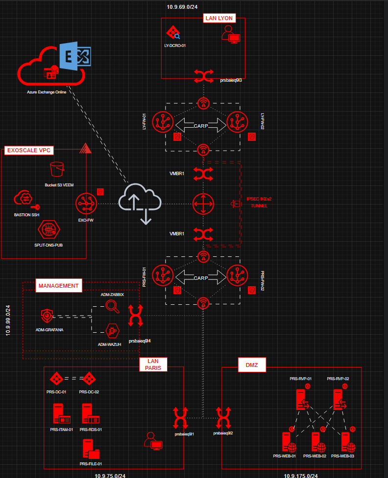

import { Aside } from '@astrojs/starlight/components';

## Architecture générale

L'infrastructure FreeMotions est organisée en **5 zones réseau isolées** interconnectées via les pfSense en configuration CARP (haute disponibilité) :

- **LAN Paris** (10.9.75.0/24) : 40 postes fixes, serveurs internes
- **DMZ Paris** (10.9.175.0/24) : services exposés (reverse proxy, web)
- **Management** (10.9.99.0/24) : supervision, SIEM, accès admin
- **LAN Lyon** (10.9.69.0/24) : 10 collaborateurs, RODC
- **Cloud Exoscale VPC** : Bastion SSH, Split-DNS, Object Storage Veeam

## Schéma de topologie

## Pare-feu & Haute Disponibilité

Les deux sites sont protégés par des **pfSense en configuration CARP** (Common Address Redundancy Protocol) :

- **Paris** : PRS-FW01 (maître) + PRS-FW02 (esclave) = VIP 192.168.254.9
- **Lyon** : LY-FW01 (maître) + LY-FW02 (esclave) = VIP 192.168.254.39

En cas de défaillance du nœud maître, la VIP bascule automatiquement sur l'esclave sans interruption de service.

## Interconnexion Paris–Lyon

Le tunnel **VPN IPSec IKEv2** relie les deux sites de manière permanente et chiffrée. Le routage inter-site passe exclusivement par ce tunnel.

<Aside type="caution" title="Note maquette">
  En production, le tunnel transite par Internet entre deux liens physiques distincts. En maquette sur pve3-ovh, il transite par vmbr1 (bridge WAN partagé simulant Internet).
</Aside>

## Messagerie & Cloud

La messagerie est hébergée sur **Microsoft 365 / Exchange Online** (SaaS). La synchronisation des identités se fait via **Azure AD Connect** depuis le DC Paris vers Azure AD, avec activation du **MFA** pour tous les comptes.

## Sauvegarde (règle 3-2-1)

| Copie | Emplacement | Outil |
|---|---|---|
| Copie 1 (production) | Serveurs Proxmox | . |
| Copie 2 (locale) | PRS-VEEAM-01  | Veeam Backup |
| Copie 3 (externalisée) | Bucket S3 Exoscale | Veeam | 